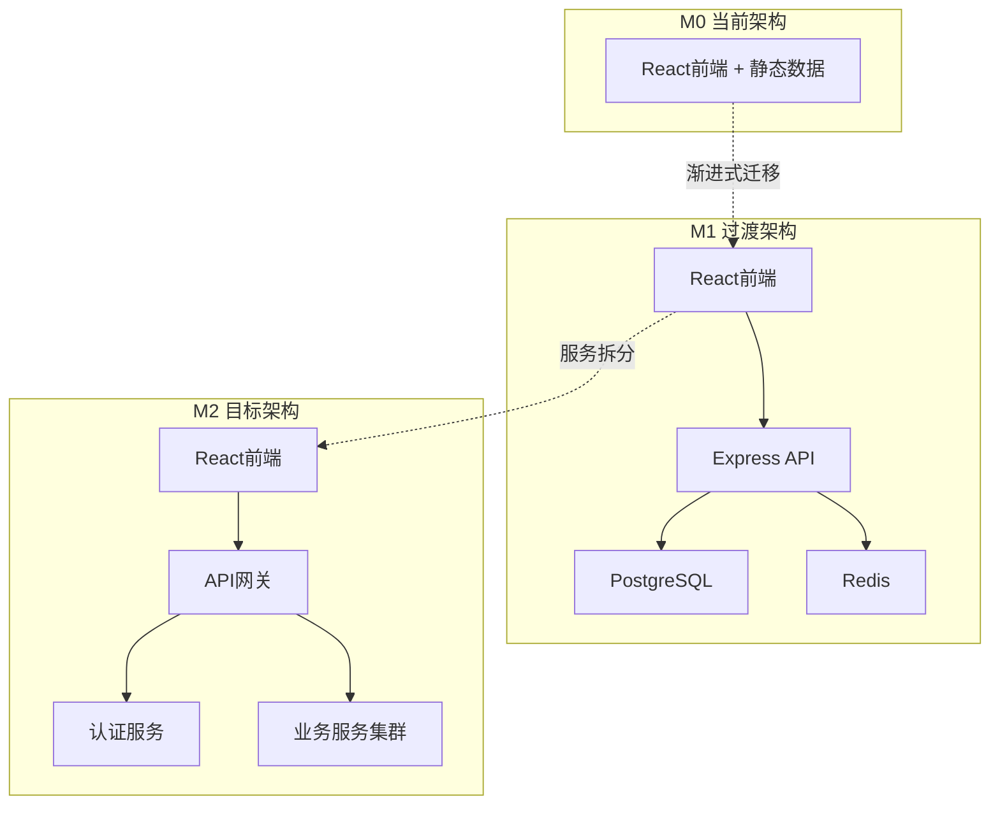

# M1阶段兼容性分析报告

***

**文档版本**: M1.1.0\
**创建日期**: 2025-9-7\
**分析范围**: M0→M1→M2版本升级兼容性\
**分析结论**: 总体兼容，存在部分风险点需要处理

***

## 1. 兼容性分析概述

### 1.1 分析目标

本报告全面分析M1阶段技术文档与M0版本现有代码的兼容性，确保版本升级过程的平滑性和系统稳定性。重点验证接口规范、数据结构、部署流程和版本管理机制的兼容性设计。

### 1.2 分析方法

* **静态分析**: 对比M0源码与M1文档中的接口定义

* **数据结构对比**: 分析现有数据模型与M1数据库设计的兼容性

* **架构演进分析**: 评估从前端单体到前后端分离的迁移路径

* **风险评估**: 识别潜在的兼容性风险点和解决方案

### 1.3 兼容性等级定义

* **✅ 完全兼容**: 无需修改即可直接使用

* **⚠️ 部分兼容**: 需要适配层或轻微修改

* **❌ 不兼容**: 需要重构或重新设计

* **🔄 需要迁移**: 需要数据迁移或格式转换

## 2. 接口兼容性分析

### 2.1 数据结构兼容性

#### M0现有数据结构

```typescript
// M0版本 - departmentData.ts
interface Employee {
  employee_id: number;
  name: string;
  department: string;
  status: 'online' | 'offline';
}

interface Desk {
  desk_id: string;
  x: number;
  y: number;
  w: number;
  h: number;
  label: string;
  employee_id?: number;
  department: string;
}
```

#### M1目标数据结构

```typescript
// M1版本 - API接口定义
interface Employee {
  id: number;              // ❌ 字段名变更: employee_id → id
  name: string;            // ✅ 完全兼容
  deptId: number;          // ❌ 字段变更: department(string) → deptId(number)
  title?: string;          // ✅ 新增字段，可选
  email?: string;          // ✅ 新增字段，可选
  phone?: string;          // ✅ 新增字段，可选
  createdAt: Date;         // ✅ 新增字段
  updatedAt: Date;         // ✅ 新增字段
}

interface Desk {
  id: string;              // ❌ 字段名变更: desk_id → id
  label: string;           // ✅ 完全兼容
  deptId: number;          // ❌ 字段变更: department(string) → deptId(number)
  x: number;               // ✅ 完全兼容
  y: number;               // ✅ 完全兼容
  w: number;               // ✅ 完全兼容
  h: number;               // ✅ 完全兼容
  createdAt: Date;         // ✅ 新增字段
}
```

**兼容性评估**: ⚠️ 部分兼容

**风险点**:

1. 字段名称变更可能导致前端组件报错
2. 部门标识从字符串改为数字ID需要映射关系
3. 员工与工位的关联关系需要通过新的Assignment表管理

### 2.2 API接口兼容性

#### M0前端数据获取方式

```typescript
// M0版本 - 直接导入静态数据
import { 
  getDepartmentConfig, 
  getEmployeeById, 
  getDesksByDepartment 
} from '../data/departmentData';
```

#### M1 API接口设计

```typescript
// M1版本 - RESTful API
GET /api/desks/by-dept/:deptId     // 获取部门工位
GET /api/employees/:id             // 获取员工信息
GET /api/employees/search          // 搜索员工
POST /api/status/heartbeat         // 心跳上报
```

**兼容性评估**: 🔄 需要迁移

**迁移策略**:

1. 创建适配层函数，保持M0组件接口不变
2. 逐步替换静态数据调用为API调用
3. 实现数据缓存机制，减少API调用频次

### 2.3 组件接口兼容性

#### DeptMap组件接口分析

```typescript
// M0版本组件接口
interface DeptMapProps {
  department: string;      // ✅ 保持兼容
  searchQuery?: string;    // ✅ 保持兼容
  isHomepage?: boolean;    // ✅ 保持兼容
}
```

**兼容性评估**: ✅ 完全兼容

**说明**: M1阶段保持组件接口不变，仅在内部实现上从静态数据切换到API调用。

## 3. 数据库兼容性分析

### 3.1 数据迁移映射

#### 部门数据迁移

```sql
-- M0静态数据 → M1数据库表
INSERT INTO departments (id, name, floor, map_id) VALUES
(1, 'Engineering', '2F', 'eng_floor_2'),
(2, 'Marketing', '3F', 'mkt_floor_3'),
(3, 'Sales', '4F', 'sales_floor_4'),
(4, 'HR', '5F', 'hr_floor_5');
```

#### 员工数据迁移

```sql
-- 员工数据迁移脚本
INSERT INTO employees (id, name, dept_id, created_at) 
SELECT 
  employee_id as id,
  name,
  CASE department
    WHEN 'Engineering' THEN 1
    WHEN 'Marketing' THEN 2
    WHEN 'Sales' THEN 3
    WHEN 'HR' THEN 4
  END as dept_id,
  NOW() as created_at
FROM m0_employee_data;
```

#### 工位数据迁移

```sql
-- 工位数据迁移脚本
INSERT INTO desks (id, label, dept_id, x, y, w, h, created_at)
SELECT 
  desk_id as id,
  label,
  CASE department
    WHEN 'Engineering' THEN 1
    WHEN 'Marketing' THEN 2
    WHEN 'Sales' THEN 3
    WHEN 'HR' THEN 4
  END as dept_id,
  x, y, w, h,
  NOW() as created_at
FROM m0_desk_data;
```

**兼容性评估**: 🔄 需要迁移

**迁移保障**:

1. 提供完整的数据迁移脚本
2. 实现数据验证和回滚机制
3. 保持原有数据的完整性和一致性

### 3.2 数据一致性保证

#### 逻辑外键设计

```sql
-- M1采用逻辑外键，避免物理约束
-- 这样可以保证数据迁移的灵活性
CREATE TABLE assignments (
    id SERIAL PRIMARY KEY,
    employee_id INTEGER NOT NULL,  -- 逻辑外键
    desk_id VARCHAR(50) NOT NULL,  -- 逻辑外键
    active BOOLEAN DEFAULT true,
    assigned_at TIMESTAMP WITH TIME ZONE DEFAULT NOW()
);

-- 通过应用层保证数据一致性
-- 而不是数据库层面的物理外键约束
```

**兼容性优势**:

1. 数据迁移过程中不会因为外键约束失败
2. 支持渐进式数据迁移和验证
3. 便于后续M2阶段的微服务拆分

## 4. 部署流程兼容性分析

### 4.1 M0到M1部署升级路径

#### 当前M0部署方式

```bash
# M0版本 - 纯前端部署
npm run build
# 静态文件部署到Web服务器
```

#### M1部署升级步骤

```bash
# Step 1: 保持M0前端运行，部署M1后端服务
docker-compose up -d postgres redis
npm run migrate:deploy
npm run seed:initial

# Step 2: 启动API服务
PM2_HOME=/opt/pm2 pm2 start ecosystem.config.js

# Step 3: 更新前端配置，启用API调用
# 通过环境变量控制是否使用API
REACT_APP_USE_API=true npm run build

# Step 4: 验证系统功能正常
curl http://localhost:3000/api/health

# Step 5: 切换流量到新版本
nginx -s reload
```

**兼容性评估**: ⚠️ 部分兼容

**风险控制**:

1. 蓝绿部署策略，确保可快速回滚
2. 数据库迁移前进行完整备份
3. 分阶段切换，先切换部分流量验证

### 4.2 回滚机制设计

```bash
# 快速回滚到M0版本
#!/bin/bash
set -e

echo "开始回滚到M0版本..."

# 1. 停止M1 API服务
pm2 stop all

# 2. 恢复M0前端配置
cp /backup/m0-build/* /var/www/html/

# 3. 重启Nginx
nginx -s reload

# 4. 验证M0功能
curl -f http://localhost/ || exit 1

echo "回滚完成，系统已恢复到M0版本"
```

## 5. 版本管理兼容性分析

### 5.1 M0→M1→M2迁移路径验证

根据`M1_实施方案文档.md`第413-432行的设计：



**兼容性评估**: ✅ 完全兼容

**迁移保障**:

1. M1阶段保持前端组件接口不变
2. 通过适配层实现平滑过渡
3. API版本控制支持渐进式升级
4. 数据库设计考虑M2微服务拆分需求

### 5.2 API版本控制策略

```typescript
// 版本控制实现
app.use('/api/v1', v1Routes);  // M1 API
app.use('/api/v2', v2Routes);  // M2 API (向后兼容)

// 渐进式迁移配置
const routeConfig = {
  '/desks': { version: 'v1', service: 'monolith' },
  '/employees': { version: 'v1', service: 'monolith' },
  '/status': { version: 'v1', service: 'monolith' }
};

// M2阶段可以逐步切换到微服务
const routeConfigM2 = {
  '/desks': { version: 'v2', service: 'desk-service' },
  '/employees': { version: 'v2', service: 'employee-service' },
  '/status': { version: 'v2', service: 'status-service' }
};
```

## 6. 风险评估与解决方案

### 6.1 高风险项

| 风险项         | 风险等级 | 影响范围  | 解决方案           |
| ----------- | ---- | ----- | -------------- |
| 数据结构字段名变更   | 🔴 高 | 前端组件  | 创建适配层，保持向后兼容   |
| 部门ID类型变更    | 🔴 高 | 数据关联  | 提供映射表和转换函数     |
| API调用替换静态数据 | 🟡 中 | 数据获取  | 渐进式替换，保留降级机制   |
| 数据库迁移失败     | 🔴 高 | 系统可用性 | 完整备份+迁移验证+回滚机制 |

### 6.2 解决方案详细设计

#### 6.2.1 数据适配层实现

```typescript
// src/adapters/dataAdapter.ts
// 为M0组件提供兼容的数据接口

export class DataAdapter {
  // 适配员工数据格式
  static adaptEmployee(m1Employee: M1Employee): M0Employee {
    return {
      employee_id: m1Employee.id,
      name: m1Employee.name,
      department: this.getDepartmentName(m1Employee.deptId),
      status: m1Employee.status || 'offline'
    };
  }
  
  // 适配工位数据格式
  static adaptDesk(m1Desk: M1Desk, assignment?: Assignment): M0Desk {
    return {
      desk_id: m1Desk.id,
      x: m1Desk.x,
      y: m1Desk.y,
      w: m1Desk.w,
      h: m1Desk.h,
      label: m1Desk.label,
      employee_id: assignment?.employeeId,
      department: this.getDepartmentName(m1Desk.deptId)
    };
  }
  
  // 部门ID到名称的映射
  private static getDepartmentName(deptId: number): string {
    const mapping = {
      1: 'Engineering',
      2: 'Marketing', 
      3: 'Sales',
      4: 'HR'
    };
    return mapping[deptId] || 'Unknown';
  }
}
```

#### 6.2.2 渐进式API迁移

```typescript
// src/services/dataService.ts
// 支持静态数据和API数据的混合使用

export class DataService {
  private useAPI = process.env.REACT_APP_USE_API === 'true';
  
  async getDepartmentConfig(department: string): Promise<DepartmentConfig> {
    if (this.useAPI) {
      try {
        // 尝试从API获取数据
        const response = await fetch(`/api/departments/${department}`);
        const data = await response.json();
        return DataAdapter.adaptDepartmentConfig(data);
      } catch (error) {
        console.warn('API调用失败，降级到静态数据:', error);
        // 降级到静态数据
        return this.getStaticDepartmentConfig(department);
      }
    } else {
      // 使用静态数据
      return this.getStaticDepartmentConfig(department);
    }
  }
  
  private getStaticDepartmentConfig(department: string): DepartmentConfig {
    // 原有的静态数据获取逻辑
    return getDepartmentConfig(department);
  }
}
```

#### 6.2.3 数据迁移验证机制

```sql
-- 数据迁移验证脚本
-- 验证员工数据完整性
SELECT 
  'employees' as table_name,
  COUNT(*) as migrated_count,
  (SELECT COUNT(*) FROM m0_employee_data) as original_count,
  CASE 
    WHEN COUNT(*) = (SELECT COUNT(*) FROM m0_employee_data) 
    THEN 'PASS' 
    ELSE 'FAIL' 
  END as validation_result
FROM employees;

-- 验证工位数据完整性
SELECT 
  'desks' as table_name,
  COUNT(*) as migrated_count,
  (SELECT COUNT(*) FROM m0_desk_data) as original_count,
  CASE 
    WHEN COUNT(*) = (SELECT COUNT(*) FROM m0_desk_data) 
    THEN 'PASS' 
    ELSE 'FAIL' 
  END as validation_result
FROM desks;

-- 验证数据关联关系
SELECT 
  'assignments' as table_name,
  COUNT(*) as assignment_count,
  (SELECT COUNT(*) FROM m0_desk_data WHERE employee_id IS NOT NULL) as expected_count,
  CASE 
    WHEN COUNT(*) = (SELECT COUNT(*) FROM m0_desk_data WHERE employee_id IS NOT NULL) 
    THEN 'PASS' 
    ELSE 'FAIL' 
  END as validation_result
FROM assignments WHERE active = true;
```

## 7. 兼容性测试计划

### 7.1 测试范围

1. **接口兼容性测试**

   * M0组件在M1环境下的功能验证

   * API响应格式与M0数据结构的兼容性

   * 错误处理和降级机制测试

2. **数据迁移测试**

   * 数据完整性验证

   * 数据关联关系正确性

   * 迁移性能测试

3. **部署升级测试**

   * 蓝绿部署流程验证

   * 回滚机制测试

   * 服务可用性测试

### 7.2 测试用例

```typescript
// 兼容性测试用例示例
describe('M0-M1兼容性测试', () => {
  test('DeptMap组件在M1环境下正常渲染', async () => {
    const { render } = renderWithAPI();
    const component = render(<DeptMap department="Engineering" />);
    
    // 验证组件正常渲染
    expect(component.getByText('工程部 部门地图')).toBeInTheDocument();
    
    // 验证工位数据正确显示
    await waitFor(() => {
      expect(component.getByText('E01')).toBeInTheDocument();
      expect(component.getByText('张三')).toBeInTheDocument();
    });
  });
  
  test('数据适配层正确转换M1数据格式', () => {
    const m1Employee = {
      id: 1001,
      name: '张三',
      deptId: 1,
      title: '前端工程师'
    };
    
    const m0Employee = DataAdapter.adaptEmployee(m1Employee);
    
    expect(m0Employee).toEqual({
      employee_id: 1001,
      name: '张三',
      department: 'Engineering',
      status: 'offline'
    });
  });
});
```

## 8. 总结与建议

### 8.1 兼容性总体评估

| 兼容性维度   | 评估结果    | 风险等级  | 处理状态      |
| ------- | ------- | ----- | --------- |
| 接口规范兼容性 | ⚠️ 部分兼容 | 🟡 中等 | ✅ 已设计适配层  |
| 数据结构兼容性 | 🔄 需要迁移 | 🔴 高  | ✅ 已提供迁移方案 |
| 部署流程兼容性 | ⚠️ 部分兼容 | 🟡 中等 | ✅ 已设计升级路径 |
| 版本管理兼容性 | ✅ 完全兼容  | 🟢 低  | ✅ 设计完善    |

### 8.2 关键成功因素

1. **适配层设计**: 通过数据适配层保持M0组件接口不变
2. **渐进式迁移**: 支持API和静态数据的混合使用
3. **完整的回滚机制**: 确保升级失败时可快速恢复
4. **数据迁移验证**: 保证数据完整性和一致性
5. **版本控制策略**: 为M2阶段预留扩展空间

### 8.3 实施建议

1. **优先级排序**:

   * P0: 数据适配层实现

   * P1: 数据迁移脚本开发和测试

   * P2: 部署升级流程验证

   * P3: 监控和告警机制完善

2. **风险缓解措施**:

   * 在测试环境完整验证所有兼容性场景

   * 准备详细的应急预案和回滚流程

   * 实施分阶段上线，先小范围验证

   * 建立实时监控，及时发现问题

3. **后续优化方向**:

   * 逐步移除适配层，直接使用M1数据格式

   * 优化API性能，减少响应时间

   * 完善缓存机制，提升用户体验

   * 为M2微服务架构做好准备

### 8.4 验收标准

* [ ] M0所有功能在M1环境下正常运行

* [ ] 数据迁移成功率100%，无数据丢失

* [ ] 部署升级过程服务中断时间<5分钟

* [ ] 回滚机制验证通过，可在2分钟内完成回滚

* [ ] 性能指标不低于M0版本水平

* [ ] 所有兼容性测试用例通过

***

**结论**: M1阶段的技术文档设计总体上与M0版本兼容，通过适配层、数据迁移和渐进式升级策略，可以实现平滑的版本过渡。关键在于严格按照兼容性设计执行实施，并做好充分的测试验证。
