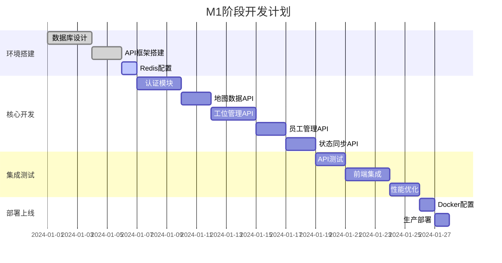
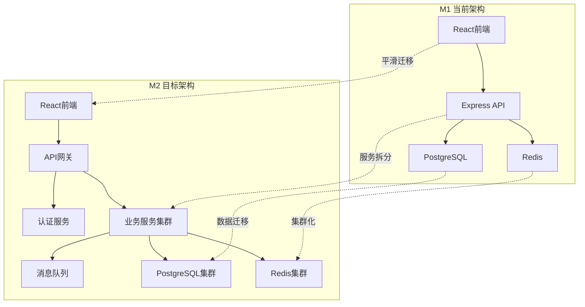

# 部门地图项目 M1 阶段实施方案

## 1. 实施概述

### 1.1 M1阶段目标

* **核心目标**: 建立完整的服务器端架构和数据层基础设施

* **技术重点**: 实现前后端分离通信，避免直接耦合

* **交付成果**: 可用的API服务、数据库设计、缓存系统

* **验收标准**: 前端能够通过API获取所有必要数据

### 1.2 里程碑规划



## 2. 技术实施路径

### 2.1 Phase 1: 基础设施搭建 (3-5天)

**目标**: 建立开发环境和基础架构

**任务清单**:

* [ ] 创建API项目结构

* [ ] 配置TypeScript + Express开发环境

* [ ] 设置PostgreSQL数据库

* [ ] 配置Redis缓存服务

* [ ] 建立Prisma ORM连接

* [ ] 配置开发工具链(ESLint, Prettier, Jest)

**技术要点**:

```bash
# 项目初始化
npm init -y
npm install express typescript @types/node @types/express
npm install prisma @prisma/client
npm install redis ioredis @types/ioredis
npm install jsonwebtoken bcrypt zod
npm install -D nodemon ts-node jest supertest

# Prisma初始化
npx prisma init
npx prisma db push
npx prisma generate
```

**验收标准**:

* API服务能够启动并响应健康检查

* 数据库连接正常，能执行基本CRUD操作

* Redis连接正常，能进行缓存读写

### 2.2 Phase 2: 核心API开发 (8-10天)

**目标**: 实现所有核心业务API接口

#### 2.2.1 认证模块 (3天)

**实现内容**:

* JWT token生成和验证

* 用户登录/注册接口

* 认证中间件

* 权限控制机制

**关键代码结构**:

```typescript
// src/middleware/auth.middleware.ts
export const authenticateToken = (req: Request, res: Response, next: NextFunction) => {
  const authHeader = req.headers['authorization'];
  const token = authHeader && authHeader.split(' ')[1];
  
  if (!token) {
    return res.status(401).json({ success: false, message: 'Access token required' });
  }
  
  jwt.verify(token, process.env.JWT_SECRET!, (err, user) => {
    if (err) return res.status(403).json({ success: false, message: 'Invalid token' });
    req.user = user;
    next();
  });
};
```

#### 2.2.2 地图数据API (2天)

**实现内容**:

* 地图文件上传和存储

* 地图信息CRUD操作

* 地图与部门关联

* 文件访问权限控制

**API设计**:

```typescript
// GET /api/maps - 获取地图列表
// GET /api/maps/:id - 获取指定地图
// POST /api/maps - 上传新地图
// PUT /api/maps/:id - 更新地图信息
// DELETE /api/maps/:id - 删除地图
```

#### 2.2.3 工位管理API (3天)

**实现内容**:

* 工位信息CRUD操作

* 按部门查询工位

* 工位状态管理

* 工位分配逻辑

**核心业务逻辑**:

```typescript
// src/services/desks.service.ts
export class DesksService {
  async getDesksByDepartment(deptId: number, includeEmployee = false) {
    const desks = await this.desksRepository.findByDepartment(deptId);
    
    if (includeEmployee) {
      // 关联查询员工信息和在线状态
      for (const desk of desks) {
        const assignment = await this.getActiveAssignment(desk.id);
        if (assignment) {
          desk.employee = assignment.employee;
          desk.status = await this.getEmployeeStatus(assignment.employeeId);
        }
      }
    }
    
    return desks;
  }
}
```

#### 2.2.4 员工管理API (2天)

**实现内容**:

* 员工信息CRUD操作

* 员工搜索功能

* 员工与工位关联

* 批量导入功能

#### 2.2.5 状态同步API (2天)

**实现内容**:

* 心跳上报机制

* 在线状态缓存

* 部门状态统计

* WebSocket实时推送(可选)

**心跳机制设计**:

```typescript
// src/services/status.service.ts
export class StatusService {
  async updateHeartbeat(userId: number, deskId?: string) {
    const status = {
      userId,
      status: 'online',
      lastSeen: Date.now(),
      deskId
    };
    
    // 更新Redis缓存
    await this.redisService.setPresence(userId, status);
    
    // 更新部门统计
    await this.updateDepartmentStats(userId);
    
    return status;
  }
  
  async getDepartmentStatus(deptId: number) {
    // 从Redis获取部门所有员工状态
    const employees = await this.employeesRepository.findByDepartment(deptId);
    const statuses = await Promise.all(
      employees.map(emp => this.redisService.getPresence(emp.id))
    );
    
    return {
      total: employees.length,
      online: statuses.filter(s => s?.status === 'online').length,
      offline: statuses.filter(s => !s || s.status === 'offline').length
    };
  }
}
```

### 2.3 Phase 3: 集成测试与优化 (5-7天)

**目标**: 确保API稳定性和性能

#### 2.3.1 API测试 (2天)

**测试策略**:

* 单元测试: 覆盖所有Service层逻辑

* 集成测试: 测试API端到端流程

* 性能测试: 验证并发处理能力

**测试用例示例**:

```typescript
// tests/integration/desks.test.ts
describe('Desks API', () => {
  test('GET /api/desks/by-dept/:id should return department desks', async () => {
    const response = await request(app)
      .get('/api/desks/by-dept/1')
      .set('Authorization', `Bearer ${authToken}`)
      .expect(200);
    
    expect(response.body.success).toBe(true);
    expect(response.body.data).toBeInstanceOf(Array);
    expect(response.body.data[0]).toHaveProperty('id');
    expect(response.body.data[0]).toHaveProperty('label');
  });
});
```

#### 2.3.2 前端集成 (3天)

**集成要点**:

* 替换前端Mock数据为真实API调用

* 实现API错误处理

* 优化数据加载和缓存策略

* 实现认证状态管理

**前端API客户端**:

```typescript
// src/services/api.client.ts
class ApiClient {
  private baseURL = process.env.REACT_APP_API_URL || 'http://localhost:3000/api';
  private token: string | null = null;
  
  setToken(token: string) {
    this.token = token;
  }
  
  async request<T>(endpoint: string, options: RequestInit = {}): Promise<T> {
    const url = `${this.baseURL}${endpoint}`;
    const headers = {
      'Content-Type': 'application/json',
      ...(this.token && { Authorization: `Bearer ${this.token}` }),
      ...options.headers
    };
    
    const response = await fetch(url, { ...options, headers });
    
    if (!response.ok) {
      throw new Error(`API Error: ${response.status}`);
    }
    
    return response.json();
  }
  
  // 部门工位数据
  async getDepartmentDesks(deptId: number, includeEmployee = true) {
    return this.request<ApiResponse<Desk[]>>(
      `/desks/by-dept/${deptId}?include=${includeEmployee ? 'employee,assignment' : ''}`
    );
  }
  
  // 员工搜索
  async searchEmployees(query: string, deptId?: number) {
    const params = new URLSearchParams({ q: query });
    if (deptId) params.append('dept', deptId.toString());
    
    return this.request<ApiResponse<Employee[]>>(`/employees/search?${params}`);
  }
}
```

#### 2.3.3 性能优化 (2天)

**优化重点**:

* 数据库查询优化

* Redis缓存策略

* API响应时间优化

* 内存使用优化

**缓存策略**:

```typescript
// src/services/cache.service.ts
export class CacheService {
  private readonly TTL = {
    DEPARTMENT_DESKS: 300,    // 5分钟
    EMPLOYEE_INFO: 600,       // 10分钟
    PRESENCE_STATUS: 60       // 1分钟
  };
  
  async getDepartmentDesks(deptId: number): Promise<Desk[] | null> {
    const key = `dept:${deptId}:desks`;
    const cached = await this.redis.get(key);
    
    if (cached) {
      return JSON.parse(cached);
    }
    
    return null;
  }
  
  async setDepartmentDesks(deptId: number, desks: Desk[]): Promise<void> {
    const key = `dept:${deptId}:desks`;
    await this.redis.setex(key, this.TTL.DEPARTMENT_DESKS, JSON.stringify(desks));
  }
}
```

### 2.4 Phase 4: 部署上线 (2天)

**目标**: 完成生产环境部署

#### 2.4.1 Docker化 (1天)

**容器配置**:

* API服务容器

* PostgreSQL数据库容器

* Redis缓存容器

* Nginx反向代理容器

#### 2.4.2 生产部署 (1天)

**部署检查清单**:

* [ ] 环境变量配置

* [ ] 数据库迁移执行

* [ ] SSL证书配置

* [ ] 监控和日志配置

* [ ] 备份策略实施

* [ ] 健康检查配置

## 3. M1与M2衔接方案

### 3.1 架构演进路径



### 3.2 数据迁移策略

**M1到M2数据兼容性**:

* 保持现有数据库Schema不变

* 新增服务发现和配置表

* 实现数据版本控制机制

* 建立数据同步和备份流程

**迁移步骤**:

1. **Phase 1**: 在M1基础上添加服务注册功能
2. **Phase 2**: 拆分单体API为微服务
3. **Phase 3**: 引入API网关和负载均衡
4. **Phase 4**: 实现服务间通信和数据一致性

### 3.3 API兼容性保证

**版本控制策略**:

```typescript
// API版本控制
app.use('/api/v1', v1Routes);  // M1 API
app.use('/api/v2', v2Routes);  // M2 API (向后兼容)

// 渐进式迁移
const routeConfig = {
  '/desks': { version: 'v1', service: 'monolith' },
  '/employees': { version: 'v2', service: 'employee-service' },
  '/status': { version: 'v2', service: 'status-service' }
};
```

**接口兼容性**:

* 保持M1所有API接口不变

* 新功能通过新版本API提供

* 实现API代理和路由转发

* 提供平滑的客户端升级路径

## 4. 风险控制与应急预案

### 4.1 技术风险

| 风险项       | 影响程度 | 发生概率 | 应对措施           |
| --------- | ---- | ---- | -------------- |
| 数据库性能瓶颈   | 高    | 中    | 实施读写分离，优化查询索引  |
| Redis缓存失效 | 中    | 低    | 实现缓存降级，数据库兜底   |
| API并发问题   | 高    | 中    | 实施连接池，限流机制     |
| 前端集成问题    | 中    | 中    | 提供Mock服务，渐进式集成 |

### 4.2 进度风险

**关键路径监控**:

* 数据库设计延期 → 影响所有后续开发

* API开发延期 → 影响前端集成测试

* 性能问题 → 影响上线时间

**应急措施**:

* 准备简化版API实现

* 建立开发环境快速恢复机制

* 实施每日构建和测试

### 4.3 质量保证

**代码质量标准**:

* 单元测试覆盖率 > 80%

* API响应时间 < 200ms

* 并发支持 > 100请求/秒

* 错误率 < 1%

**监控指标**:

```typescript
// 性能监控
const performanceMetrics = {
  responseTime: '< 200ms',
  throughput: '> 100 req/s',
  errorRate: '< 1%',
  availability: '> 99.9%'
};

// 业务监控
const businessMetrics = {
  activeUsers: 'real-time count',
  departmentStatus: 'update frequency',
  dataConsistency: 'validation checks'
};
```

## 5. 交付清单

### 5.1 代码交付

* [ ] API服务源代码

* [ ] 数据库Schema和迁移脚本

* [ ] Docker配置文件

* [ ] 部署脚本和文档

* [ ] 测试用例和测试报告

### 5.2 文档交付

* [ ] API接口文档 (Swagger)

* [ ] 数据库设计文档

* [ ] 部署运维文档

* [ ] 开发者指南

* [ ] 故障排查手册

### 5.3 环境交付

* [ ] 开发环境配置

* [ ] 测试环境部署

* [ ] 生产环境准备

* [ ] 监控和日志系统

* [ ] 备份和恢复机制

***

**M1阶段实施约束**：

* 开发周期：15-20个工作日

* 团队规模：2-3名开发人员

* 技术栈固定：不允许中途更换核心技术

* 数据安全：所有API必须实现认证和授权

* 性能要求：支持100并发用户访问

* 兼容性：必须与现有M0前端完全兼容

