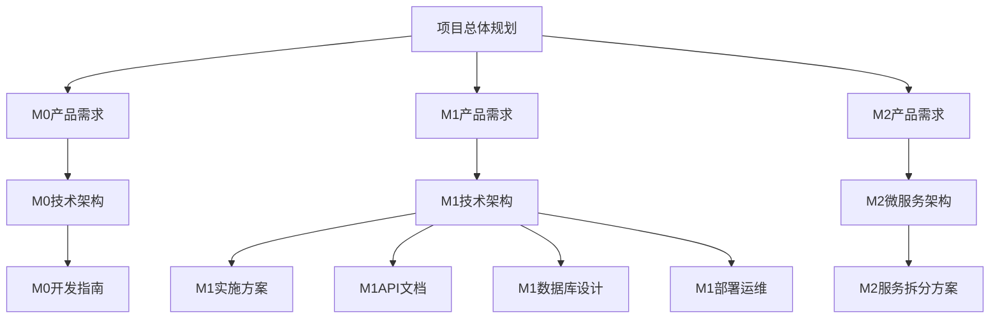

# 部门地图项目 - 里程碑目录结构与版本管理

## 1. 项目里程碑架构

### 1.1 整体目录结构

```
部门地图/
├── .trae/
│   └── documents/
│       ├── M0_前端架构/
│       │   ├── M0_产品需求文档.md
│       │   ├── M0_技术架构文档.md
│       │   ├── M0_开发指南.md
│       │   └── M0_版本历史.md
│       ├── M1_数据层与服务器架构/          # 当前阶段
│       │   ├── M1_部门地图产品需求文档.md
│       │   ├── M1_部门地图技术架构文档.md
│       │   ├── M1_实施方案文档.md
│       │   ├── M1_API接口文档.md
│       │   ├── M1_数据库设计文档.md
│       │   └── M1_部署运维文档.md
│       ├── M2_后端微服务架构/              # 预留阶段
│       │   ├── M2_产品需求文档.md
│       │   ├── M2_微服务架构设计.md
│       │   ├── M2_服务拆分方案.md
│       │   ├── M2_数据一致性方案.md
│       │   └── M2_性能优化方案.md
│       ├── 通用文档/
│       │   ├── 项目总体规划.md
│       │   ├── 技术选型对比.md
│       │   ├── 安全规范.md
│       │   └── 编码规范.md
│       └── 历史版本/
│           ├── 部门地图产品需求文档.md      # 原始文档
│           └── 部门地图技术架构文档.md      # 原始文档
├── src/                                   # M0 前端代码
├── api/                                   # M1 后端代码 (待创建)
├── docs/                                  # 开发者文档
├── web_登录版｜一体化技术文档_cursor_提示词.md
├── README.md
└── CHANGELOG.md
```

### 1.2 里程碑定义

| 里程碑    | 阶段名称      | 核心目标      | 技术重点                         | 交付成果      |
| ------ | --------- | --------- | ---------------------------- | --------- |
| **M0** | 前端架构      | 建立可用的前端应用 | React + SVG + 响应式设计          | 可视化部门地图界面 |
| **M1** | 数据层/服务器架构 | 实现前后端分离   | Express + PostgreSQL + Redis | 完整的API服务  |
| **M2** | 后端微服务架构   | 服务化和可扩展性  | 微服务 + 消息队列 + 负载均衡            | 高可用分布式系统  |

## 2. M0 前端架构文档整理

### 2.1 现有文档状态分析

**需要整理的文档**:

1. `web_登录版｜一体化技术文档_cursor_提示词.md` - 包含旧版技术方案
2. `README.md` - 项目概述，需要更新为导航功能
3. `.trae/documents/部门地图产品需求文档.md` - 原始需求文档
4. `.trae/documents/部门地图技术架构文档.md` - 原始技术文档

**文档版本校准计划**:

* 将原始文档移动到 `历史版本/` 目录

* 基于当前M0实现创建标准化的M0文档

* 更新README为项目导航页面

* 重构技术文档，分离提示词和技术方案

### 2.2 M0文档标准化

**M0\_产品需求文档.md** (基于当前实现):

```markdown
# 部门地图 M0 阶段产品需求文档

## 1. 产品概述
部门地图是一个基于SVG的可视化工位管理系统，M0阶段专注于前端展示和交互功能。

## 2. 核心功能
### 2.1 用户角色
- 普通用户：浏览部门地图，查看工位信息

### 2.2 功能模块
1. **首页**：部门概况展示，地图导航
2. **部门地图页**：SVG地图展示，工位详情，员工搜索
3. **登录页**：用户认证界面

### 2.3 页面详情
| 页面名称 | 模块名称 | 功能描述 |
|----------|----------|----------|
| 首页 | 部门概况 | 显示各部门工位总数和在线人数统计 |
| 首页 | 地图导航 | 提供部门地图快速访问入口 |
| 部门地图页 | SVG地图渲染 | 加载并显示部门SVG地图，支持缩放和平移 |
| 部门地图页 | 工位信息展示 | 显示工位标签、员工信息、在线状态 |
| 部门地图页 | 员工搜索 | 实时搜索员工并高亮显示其工位位置 |
| 部门地图页 | 图例说明 | 显示工位状态图例，位于底部中央 |
| 登录页 | 用户认证 | 用户名密码登录，记住登录状态 |

## 3. 核心流程
用户登录 → 查看首页概况 → 选择部门 → 浏览地图 → 搜索员工 → 查看工位详情

## 4. 用户界面设计
### 4.1 设计风格
- 主色调：蓝色系 (#1890ff)
- 辅助色：灰色系 (#f0f0f0)
- 按钮样式：圆角按钮，悬停效果
- 字体：系统默认字体，14px基础字号
- 布局：卡片式布局，顶部导航

### 4.2 响应式设计
- 桌面优先设计
- 支持移动端适配
- SVG自适应缩放
```

**M0\_技术架构文档.md**:

````markdown
# 部门地图 M0 阶段技术架构文档

## 1. 架构设计
```mermaid
graph TD
    A[用户浏览器] --> B[React前端应用]
    B --> C[本地Mock数据]
    B --> D[SVG文件资源]
    
    subgraph "前端层"
        B
    end
    
    subgraph "数据层"
        C
        D
    end
````

## 2. 技术描述

* 前端：React\@18 + TypeScript + Tailwind CSS + Vite

* 状态管理：React Hooks (useState, useEffect)

* 路由：React Router\@6

* 图标：Lucide React

* 构建工具：Vite\@4

## 3. 路由定义

| 路由        | 用途           |
| --------- | ------------ |
| /         | 首页，显示部门概况和导航 |
| /login    | 登录页面         |
| /dept/:id | 部门地图页面       |

## 4. 组件架构

### 4.1 核心组件

* App.tsx：应用主入口，路由配置

* HomePage.tsx：首页组件，部门概况展示

* DeptMap.tsx：部门地图组件，SVG渲染和交互

* LoginPage.tsx：登录页面组件

### 4.2 数据模型

```typescript
interface Department {
  id: number;
  name: string;
  totalDesks: number;
  occupiedDesks: number;
  mapFile: string;
}

interface Employee {
  id: number;
  name: string;
  department: string;
  position: string;
  x: number;
  y: number;
  status: 'online' | 'offline';
}
```

````

## 3. M1 数据层与服务器架构

### 3.1 M1文档结构

**已创建文档**:
- ✅ `M1_部门地图产品需求文档.md` - 产品功能需求
- ✅ `M1_部门地图技术架构文档.md` - 技术架构设计
- ✅ `M1_实施方案文档.md` - 开发实施计划

**待创建文档**:
- 🔄 `M1_API接口文档.md` - 详细API规范
- 🔄 `M1_数据库设计文档.md` - 数据库Schema设计
- 🔄 `M1_部署运维文档.md` - 部署和运维指南

### 3.2 M1与M0的关系

**数据流转换**:
```mermaid
graph LR
    subgraph "M0 数据流"
        A1[React组件] --> B1[Mock数据]
        B1 --> C1[本地JSON]
    end
    
    subgraph "M1 数据流"
        A2[React组件] --> B2[API客户端]
        B2 --> C2[Express API]
        C2 --> D2[PostgreSQL]
        C2 --> E2[Redis缓存]
    end
    
    A1 -.->|升级| A2
    B1 -.->|替换| B2
    C1 -.->|迁移| D2
````

**兼容性保证**:

* 保持现有React组件接口不变

* 数据格式向后兼容

* 渐进式API集成

* 支持降级到Mock数据

## 4. M2 后端微服务架构 (预留)

### 4.1 M2规划概述

**目标架构**:

```mermaid
graph TD
    A[前端应用] --> B[API网关]
    B --> C[认证服务]
    B --> D[地图服务]
    B --> E[员工服务]
    B --> F[状态服务]
    
    C --> G[(用户数据库)]
    D --> H[(地图数据库)]
    E --> I[(员工数据库)]
    F --> J[(Redis集群)]
    
    K[消息队列] --> D
    K --> E
    K --> F
```

**服务拆分计划**:

* 认证服务：用户管理、权限控制

* 地图服务：地图文件管理、部门信息

* 员工服务：员工信息管理、搜索功能

* 状态服务：在线状态、心跳监控

### 4.2 M2预留目录

```
M2_后端微服务架构/
├── M2_产品需求文档.md          # 微服务功能需求
├── M2_微服务架构设计.md        # 服务拆分设计
├── M2_服务拆分方案.md          # 从M1到M2的迁移方案
├── M2_数据一致性方案.md        # 分布式数据一致性
├── M2_性能优化方案.md          # 高并发和性能优化
├── M2_服务治理方案.md          # 服务发现、配置管理
├── M2_监控告警方案.md          # 分布式监控和告警
└── M2_部署运维文档.md          # 容器化和自动化部署
```

## 5. 文档管理规范

### 5.1 文档命名规范

**格式**: `{里程碑}_{文档类型}_{具体名称}.md`

**示例**:

* `M0_产品需求文档.md`

* `M1_技术架构文档.md`

* `M2_微服务架构设计.md`

### 5.2 版本控制规范

**文档版本标识**:

```markdown
---
文档版本: M1.1.0
创建日期: 2024-01-15
最后更新: 2024-01-20
更新内容: 添加Redis缓存策略
---
```

**变更记录格式**:

```markdown
## 变更历史

### v1.1.0 (2024-01-20)
- 新增: Redis缓存策略设计
- 优化: API响应时间要求
- 修复: 数据库索引设计问题

### v1.0.0 (2024-01-15)
- 初始版本创建
```

### 5.3 文档关联关系

**文档依赖图**:



**交叉引用规范**:

```markdown
<!-- 引用其他文档 -->
详细的API设计请参考 [M1_API接口文档](./M1_API接口文档.md#核心接口)

<!-- 引用特定章节 -->
关于数据库设计，请查看 [数据库设计文档](./M1_数据库设计文档.md#表结构设计)

<!-- 引用外部文档 -->
前端组件设计参考 [M0技术架构文档](../M0_前端架构/M0_技术架构文档.md)
```

## 6. 文档维护计划

### 6.1 定期更新机制

**更新频率**:

* 产品需求文档：每个Sprint结束后更新

* 技术架构文档：重大技术变更时更新

* API文档：接口变更时实时更新

* 部署文档：环境变更时更新

**更新责任人**:

* 产品需求：产品经理

* 技术架构：架构师/技术负责人

* API文档：后端开发工程师

* 前端文档：前端开发工程师

### 6.2 文档质量保证

**质量检查清单**:

* [ ] 文档结构完整，章节清晰

* [ ] 代码示例可执行，格式正确

* [ ] 图表清晰，逻辑正确

* [ ] 链接有效，引用准确

* [ ] 版本信息完整，变更记录详细

**审核流程**:

1. 作者自检
2. 同行评审
3. 技术负责人审核
4. 最终发布

***

**文档管理约束**：

* 所有技术文档必须使用Markdown格式

* 图表优先使用Mermaid语法

* 代码示例必须包含语言标识

* 每个文档必须包含版本信息和变更历史

* 文档间引用必须使用相对路径

* 废弃文档移动到历史版本目录，不得删除

