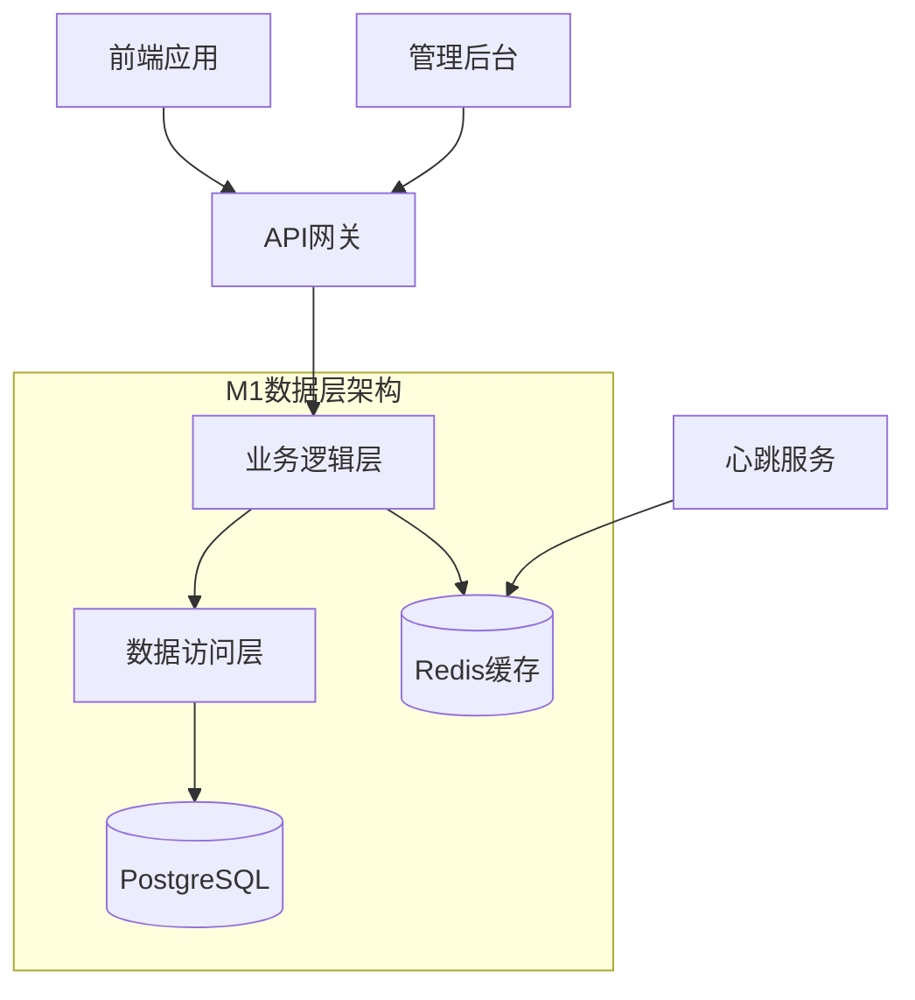

# 部门地图项目 M1 阶段产品需求文档

## 1. 产品概述

部门地图系统M1阶段专注于数据层和服务器架构的建设，实现前后端分离的通信机制，为后续功能扩展奠定坚实基础。本阶段将建立完整的数据模型、API接口规范和服务器架构，确保系统的可扩展性和稳定性。

* **核心目标**：构建稳定可靠的数据层和服务器架构，实现前后端分离通信

* **服务对象**：为M0前端架构提供数据支撑，为M2后端功能扩展预留接口

* **技术价值**：建立标准化的API规范和数据模型，提升系统整体架构质量

## 2. 核心功能

### 2.1 用户角色

| 角色    | 注册方式   | 核心权限                 |
| ----- | ------ | -------------------- |
| 普通员工  | 企业邮箱注册 | 查看地图、搜索人员、更新个人状态     |
| 部门管理员 | 管理员邀请  | 管理部门地图、编辑工位信息、查看部门统计 |
| 系统管理员 | 系统预设   | 全局配置、用户管理、系统监控       |

### 2.2 功能模块

M1阶段主要构建以下核心页面和功能模块：

1. **数据管理页面**：部门信息管理、工位数据管理、员工信息管理
2. **API接口层**：地图数据接口、工位状态接口、用户搜索接口
3. **数据同步页面**：实时状态同步、心跳监控、缓存管理
4. **系统配置页面**：数据库配置、Redis配置、API文档

### 2.3 页面详情

| 页面名称   | 模块名称   | 功能描述                           |
| ------ | ------ | ------------------------------ |
| 数据管理页面 | 部门管理模块 | 创建、编辑、删除部门信息；管理部门地图文件；设置部门层级关系 |
| 数据管理页面 | 工位管理模块 | 批量导入工位数据；编辑工位坐标和属性；管理工位分配关系    |
| 数据管理页面 | 员工管理模块 | 员工信息CRUD操作；工位分配管理；权限角色设置       |
| API接口层 | 地图数据接口 | 提供部门地图文件URL；返回工位坐标数据；支持多格式地图   |
| API接口层 | 状态同步接口 | 实时工位状态查询；员工在线状态更新；心跳数据处理       |
| API接口层 | 搜索查询接口 | 员工姓名模糊搜索；跨部门人员定位；搜索结果排序        |
| 数据同步页面 | 缓存管理模块 | Redis缓存状态监控；缓存数据刷新；性能指标展示      |
| 系统配置页面 | 数据库配置  | 连接参数设置；迁移脚本管理；备份恢复功能           |

## 3. 核心流程

### 3.1 数据管理流程

管理员通过数据管理页面进行部门、工位、员工信息的维护，系统自动同步到数据库并更新缓存。

### 3.2 API调用流程

前端应用通过标准化API接口获取数据，后端服务处理请求并返回JSON格式数据，支持分页、过滤、排序等功能。

### 3.3 状态同步流程

员工客户端定期发送心跳数据，服务器更新Redis缓存中的在线状态，前端通过轮询或WebSocket获取最新状态。

## 4. 用户界面设计

### 4.1 设计风格

* **主色调**：蓝色系（#2563eb）和灰色系（#64748b）

* **按钮样式**：圆角矩形，渐变背景，悬停效果

* **字体规范**：系统默认字体，标题16px，正文14px，说明12px

* **布局风格**：卡片式布局，左侧导航，响应式设计

* **图标风格**：线性图标，统一风格，支持深色模式

### 4.2 页面设计概览

| 页面名称   | 模块名称   | UI元素                         |
| ------ | ------ | ---------------------------- |
| 数据管理页面 | 部门管理模块 | 表格组件、表单弹窗、文件上传区域、树形结构展示      |
| API接口层 | 接口文档   | Swagger UI集成、请求示例、响应格式、错误码说明 |
| 数据同步页面 | 状态监控   | 实时图表、状态指示灯、日志列表、性能仪表盘        |
| 系统配置页面 | 配置表单   | 分组表单、验证提示、保存确认、重置功能          |

### 4.3 响应式设计

采用桌面优先的响应式设计策略，支持1920px、1366px、768px等主流分辨率，确保在不同设备上的良好体验。

***

**M1阶段差异与约束**：

* 本阶段专注于数据层和API接口建设，不涉及复杂的前端交互

* 数据库设计需考虑后续扩展性，预留字段和索引优化

* API接口需遵循RESTful规范，支持版本控制

* 缓存策略需平衡性能和数据一致性

* 所有接口需提供完整的文档和测试用例

