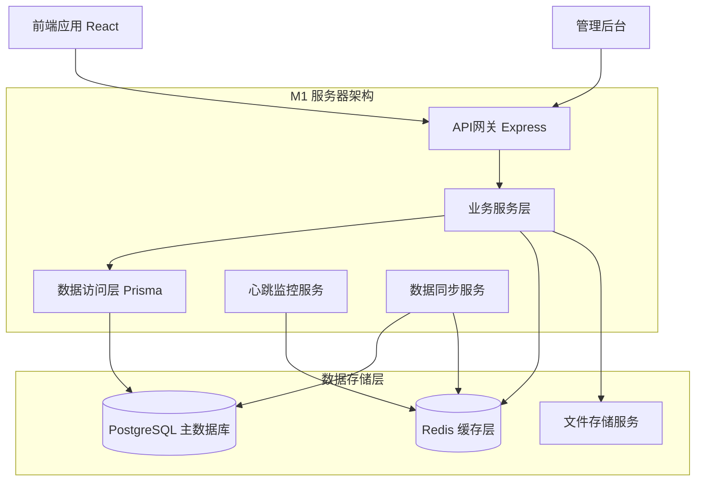
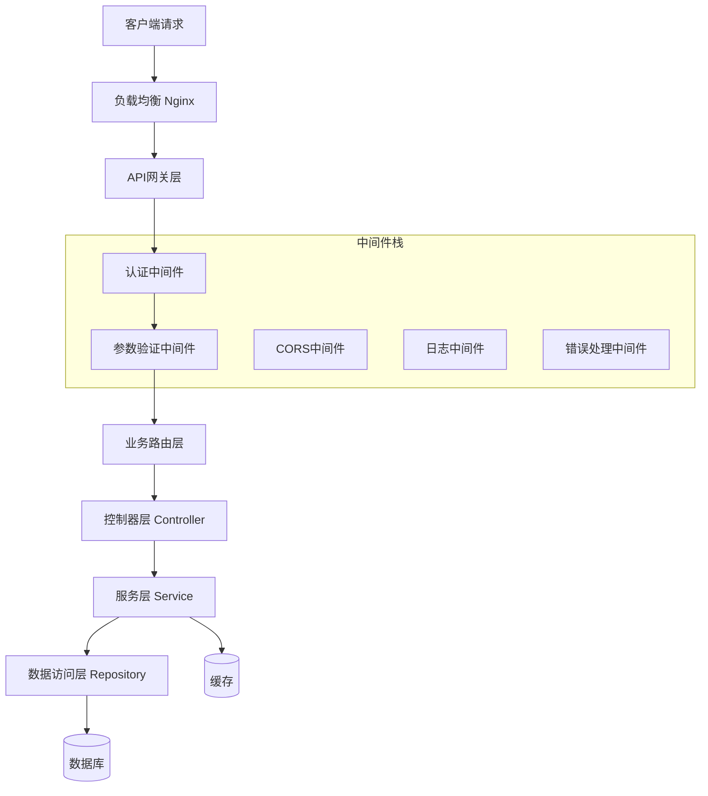

# 部门地图项目 M1 阶段技术架构文档

## 1. 架构设计

### 1.1 整体架构图



### 1.2 服务分层架构



## 2. 技术栈说明

### 2.1 核心技术

* **API服务器**: Express\@4 + TypeScript\@5

* **数据库ORM**: Prisma\@5 + PostgreSQL\@15

* **缓存系统**: Redis\@7 + ioredis\@5

* **参数验证**: Zod\@3 + express-validator\@7

* **认证授权**: JWT + bcrypt

* **文档生成**: Swagger/OpenAPI 3.0

### 2.2 开发工具

* **代码质量**: ESLint + Prettier + Husky

* **测试框架**: Jest + Supertest

* **API测试**: Postman + Newman

* **监控日志**: Winston + Morgan

* **进程管理**: PM2

### 2.3 部署环境

* **容器化**: Docker + Docker Compose

* **反向代理**: Nginx

* **数据库**: PostgreSQL 15 (主) + Redis 7 (缓存)

* **文件存储**: 本地存储 / MinIO (可选)

## 3. 路由定义

### 3.1 API路由结构

| 路由分组 | 基础路径           | 描述              |
| ---- | -------------- | --------------- |
| 认证相关 | /api/auth      | 用户登录、注册、token刷新 |
| 地图数据 | /api/maps      | 地图文件、部门信息       |
| 工位管理 | /api/desks     | 工位数据、状态查询       |
| 员工管理 | /api/employees | 员工信息、搜索功能       |
| 状态同步 | /api/status    | 心跳上报、在线状态       |
| 系统管理 | /api/admin     | 系统配置、数据管理       |

### 3.2 详细路由定义

```TypeScript
// 认证路由
POST   /api/auth/login     // 用户登录
POST   /api/auth/register  // 用户注册
POST   /api/auth/refresh   // 刷新token
POST   /api/auth/logout    // 用户登出

// 地图数据路由
GET    /api/maps           // 获取所有地图
GET    /api/maps/:id       // 获取指定地图
POST   /api/maps           // 创建新地图
PUT    /api/maps/:id       // 更新地图信息
DELETE /api/maps/:id       // 删除地图

// 工位管理路由
GET    /api/desks          // 获取工位列表
GET    /api/desks/:id      // 获取工位详情
POST   /api/desks          // 创建工位
PUT    /api/desks/:id      // 更新工位信息
DELETE /api/desks/:id      // 删除工位
GET    /api/desks/by-dept/:deptId  // 按部门获取工位

// 员工管理路由
GET    /api/employees      // 获取员工列表
GET    /api/employees/:id  // 获取员工详情
POST   /api/employees      // 创建员工
PUT    /api/employees/:id  // 更新员工信息
DELETE /api/employees/:id  // 删除员工
GET    /api/employees/search  // 搜索员工

// 状态同步路由
POST   /api/status/heartbeat    // 心跳上报
GET    /api/status/online       // 获取在线状态
GET    /api/status/dept/:id     // 获取部门状态统计
```

## 4. API接口定义

### 4.1 通用响应格式

```typescript
interface ApiResponse<T> {
  success: boolean;
  data?: T;
  message?: string;
  error?: {
    code: string;
    message: string;
    details?: any;
  };
  pagination?: {
    page: number;
    limit: number;
    total: number;
    totalPages: number;
  };
}
```

### 4.2 核心数据类型

```typescript
// 部门信息
interface Department {
  id: number;
  name: string;
  floor?: string;
  mapId?: string;
  createdAt: Date;
  updatedAt: Date;
}

// 地图信息
interface Map {
  id: string;
  type: 'svg' | 'png' | 'json';
  url: string;
  deptId?: number;
  createdAt: Date;
}

// 工位信息
interface Desk {
  id: string;
  label: string;
  deptId: number;
  x: number;
  y: number;
  w: number;
  h: number;
  createdAt: Date;
}

// 员工信息
interface Employee {
  id: number;
  name: string;
  deptId: number;
  title?: string;
  email?: string;
  phone?: string;
  createdAt: Date;
  updatedAt: Date;
}

// 工位分配
interface Assignment {
  id: number;
  employeeId: number;
  deskId: string;
  active: boolean;
  assignedAt: Date;
}

// 在线状态
interface PresenceStatus {
  userId: number;
  status: 'online' | 'offline';
  lastSeen: number;
  deskId?: string;
}
```

### 4.3 关键API示例

**获取部门工位数据**

```
GET /api/desks/by-dept/1?include=employee,assignment

Response:
{
  "success": true,
  "data": [
    {
      "id": "ENG-001",
      "label": "E01",
      "x": 100,
      "y": 100,
      "w": 60,
      "h": 40,
      "employee": {
        "id": 1,
        "name": "张三",
        "title": "前端工程师"
      },
      "status": "online"
    }
  ]
}
```

**员工搜索接口**

```
GET /api/employees/search?q=张三&dept=1&limit=10

Response:
{
  "success": true,
  "data": [
    {
      "id": 1,
      "name": "张三",
      "dept": "Engineering",
      "deskId": "ENG-001",
      "x": 100,
      "y": 100,
      "status": "online"
    }
  ],
  "pagination": {
    "page": 1,
    "limit": 10,
    "total": 1,
    "totalPages": 1
  }
}
```

## 5. 服务器架构实现

### 5.1 项目目录结构

```
api/
├── src/
│   ├── controllers/     # 控制器层
│   │   ├── auth.controller.ts
│   │   ├── maps.controller.ts
│   │   ├── desks.controller.ts
│   │   ├── employees.controller.ts
│   │   └── status.controller.ts
│   ├── services/        # 业务逻辑层
│   │   ├── auth.service.ts
│   │   ├── maps.service.ts
│   │   ├── desks.service.ts
│   │   ├── employees.service.ts
│   │   └── status.service.ts
│   ├── repositories/    # 数据访问层
│   │   ├── base.repository.ts
│   │   ├── departments.repository.ts
│   │   ├── desks.repository.ts
│   │   └── employees.repository.ts
│   ├── middleware/      # 中间件
│   │   ├── auth.middleware.ts
│   │   ├── validation.middleware.ts
│   │   ├── cors.middleware.ts
│   │   └── error.middleware.ts
│   ├── routes/          # 路由定义
│   │   ├── index.ts
│   │   ├── auth.routes.ts
│   │   ├── maps.routes.ts
│   │   ├── desks.routes.ts
│   │   ├── employees.routes.ts
│   │   └── status.routes.ts
│   ├── schemas/         # 数据验证模式
│   │   ├── auth.schema.ts
│   │   ├── maps.schema.ts
│   │   ├── desks.schema.ts
│   │   └── employees.schema.ts
│   ├── utils/           # 工具函数
│   │   ├── logger.ts
│   │   ├── redis.ts
│   │   ├── jwt.ts
│   │   └── validation.ts
│   ├── types/           # 类型定义
│   │   ├── api.types.ts
│   │   ├── auth.types.ts
│   │   └── database.types.ts
│   ├── config/          # 配置文件
│   │   ├── database.ts
│   │   ├── redis.ts
│   │   └── app.ts
│   └── app.ts           # 应用入口
├── prisma/              # 数据库相关
│   ├── schema.prisma
│   ├── migrations/
│   └── seed.ts
├── tests/               # 测试文件
│   ├── unit/
│   ├── integration/
│   └── e2e/
├── docs/                # API文档
│   └── swagger.yaml
├── docker/              # Docker配置
│   ├── Dockerfile
│   └── docker-compose.yml
└── package.json
```

### 5.2 核心服务实现

**基础仓库类**

```typescript
// src/repositories/base.repository.ts
export abstract class BaseRepository<T> {
  constructor(protected prisma: PrismaClient) {}
  
  abstract findMany(options?: any): Promise<T[]>;
  abstract findById(id: any): Promise<T | null>;
  abstract create(data: any): Promise<T>;
  abstract update(id: any, data: any): Promise<T>;
  abstract delete(id: any): Promise<void>;
}
```

**Redis缓存服务**

```typescript
// src/utils/redis.ts
import Redis from 'ioredis';

export class RedisService {
  private client: Redis;
  
  constructor() {
    this.client = new Redis({
      host: process.env.REDIS_HOST || 'localhost',
      port: parseInt(process.env.REDIS_PORT || '6379'),
      retryDelayOnFailover: 100,
      maxRetriesPerRequest: 3
    });
  }
  
  async setPresence(userId: number, status: 'online' | 'offline'): Promise<void> {
    const key = `presence:${userId}`;
    const data = {
      status,
      lastSeen: Date.now()
    };
    await this.client.setex(key, 300, JSON.stringify(data)); // 5分钟过期
  }
  
  async getPresence(userId: number): Promise<any> {
    const key = `presence:${userId}`;
    const data = await this.client.get(key);
    return data ? JSON.parse(data) : null;
  }
  
  async getDepartmentStatus(deptId: number): Promise<any[]> {
    const pattern = 'presence:*';
    const keys = await this.client.keys(pattern);
    const pipeline = this.client.pipeline();
    
    keys.forEach(key => pipeline.get(key));
    const results = await pipeline.exec();
    
    return results
      ?.map(([err, data]) => data ? JSON.parse(data as string) : null)
      .filter(Boolean) || [];
  }
}
```

## 6. 数据模型设计

### 6.1 Prisma Schema

```prisma
// prisma/schema.prisma
generator client {
  provider = "prisma-client-js"
}

datasource db {
  provider = "postgresql"
  url      = env("DATABASE_URL")
}

model Department {
  id        Int      @id @default(autoincrement())
  name      String   @unique @db.VarChar(100)
  floor     String?  @db.VarChar(50)
  mapId     String?  @db.VarChar(100)
  createdAt DateTime @default(now()) @map("created_at")
  updatedAt DateTime @updatedAt @map("updated_at")
  
  // Relations
  desks     Desk[]
  employees Employee[]
  maps      Map[]
  
  @@map("departments")
  @@index([name])
}

model Map {
  id        String   @id @db.VarChar(100)
  type      MapType
  url       String   @db.VarChar(500)
  deptId    Int?     @map("dept_id")
  createdAt DateTime @default(now()) @map("created_at")
  
  // Relations
  department Department? @relation(fields: [deptId], references: [id])
  
  @@map("maps")
}

model Desk {
  id        String   @id @db.VarChar(100)
  label     String   @db.VarChar(50)
  deptId    Int      @map("dept_id")
  x         Int
  y         Int
  w         Int      @default(60)
  h         Int      @default(40)
  createdAt DateTime @default(now()) @map("created_at")
  
  // Relations
  department  Department   @relation(fields: [deptId], references: [id])
  assignments Assignment[]
  
  @@map("desks")
  @@index([deptId])
  @@index([x, y])
}

model Employee {
  id        Int      @id @default(autoincrement())
  name      String   @db.VarChar(100)
  deptId    Int      @map("dept_id")
  title     String?  @db.VarChar(100)
  email     String?  @db.VarChar(255)
  phone     String?  @db.VarChar(20)
  createdAt DateTime @default(now()) @map("created_at")
  updatedAt DateTime @updatedAt @map("updated_at")
  
  // Relations
  department  Department   @relation(fields: [deptId], references: [id])
  assignments Assignment[]
  
  @@map("employees")
  @@index([name])
  @@index([deptId])
}

model Assignment {
  id         Int      @id @default(autoincrement())
  employeeId Int      @map("employee_id")
  deskId     String   @map("desk_id") @db.VarChar(100)
  active     Boolean  @default(true)
  assignedAt DateTime @default(now()) @map("assigned_at")
  
  // Relations
  employee Employee @relation(fields: [employeeId], references: [id])
  desk     Desk     @relation(fields: [deskId], references: [id])
  
  @@map("assignments")
  @@unique([employeeId, deskId, active], name: "unique_active_assignment")
  @@index([employeeId])
  @@index([deskId])
}

enum MapType {
  svg
  png
  json
}
```

### 6.2 数据库迁移和种子数据

```typescript
// prisma/seed.ts
import { PrismaClient } from '@prisma/client';

const prisma = new PrismaClient();

async function main() {
  // 创建部门
  const engineering = await prisma.department.create({
    data: {
      name: 'Engineering',
      floor: '2F',
      mapId: 'eng_floor_2'
    }
  });
  
  const marketing = await prisma.department.create({
    data: {
      name: 'Marketing', 
      floor: '3F',
      mapId: 'mkt_floor_3'
    }
  });
  
  // 创建地图
  await prisma.map.createMany({
    data: [
      {
        id: 'eng_floor_2',
        type: 'svg',
        url: '/maps/engineering_floor2.svg',
        deptId: engineering.id
      },
      {
        id: 'mkt_floor_3',
        type: 'svg', 
        url: '/maps/marketing_floor3.svg',
        deptId: marketing.id
      }
    ]
  });
  
  // 创建工位
  const desks = [];
  for (let i = 1; i <= 10; i++) {
    desks.push({
      id: `ENG-${i.toString().padStart(3, '0')}`,
      label: `E${i.toString().padStart(2, '0')}`,
      deptId: engineering.id,
      x: 100 + (i - 1) % 5 * 100,
      y: 100 + Math.floor((i - 1) / 5) * 100
    });
  }
  
  await prisma.desk.createMany({ data: desks });
  
  // 创建员工
  const employees = [
    { name: '张三', deptId: engineering.id, title: '前端工程师', email: 'zhangsan@company.com' },
    { name: '李四', deptId: engineering.id, title: '后端工程师', email: 'lisi@company.com' },
    { name: '王五', deptId: engineering.id, title: '全栈工程师', email: 'wangwu@company.com' },
    { name: '赵六', deptId: engineering.id, title: '测试工程师', email: 'zhaoliu@company.com' },
    { name: '钱七', deptId: engineering.id, title: '产品经理', email: 'qianqi@company.com' }
  ];
  
  for (const emp of employees) {
    const employee = await prisma.employee.create({ data: emp });
    
    // 分配工位
    await prisma.assignment.create({
      data: {
        employeeId: employee.id,
        deskId: `ENG-${employee.id.toString().padStart(3, '0')}`,
        active: true
      }
    });
  }
}

main()
  .catch(e => {
    console.error(e);
    process.exit(1);
  })
  .finally(async () => {
    await prisma.$disconnect();
  });
```

## 7. 部署配置

### 7.1 Docker配置

```dockerfile
# docker/Dockerfile
FROM node:18-alpine

WORKDIR /app

# 复制依赖文件
COPY package*.json ./
COPY prisma ./prisma/

# 安装依赖
RUN npm ci --only=production

# 生成Prisma客户端
RUN npx prisma generate

# 复制源代码
COPY src ./src
COPY tsconfig.json ./

# 构建应用
RUN npm run build

# 暴露端口
EXPOSE 3000

# 启动应用
CMD ["npm", "start"]
```

```yaml
# docker/docker-compose.yml
version: '3.9'

services:
  api:
    build:
      context: ..
      dockerfile: docker/Dockerfile
    ports:
      - "3000:3000"
    environment:
      - NODE_ENV=production
      - DATABASE_URL=postgresql://postgres:postgres@db:5432/dept_map
      - REDIS_URL=redis://redis:6379
      - JWT_SECRET=your-jwt-secret
    depends_on:
      - db
      - redis
    volumes:
      - ../uploads:/app/uploads
  
  db:
    image: postgres:15-alpine
    environment:
      - POSTGRES_DB=dept_map
      - POSTGRES_USER=postgres
      - POSTGRES_PASSWORD=postgres
    ports:
      - "5432:5432"
    volumes:
      - postgres_data:/var/lib/postgresql/data
  
  redis:
    image: redis:7-alpine
    ports:
      - "6379:6379"
    volumes:
      - redis_data:/data
  
  nginx:
    image: nginx:alpine
    ports:
      - "80:80"
    volumes:
      - ./nginx.conf:/etc/nginx/nginx.conf:ro
    depends_on:
      - api

volumes:
  postgres_data:
  redis_data:
```

### 7.2 Nginx配置

```nginx
# docker/nginx.conf
events {
    worker_connections 1024;
}

http {
    upstream api {
        server api:3000;
    }
    
    server {
        listen 80;
        
        # API代理
        location /api/ {
            proxy_pass http://api;
            proxy_set_header Host $host;
            proxy_set_header X-Real-IP $remote_addr;
            proxy_set_header X-Forwarded-For $proxy_add_x_forwarded_for;
            proxy_set_header X-Forwarded-Proto $scheme;
        }
        
        # 静态文件
        location /maps/ {
            alias /app/uploads/maps/;
            expires 1d;
            add_header Cache-Control "public, immutable";
        }
        
        # 健康检查
        location /health {
            proxy_pass http://api/health;
        }
    }
}
```

***

**M1阶段技术约束**：

* 数据库连接池大小限制为20个连接

* Redis缓存TTL统一设置为5分钟

* API响应时间要求在200ms以内

* 支持并发请求数不超过100个

* 文件上传大小限制为10MB

* 日志保留期限为30天

* 数据库备份频率为每日一次

