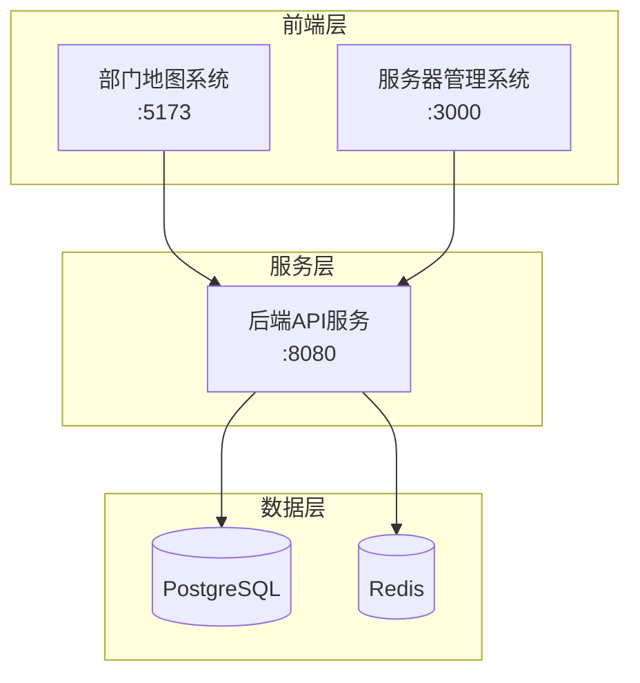

# 部门地图项目 - 项目文档

## 📋 项目概述

部门地图项目是一个基于微前端架构的企业级应用，提供部门地图可视化、人员搜索定位和服务器管理功能。项目采用多端口分离架构，确保功能模块化和系统安全性。

## 🏗️ 系统架构

### 架构图



### 端口配置

| 端口 | 系统 | 功能 | 访问地址 |
|------|------|------|----------|
| 5173 | 部门地图系统 | 地图展示、人员搜索、工位管理 | http://localhost:5173/ |
| 3000 | 服务器管理系统 | 服务器监控、系统管理 | http://localhost:3000/server-management.html |
| 8080 | 后端API服务 | 数据接口、业务逻辑 | http://localhost:8080/api/* |

## 🚀 快速开始

### 环境要求

- Node.js >= 18.0.0
- npm >= 9.0.0
- PostgreSQL >= 15.0
- Redis >= 7.0

### 安装依赖

```bash
# 安装项目依赖
npm install

# 安装数据库依赖
npm run db:setup
```

### 启动服务

```bash
# 启动部门地图系统 (5173端口)
npm run client:dev

# 启动服务器管理系统 (3000端口)
npm run server-management:dev

# 启动后端API服务 (8080端口)
npm run server:dev

# 同时启动所有服务
npm run dev:all
```

### 验证安装

访问以下地址确认服务正常运行：

- 部门地图系统：http://localhost:5173/
- 服务器管理系统：http://localhost:3000/server-management.html
- API健康检查：http://localhost:8080/api/health

## 📁 项目结构

```
部门地图/
├── src/                          # 前端源码
│   ├── main.tsx                  # 部门地图系统入口
│   ├── server-management-main.tsx # 服务器管理系统入口
│   ├── App.tsx                   # 部门地图主组件
│   ├── components/               # 共享组件
│   ├── contexts/                 # React上下文
│   └── utils/                    # 工具函数
├── api/                          # 后端API
│   ├── server.ts                 # API服务器入口
│   ├── routes/                   # 路由定义
│   ├── controllers/              # 控制器
│   ├── services/                 # 业务逻辑
│   └── models/                   # 数据模型
├── public/                       # 静态资源
├── .trae/                        # 项目文档
│   └── documents/                # 技术文档
├── vite.config.ts                # 部门地图系统配置
├── vite.server-management.config.ts # 服务器管理系统配置
├── package.json                  # 项目配置
└── README.md                     # 项目说明
```

## 🔧 端口访问规范

### 访问控制机制

**5173端口 - 部门地图系统**
- ✅ 允许访问：`/`, `/login`, `/map/*`
- ❌ 禁止访问：`/server-management.html`
- 🛡️ 防护措施：严格路径控制中间件

**3000端口 - 服务器管理系统**
- ✅ 允许访问：`/server-management.html`
- 🔄 自动重定向：根路径 `/` → `/server-management.html`
- 🛡️ 防护措施：管理员权限验证

**8080端口 - 后端API服务**
- ✅ 允许访问：`/api/*`, `/monitor`
- 🔐 需要认证：JWT令牌验证
- 🛡️ 防护措施：API访问频率限制

### 安全注意事项

1. **端口隔离**：不同端口承担不同职责，严禁跨端口访问
2. **权限控制**：每个系统都有独立的认证机制
3. **数据保护**：敏感数据传输使用HTTPS加密
4. **访问日志**：所有访问都会记录在日志中

## 🔍 故障排除指南

### 常见问题

#### 问题1：端口内容重复

**症状**：不同端口显示相同内容

**可能原因**：
- 访问控制中间件失效
- Vite配置文件错误
- 路由配置冲突

**解决步骤**：
```bash
# 1. 检查Vite配置
cat vite.config.ts
cat vite.server-management.config.ts

# 2. 重启服务
npm run dev:stop
npm run dev:all

# 3. 清除缓存
npm run cache:clear
```

#### 问题2：端口无法访问

**症状**：浏览器显示"连接被拒绝"

**可能原因**：
- 服务未启动
- 端口被占用
- 防火墙阻止

**解决步骤**：
```bash
# 1. 检查端口占用
netstat -ano | findstr :5173
netstat -ano | findstr :3000
netstat -ano | findstr :8080

# 2. 杀死占用进程
taskkill /PID <进程ID> /F

# 3. 重新启动服务
npm run client:dev
npm run server-management:dev
npm run server:dev
```

#### 问题3：API调用失败

**症状**：前端无法获取数据

**可能原因**：
- 后端服务未启动
- 数据库连接失败
- CORS配置错误

**解决步骤**：
```bash
# 1. 检查后端服务
curl http://localhost:8080/api/health

# 2. 检查数据库连接
npm run db:test

# 3. 查看错误日志
npm run logs:api
```

### 诊断工具

```bash
# 系统健康检查
npm run health:check

# 端口连通性测试
npm run test:ports

# 数据库连接测试
npm run test:db

# 完整系统测试
npm run test:system
```

### 日志查看

```bash
# 查看所有服务日志
npm run logs:all

# 查看特定服务日志
npm run logs:client      # 5173端口日志
npm run logs:management  # 3000端口日志
npm run logs:api         # 8080端口日志

# 实时监控日志
npm run logs:watch
```

## 📚 相关文档

### 核心文档

- [系统架构关联逻辑文档](./系统架构关联逻辑文档.md) - 详细的系统架构说明
- [端口配置文档](./端口配置文档.md) - 端口配置和安全策略
- [CHANGELOG](./CHANGELOG.md) - 版本更新记录

### M1阶段文档

- [M1_部门地图技术架构文档](./M1/M1_部门地图技术架构文档.md)
- [M1_部门地图产品需求文档](./M1/M1_部门地图产品需求文档.md)
- [M1_数据库设计文档](./M1/M1_数据库设计文档.md)
- [M1_API接口文档](./M1/M1_API接口文档.md)
- [M1_部署运维文档](./M1/M1_部署运维文档.md)

## 🛠️ 开发规范

### Git提交规范

```bash
# 提交格式
git commit -m "<type>: <description>"

# 类型说明
feat:     新功能
fix:      修复bug
docs:     文档更新
style:    代码格式调整
refactor: 代码重构
test:     测试相关
chore:    构建过程或辅助工具的变动
```

### 代码规范

- 使用TypeScript进行类型检查
- 遵循ESLint和Prettier配置
- 组件命名使用PascalCase
- 文件命名使用kebab-case
- 常量使用UPPER_SNAKE_CASE

### 版本管理

- 遵循语义化版本控制（SemVer）
- 主版本号.次版本号.修订号
- 每次发布前更新CHANGELOG.md

## 🤝 贡献指南

1. Fork项目到个人仓库
2. 创建功能分支：`git checkout -b feature/new-feature`
3. 提交更改：`git commit -m 'feat: add new feature'`
4. 推送分支：`git push origin feature/new-feature`
5. 创建Pull Request

## 📞 技术支持

如果遇到问题，请按以下顺序寻求帮助：

1. 查看本文档的故障排除指南
2. 检查[CHANGELOG](./CHANGELOG.md)中的已知问题
3. 搜索项目Issues中的相关问题
4. 创建新的Issue并提供详细信息

## 📄 许可证

本项目采用MIT许可证，详见LICENSE文件。

---

**最后更新**：2024年1月

**维护团队**：部门地图开发团队