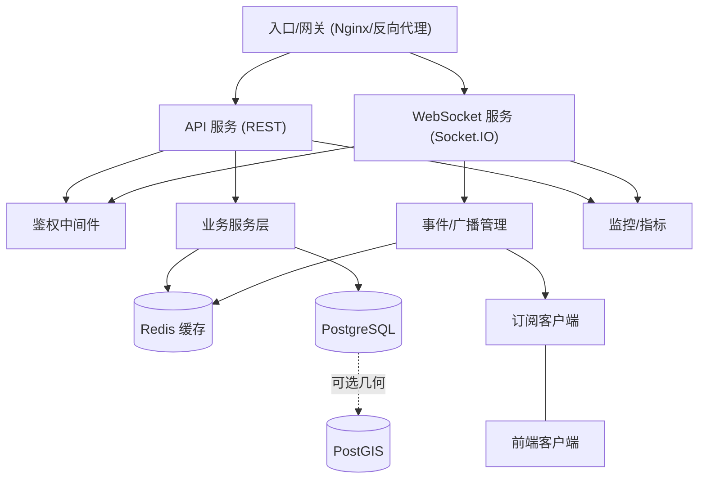
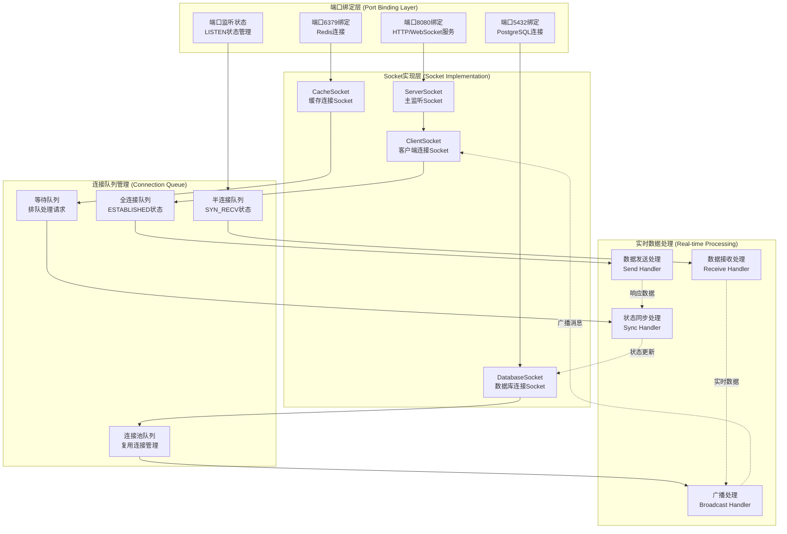
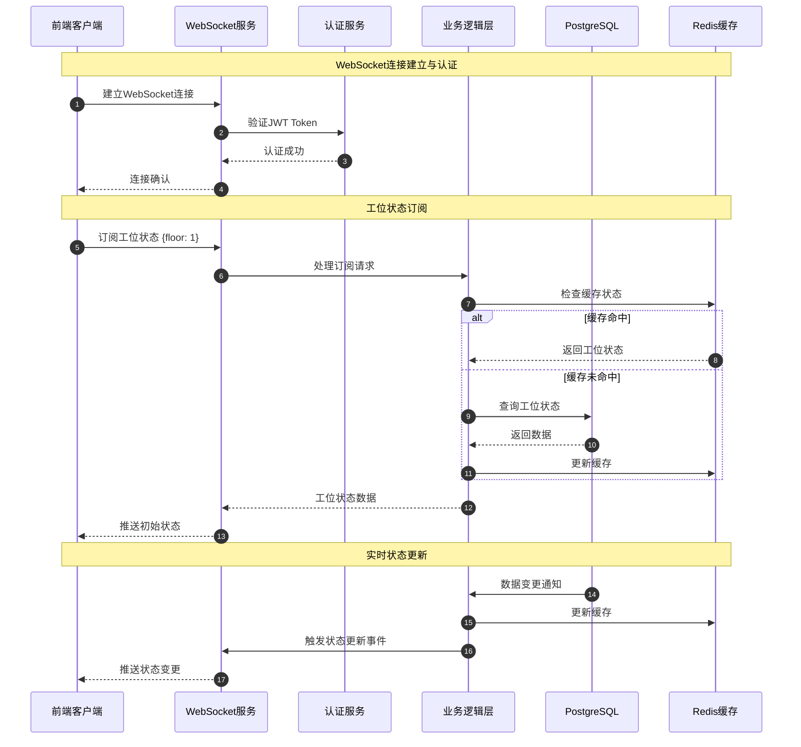
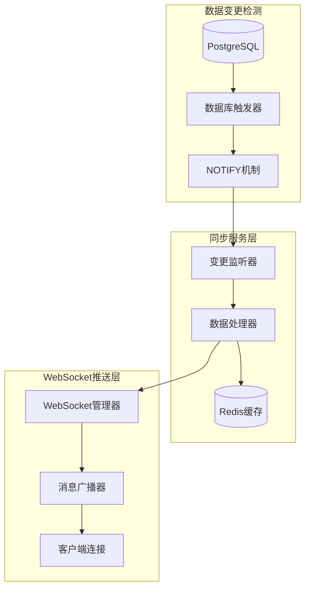
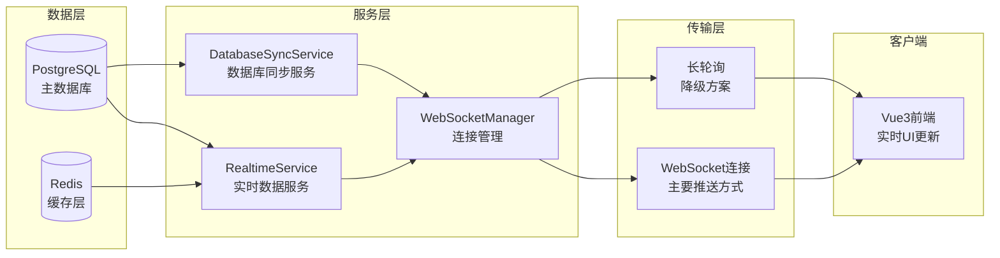
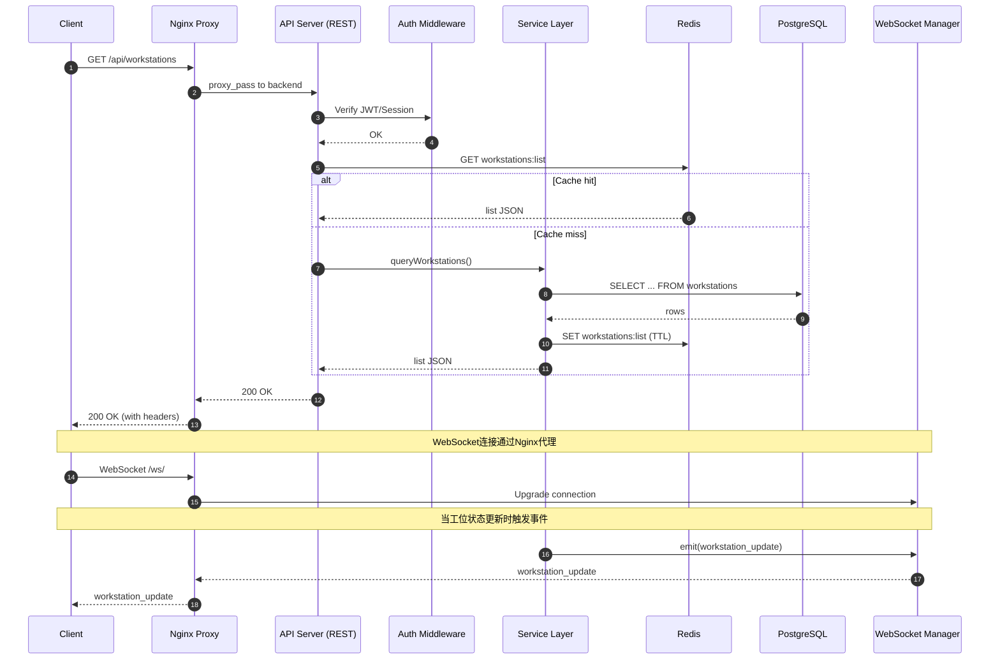
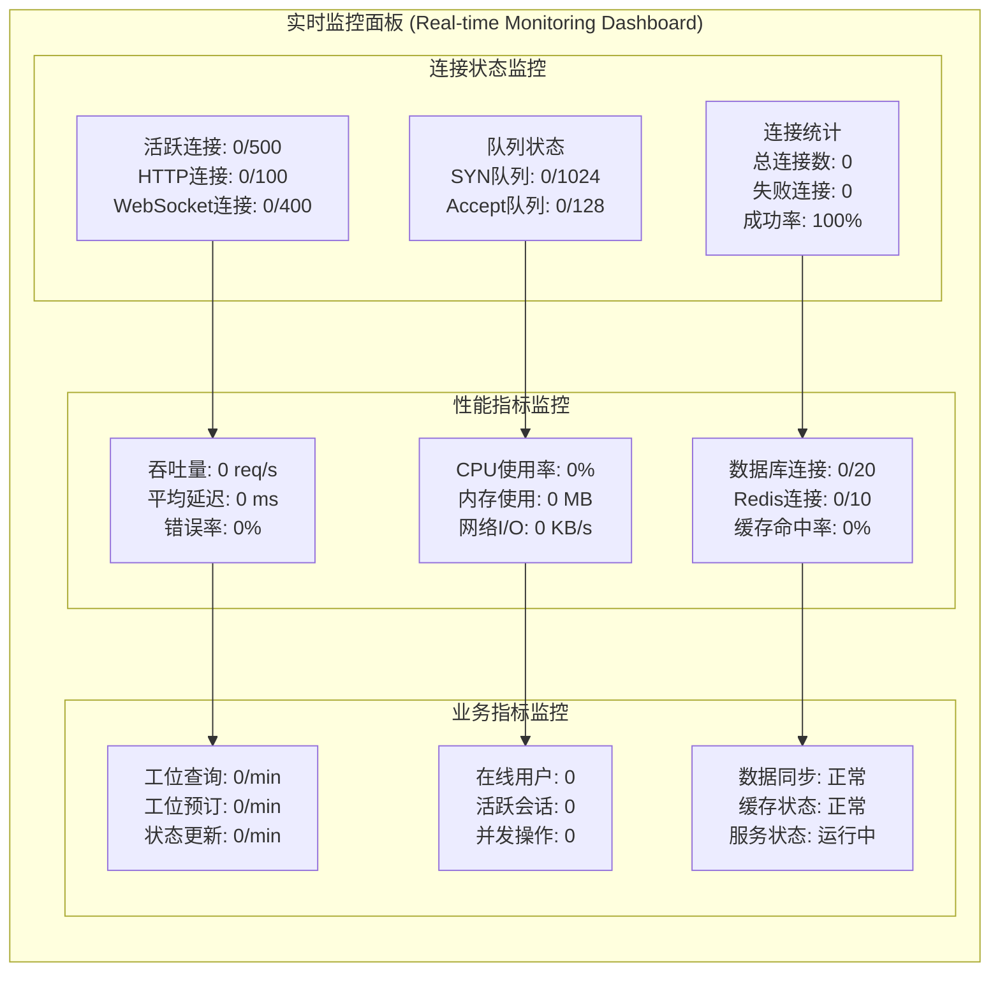

# WebSocket与PostgreSQL组件关联技术文档

## 1. 架构概述

本文档详细描述了系统中WebSocket服务与PostgreSQL数据库之间的技术关联实现，包括多连接管理、数据同步机制、性能优化和故障恢复策略。基于四层网络模型架构，实现端到端的实时通信和数据传输规范。

### 1.1 系统架构总览



核心要点：
- 入口/网关分发到 REST 与 WebSocket 服务
- 服务层对接 Redis 与 PostgreSQL，可选启用 PostGIS
- 统一鉴权与监控机制
- 事件管理负责广播与订阅

### 1.2 端口绑定机制及实时数据处理流程



## 2. WebSocket通信协议标准化规范

### 2.1 Socket监听状态定义

```typescript
// Socket监听状态枚举
enum SocketListenState {
  CLOSED = 'CLOSED',           // 关闭状态
  LISTEN = 'LISTEN',           // 监听状态
  SYN_SENT = 'SYN_SENT',       // 同步已发送
  SYN_RECV = 'SYN_RECV',       // 同步已接收
  ESTABLISHED = 'ESTABLISHED',  // 连接已建立
  FIN_WAIT_1 = 'FIN_WAIT_1',   // 终止等待1
  FIN_WAIT_2 = 'FIN_WAIT_2',   // 终止等待2
  CLOSE_WAIT = 'CLOSE_WAIT',   // 关闭等待
  CLOSING = 'CLOSING',         // 正在关闭
  LAST_ACK = 'LAST_ACK',       // 最后确认
  TIME_WAIT = 'TIME_WAIT'      // 时间等待
}

// Socket监听对象接口
interface SocketListener {
  socketId: string;            // Socket唯一标识
  port: number;                // 监听端口
  address: string;             // 绑定地址
  state: SocketListenState;    // 当前状态
  protocol: 'TCP' | 'UDP' | 'WebSocket'; // 协议类型
  
  // 连接统计
  connectionStats: {
    activeConnections: number;  // 活跃连接数
    totalConnections: number;   // 总连接数
    failedConnections: number;  // 失败连接数
    maxConnections: number;     // 最大连接数
  };
  
  // 队列状态
  queueStatus: {
    synQueue: {                // 半连接队列
      current: number;         // 当前数量
      max: number;            // 最大容量
      timeout: number;        // 超时时间(ms)
    };
    acceptQueue: {             // 全连接队列
      current: number;         // 当前数量
      max: number;            // 最大容量
      backlog: number;        // 积压数量
    };
  };
  
  // 性能指标
  performance: {
    throughput: number;        // 吞吐量(req/s)
    latency: number;          // 延迟(ms)
    errorRate: number;        // 错误率(%)
    cpuUsage: number;         // CPU使用率(%)
    memoryUsage: number;      // 内存使用率(%)
  };
  
  // 时间戳
  createdAt: Date;            // 创建时间
  lastActivity: Date;         // 最后活动时间
}
```

### 2.2 Socket管理器接口规范

```typescript
// Socket管理器接口
interface SocketManager {
  // 端口绑定
  bindPort(port: number, address?: string): Promise<SocketListener>;
  
  // 开始监听
  startListening(socketId: string): Promise<void>;
  
  // 停止监听
  stopListening(socketId: string): Promise<void>;
  
  // 获取监听状态
  getListenerState(socketId: string): SocketListener;
  
  // 获取所有监听器
  getAllListeners(): SocketListener[];
  
  // 连接处理
  acceptConnection(socketId: string): Promise<ClientConnection>;
  
  // 关闭连接
  closeConnection(connectionId: string): Promise<void>;
  
  // 广播消息
  broadcast(message: any, filter?: (conn: ClientConnection) => boolean): Promise<void>;
}
```

### 2.3 WebSocket业务逻辑层文档

#### 2.3.1 业务交互架构概述



#### 2.3.2 核心业务事件定义

```typescript
// 连接管理事件
interface ConnectionEvents {
  // 连接建立
  'connection': (socket: Socket) => void;
  
  // 连接断开
  'disconnect': (reason: string) => void;
  
  // 认证事件
  'authenticate': (token: string) => Promise<AuthResult>;
  
  // 心跳检测
  'heartbeat': () => void;
}

// 工位业务事件
interface WorkstationEvents {
  // 工位状态查询
  'workstation:query': (params: WorkstationQueryParams) => Promise<WorkstationData[]>;
  
  // 工位状态订阅
  'workstation:subscribe': (filter: WorkstationFilter) => void;
  
  // 工位状态取消订阅
  'workstation:unsubscribe': (filter: WorkstationFilter) => void;
  
  // 工位状态更新
  'workstation:update': (workstationId: string, status: WorkstationStatus) => Promise<UpdateResult>;
  
  // 工位预订
  'workstation:reserve': (workstationId: string, userId: string) => Promise<ReservationResult>;
  
  // 工位释放
  'workstation:release': (workstationId: string) => Promise<ReleaseResult>;
}

// 实时推送事件
interface RealtimePushEvents {
  // 工位状态变更推送
  'push:workstation_status': (data: WorkstationStatusUpdate) => void;
  
  // 用户在线状态推送
  'push:user_status': (data: UserStatusUpdate) => void;
  
  // 系统通知推送
  'push:system_notification': (data: SystemNotification) => void;
  
  // 楼层状态推送
  'push:floor_status': (data: FloorStatusUpdate) => void;
}
```

#### 2.3.3 业务逻辑处理流程

**工位状态同步机制：**

```typescript
class WorkstationSyncHandler {
  // 处理工位状态更新
  async handleWorkstationUpdate(workstationId: string, newStatus: WorkstationStatus): Promise<void> {
    try {
      // 1. 数据库更新
      await this.dbService.updateWorkstationStatus(workstationId, newStatus);
      
      // 2. 缓存更新
      await this.cacheService.updateWorkstationCache(workstationId, newStatus);
      
      // 3. 构建推送数据
      const updateData: WorkstationStatusUpdate = {
        workstationId,
        status: newStatus,
        timestamp: new Date(),
        floor: await this.getWorkstationFloor(workstationId)
      };
      
      // 4. 广播给订阅的客户端
      this.wsManager.broadcastToSubscribers('workstation_status_update', updateData, {
        floor: updateData.floor
      });
      
    } catch (error) {
      console.error('工位状态更新失败:', error);
      throw new BusinessError('WORKSTATION_UPDATE_FAILED', error.message);
    }
  }
  
  // 处理工位订阅
  async handleWorkstationSubscription(socket: Socket, filter: WorkstationFilter): Promise<void> {
    // 1. 验证订阅权限
    const hasPermission = await this.authService.checkSubscriptionPermission(
      socket.userId, 
      filter
    );
    
    if (!hasPermission) {
      throw new AuthError('SUBSCRIPTION_PERMISSION_DENIED');
    }
    
    // 2. 加入订阅组
    const subscriptionKey = this.generateSubscriptionKey(filter);
    await socket.join(subscriptionKey);
    
    // 3. 发送初始状态
    const initialData = await this.getWorkstationsByFilter(filter);
    socket.emit('workstation_initial_data', initialData);
    
    // 4. 记录订阅信息
    await this.subscriptionService.recordSubscription(socket.id, filter);
  }
}
```

**连接生命周期管理：**

```typescript
class ConnectionLifecycleManager {
  // 连接建立处理
  async handleConnection(socket: Socket): Promise<void> {
    console.log(`新连接建立: ${socket.id}`);
    
    // 1. 设置连接超时
    const connectionTimeout = setTimeout(() => {
      if (!socket.authenticated) {
        socket.disconnect(true);
      }
    }, this.config.authTimeout);
    
    // 2. 绑定认证事件
    socket.on('authenticate', async (token: string) => {
      try {
        const authResult = await this.authService.verifyToken(token);
        socket.userId = authResult.userId;
        socket.authenticated = true;
        clearTimeout(connectionTimeout);
        
        socket.emit('auth_success', { userId: authResult.userId });
      } catch (error) {
        socket.emit('auth_failed', { error: error.message });
        socket.disconnect(true);
      }
    });
    
    // 3. 绑定业务事件
    this.bindBusinessEvents(socket);
    
    // 4. 设置心跳检测
    this.setupHeartbeat(socket);
  }
  
  // 连接断开处理
  async handleDisconnection(socket: Socket, reason: string): Promise<void> {
    console.log(`连接断开: ${socket.id}, 原因: ${reason}`);
    
    // 1. 清理订阅信息
    await this.subscriptionService.cleanupSubscriptions(socket.id);
    
    // 2. 更新用户在线状态
    if (socket.userId) {
      await this.userStatusService.setOffline(socket.userId);
    }
    
    // 3. 清理心跳定时器
    this.clearHeartbeat(socket.id);
    
    // 4. 记录断开日志
    await this.logService.recordDisconnection(socket.id, reason);
  }
}
```

#### 2.3.4 错误处理与重连机制

**客户端重连策略：**

```typescript
class WebSocketReconnectManager {
  private reconnectAttempts = 0;
  private maxReconnectAttempts = 5;
  private reconnectDelay = 1000; // 初始延迟1秒
  private maxReconnectDelay = 30000; // 最大延迟30秒
  
  async handleReconnect(): Promise<void> {
    if (this.reconnectAttempts >= this.maxReconnectAttempts) {
      console.error('达到最大重连次数，停止重连');
      this.onReconnectFailed();
      return;
    }
    
    this.reconnectAttempts++;
    const delay = Math.min(
      this.reconnectDelay * Math.pow(2, this.reconnectAttempts - 1),
      this.maxReconnectDelay
    );
    
    console.log(`第${this.reconnectAttempts}次重连，延迟${delay}ms`);
    
    setTimeout(() => {
      this.attemptReconnect();
    }, delay);
  }
  
  private async attemptReconnect(): Promise<void> {
    try {
      await this.connect();
      this.reconnectAttempts = 0; // 重连成功，重置计数
      this.onReconnectSuccess();
    } catch (error) {
      console.error('重连失败:', error);
      this.handleReconnect(); // 继续尝试重连
    }
  }
}
```

**服务端异常处理：**

```typescript
class WebSocketErrorHandler {
  // 全局错误处理
  setupGlobalErrorHandling(io: SocketIOServer): void {
    io.engine.on('connection_error', (err) => {
      console.error('连接错误:', err);
      this.handleConnectionError(err);
    });
    
    // 处理未捕获的异常
    process.on('uncaughtException', (error) => {
      console.error('未捕获的异常:', error);
      this.handleUncaughtException(error);
    });
    
    process.on('unhandledRejection', (reason, promise) => {
      console.error('未处理的Promise拒绝:', reason);
      this.handleUnhandledRejection(reason, promise);
    });
  }
  
  // 业务错误处理
  handleBusinessError(socket: Socket, error: Error, context: string): void {
    const errorResponse = {
      type: 'business_error',
      context,
      message: error.message,
      timestamp: new Date().toISOString()
    };
    
    // 发送错误信息给客户端
    socket.emit('error', errorResponse);
    
    // 记录错误日志
    this.logService.logError(error, {
      socketId: socket.id,
      userId: socket.userId,
      context
    });
    
    // 根据错误类型决定是否断开连接
    if (this.isCriticalError(error)) {
      socket.disconnect(true);
    }
  }
}
```

## 3. PostgreSQL连接池配置和管理

### 3.1 连接池配置

```typescript
// PostgreSQL连接池配置
interface PostgreSQLPoolConfig {
  // 基础连接配置
  host: string;
  port: number;
  database: string;
  user: string;
  password: string;
  
  // 连接池配置
  min: number;          // 最小连接数
  max: number;          // 最大连接数
  acquireTimeoutMillis: number;  // 获取连接超时时间
  createTimeoutMillis: number;   // 创建连接超时时间
  destroyTimeoutMillis: number;  // 销毁连接超时时间
  idleTimeoutMillis: number;     // 空闲连接超时时间
  reapIntervalMillis: number;    // 连接回收检查间隔
  createRetryIntervalMillis: number; // 创建连接重试间隔
  
  // 连接验证
  testOnBorrow: boolean;    // 借用时测试连接
  testOnReturn: boolean;    // 归还时测试连接
  testWhileIdle: boolean;   // 空闲时测试连接
  validationQuery: string;  // 验证查询语句
  
  // SSL配置
  ssl: {
    rejectUnauthorized: boolean;
    ca?: string;
    cert?: string;
    key?: string;
  };
}

// 连接池实现
class PostgreSQLConnectionPool {
  private pool: Pool;
  private config: PostgreSQLPoolConfig;
  
  constructor(config: PostgreSQLPoolConfig) {
    this.config = config;
    this.pool = new Pool({
      host: config.host,
      port: config.port,
      database: config.database,
      user: config.user,
      password: config.password,
      min: config.min,
      max: config.max,
      acquireTimeoutMillis: config.acquireTimeoutMillis,
      createTimeoutMillis: config.createTimeoutMillis,
      destroyTimeoutMillis: config.destroyTimeoutMillis,
      idleTimeoutMillis: config.idleTimeoutMillis,
      reapIntervalMillis: config.reapIntervalMillis,
      createRetryIntervalMillis: config.createRetryIntervalMillis,
      ssl: config.ssl
    });
    
    this.setupEventHandlers();
  }
  
  private setupEventHandlers(): void {
    this.pool.on('connect', (client) => {
      console.log('新的数据库连接建立');
    });
    
    this.pool.on('error', (err, client) => {
      console.error('数据库连接错误:', err);
    });
    
    this.pool.on('remove', (client) => {
      console.log('数据库连接被移除');
    });
  }
}
```

### 3.2 数据库操作封装

```typescript
// 数据库操作基类
class DatabaseService {
  constructor(private pool: PostgreSQLConnectionPool) {}
  
  // 执行查询
  async query<T = any>(sql: string, params: any[] = []): Promise<T[]> {
    const client = await this.pool.connect();
    try {
      const result = await client.query(sql, params);
      return result.rows;
    } finally {
      client.release();
    }
  }
  
  // 执行事务
  async transaction<T>(callback: (client: PoolClient) => Promise<T>): Promise<T> {
    const client = await this.pool.connect();
    try {
      await client.query('BEGIN');
      const result = await callback(client);
      await client.query('COMMIT');
      return result;
    } catch (error) {
      await client.query('ROLLBACK');
      throw error;
    } finally {
      client.release();
    }
  }
}
```

## 4. 实时数据同步架构

### 4.1 数据同步机制



### 4.2 实时推送方案分析与优化

#### 4.2.1 当前推送机制评估

**架构分析：**



**核心组件分析：**

1. **WebSocket连接管理** (`api/websocket/manager.ts`)
   - 连接状态管理：`ConnectionState` 枚举
   - 消息类型定义：`MessageType` 枚举  
   - 用户连接信息：`UserConnection` 接口
   - 订阅频道管理：`SubscriptionChannel` 接口
   - 心跳机制：30秒间隔，3次失败后降级轮询

2. **实时数据同步服务** (`api/services/realtime.ts`)
   - 同步事件类型：`SyncEventType` 枚举
   - 数据同步接口：`SyncData` 接口
   - 订阅配置：`SubscriptionConfig` 接口
   - 连接统计：`connectionStats` 监控

3. **数据库同步服务** (`api/services/database-sync.ts`)
   - 数据库连接池：主从分离
   - Redis集成：缓存同步
   - 同步队列：`syncQueue` 处理
   - 定时同步：`syncInterval` 定时器

**推送触发机制：**
- 数据库变更 → 触发器/NOTIFY → 同步服务 → WebSocket广播
- 用户操作 → API调用 → 业务逻辑 → 状态更新 → 实时推送
- 定时同步 → 批量数据检查 → 增量更新 → 客户端同步

#### 4.2.2 性能优化建议

**1. 消息批处理优化**

```typescript
class MessageBatchProcessor {
  private batchQueue: Map<string, any[]> = new Map();
  private batchTimeout: Map<string, NodeJS.Timeout> = new Map();
  private readonly BATCH_SIZE = 50;
  private readonly BATCH_DELAY = 100; // 100ms批处理延迟
  
  // 添加消息到批处理队列
  addToBatch(channel: string, message: any): void {
    if (!this.batchQueue.has(channel)) {
      this.batchQueue.set(channel, []);
    }
    
    const queue = this.batchQueue.get(channel)!;
    queue.push(message);
    
    // 达到批处理大小立即发送
    if (queue.length >= this.BATCH_SIZE) {
      this.flushBatch(channel);
    } else {
      // 设置延迟发送
      this.scheduleBatchFlush(channel);
    }
  }
  
  private scheduleBatchFlush(channel: string): void {
    if (this.batchTimeout.has(channel)) {
      return; // 已有定时器
    }
    
    const timeout = setTimeout(() => {
      this.flushBatch(channel);
    }, this.BATCH_DELAY);
    
    this.batchTimeout.set(channel, timeout);
  }
  
  private flushBatch(channel: string): void {
    const queue = this.batchQueue.get(channel);
    if (!queue || queue.length === 0) return;
    
    // 发送批量消息
    this.webSocketManager.broadcastBatch(channel, queue);
    
    // 清理
    this.batchQueue.set(channel, []);
    const timeout = this.batchTimeout.get(channel);
    if (timeout) {
      clearTimeout(timeout);
      this.batchTimeout.delete(channel);
    }
  }
}
```

**2. 连接池优化**

```typescript
class OptimizedConnectionPool {
  private activeConnections: Map<string, WebSocketConnection> = new Map();
  private connectionGroups: Map<string, Set<string>> = new Map();
  
  // 按楼层/部门分组管理连接
  groupConnectionsByContext(socketId: string, context: ConnectionContext): void {
    const groupKey = `${context.floor}_${context.department}`;
    
    if (!this.connectionGroups.has(groupKey)) {
      this.connectionGroups.set(groupKey, new Set());
    }
    
    this.connectionGroups.get(groupKey)!.add(socketId);
  }
  
  // 精准推送到特定分组
  broadcastToGroup(groupKey: string, message: any): void {
    const connections = this.connectionGroups.get(groupKey);
    if (!connections) return;
    
    const batch = Array.from(connections).map(socketId => ({
      socketId,
      message
    }));
    
    // 批量发送，减少系统调用
    this.batchSend(batch);
  }
}
```

**3. 长轮询降级机制**

```typescript
class PollingFallbackManager {
  private pollingClients: Map<string, PollingClient> = new Map();
  
  // WebSocket连接失败时启用轮询
  enablePollingFallback(clientId: string, config: PollingConfig): void {
    const pollingClient: PollingClient = {
      clientId,
      lastPoll: new Date(),
      interval: config.interval || 5000, // 默认5秒轮询
      subscriptions: new Set(),
      active: true
    };
    
    this.pollingClients.set(clientId, pollingClient);
    this.startPollingLoop(clientId);
  }
  
  private async startPollingLoop(clientId: string): Promise<void> {
    const client = this.pollingClients.get(clientId);
    if (!client || !client.active) return;
    
    try {
      // 获取增量更新
      const updates = await this.getIncrementalUpdates(
        clientId, 
        client.lastPoll
      );
      
      if (updates.length > 0) {
        // 通过HTTP响应返回更新
        await this.sendPollingResponse(clientId, updates);
      }
      
      client.lastPoll = new Date();
    } catch (error) {
      console.error(`轮询客户端${clientId}错误:`, error);
    }
    
    // 调度下次轮询
    setTimeout(() => {
      this.startPollingLoop(clientId);
    }, client.interval);
  }
}
```

#### 4.2.3 方案匹配度评估

**当前实现优势：**
- ✅ 真正的服务端推送：基于WebSocket实现双向实时通信
- ✅ 连接管理完善：心跳检测、状态监控、异常处理
- ✅ 数据库集成：PostgreSQL + Redis双层存储
- ✅ 事件驱动架构：支持订阅/发布模式

**需要优化的方面：**
- ⚠️ 批处理机制：当前缺少消息批处理，高并发时可能影响性能
- ⚠️ 连接分组：未实现基于业务上下文的连接分组管理
- ⚠️ 降级策略：长轮询降级机制需要完善实现
- ⚠️ 监控告警：缺少详细的性能监控和告警机制

**最终建议：**
1. **保持WebSocket为主**：当前架构已实现真正的服务端推送，性能优异
2. **增加长轮询降级**：完善WebSocket连接失败时的降级方案
3. **优化批处理机制**：实现消息批处理，提升高并发场景性能
4. **完善监控告警**：增加连接数、延迟、错误率等关键指标监控

## 5. 组件间数据流和通信协议

### 5.1 Workstation数据结构说明

**Workstation（工位）** 是本系统的核心业务实体，代表办公室中的物理工作位置。

**数据库表结构（PostgreSQL）：**

```sql
CREATE TABLE workstations (
    id SERIAL PRIMARY KEY,                    -- 工位唯一标识
    name VARCHAR(100) NOT NULL,               -- 工位名称（如"A区-001"）
    department_id INTEGER REFERENCES departments(id), -- 所属部门
    employee_id INTEGER REFERENCES employees(id),     -- 当前使用员工
    x_position DECIMAL(10,2) NOT NULL,       -- X坐标（像素/米）
    y_position DECIMAL(10,2) NOT NULL,       -- Y坐标（像素/米）
    width DECIMAL(10,2) DEFAULT 120,         -- 工位宽度
    height DECIMAL(10,2) DEFAULT 80,         -- 工位高度
    status VARCHAR(20) DEFAULT 'available'   -- 状态枚举
        CHECK (status IN ('available', 'occupied', 'maintenance', 'reserved')),
    equipment TEXT,                          -- 设备清单（JSON字符串）
    notes TEXT,                              -- 备注信息
    floor_number INTEGER,                    -- 楼层号
    building VARCHAR(50),                    -- 建筑物名称
    created_at TIMESTAMP DEFAULT CURRENT_TIMESTAMP,
    updated_at TIMESTAMP DEFAULT CURRENT_TIMESTAMP
);
```

### 5.2 API接口定义

**REST API接口：**
- `GET /api/workstations` - 获取工位列表（支持分页、筛选）
- `GET /api/workstations/:id` - 获取单个工位详情
- `POST /api/workstations` - 创建新工位
- `PUT /api/workstations/:id` - 更新工位信息
- `DELETE /api/workstations/:id` - 删除工位
- `GET /api/workstations/stats` - 获取工位统计信息

**WebSocket事件：**
- `workstation_update` - 工位状态变更通知
- `workstation_created` - 新工位创建通知
- `workstation_deleted` - 工位删除通知

### 5.3 数据流时序图



## 6. 故障恢复和监控机制

### 6.1 8080端口实时监控面板



### 6.2 故障恢复策略

```typescript
// 故障恢复管理器
class FaultRecoveryManager {
  // 数据库连接故障恢复
  async handleDatabaseFailure(): Promise<void> {
    console.log('检测到数据库连接故障，开始恢复流程');
    
    // 1. 切换到备用数据库
    await this.switchToBackupDatabase();
    
    // 2. 重建连接池
    await this.rebuildConnectionPool();
    
    // 3. 验证连接状态
    const isHealthy = await this.verifyDatabaseHealth();
    
    if (isHealthy) {
      console.log('数据库故障恢复成功');
    } else {
      console.error('数据库故障恢复失败，启用只读模式');
      await this.enableReadOnlyMode();
    }
  }
  
  // WebSocket服务故障恢复
  async handleWebSocketFailure(): Promise<void> {
    console.log('检测到WebSocket服务故障，开始恢复流程');
    
    // 1. 重启WebSocket服务器
    await this.restartWebSocketServer();
    
    // 2. 恢复客户端连接
    await this.restoreClientConnections();
    
    // 3. 重新建立订阅关系
    await this.restoreSubscriptions();
  }
}
```

## 7. 安全与合规

### 7.1 安全配置

```typescript
// WebSocket安全配置
interface WebSocketSecurityConfig {
  // CORS配置
  cors: {
    origin: string[];
    credentials: boolean;
  };
  
  // 连接限制
  connectionLimits: {
    maxConnections: number;
    maxConnectionsPerIP: number;
    connectionTimeout: number;
  };
  
  // 认证配置
  authentication: {
    required: boolean;
    tokenExpiry: number;
    refreshTokenExpiry: number;
  };
  
  // 数据加密
  encryption: {
    enabled: boolean;
    algorithm: string;
    keyRotationInterval: number;
  };
}
```

### 7.2 数据保护

- 座位坐标、员工工号属于敏感数据，接口全部走 HTTPS
- GraphQL 屏蔽敏感字段
- Redis 座位锁 key 加随机盐，防止恶意遍历
- 合并代码前必须通过安全审计

## 8. 最佳实践和优化建议

### 8.1 性能优化

1. **连接池优化**
   - 数据库连接池：主从分离，读写分离
   - WebSocket连接池：按业务分组管理
   - Redis连接池：集群模式，分片存储

2. **缓存策略**
   - 多级缓存：内存缓存 + Redis缓存
   - 缓存预热：系统启动时预加载热点数据
   - 缓存更新：实时更新 + 定时刷新

3. **消息优化**
   - 消息批处理：减少网络开销
   - 消息压缩：大数据量时启用压缩
   - 消息去重：防止重复推送

### 8.2 监控告警

1. **关键指标监控**
   - 连接数：活跃连接、总连接数
   - 性能指标：延迟、吞吐量、错误率
   - 资源使用：CPU、内存、网络I/O

2. **告警机制**
   - 阈值告警：超过预设阈值时触发
   - 趋势告警：指标异常变化时触发
   - 业务告警：关键业务流程异常时触发

### 8.3 运维规范

1. **部署规范**
   - 蓝绿发布：零停机部署
   - 灰度发布：逐步推广新版本
   - 回滚机制：快速回滚到稳定版本

2. **日志管理**
   - 结构化日志：统一日志格式
   - 日志分级：按重要程度分级
   - 日志轮转：定期清理历史日志

---

**文档版本：** v2.0.0  
**最后更新：** 2024年12月  
**维护人员：** 技术架构团队