# WebSocket与PostgreSQL组件关联技术文档

## 1. 架构概述

本文档详细描述了系统中WebSocket服务与PostgreSQL数据库之间的技术关联实现，包括多连接管理、数据同步机制、性能优化和故障恢复策略。基于四层网络模型架构，实现端到端的实时通信和数据传输规范。

## 2. WebSocket通信协议标准化规范

## 6. API服务器Socket实现规范

### 6.1 端口绑定机制及实时数据处理流程

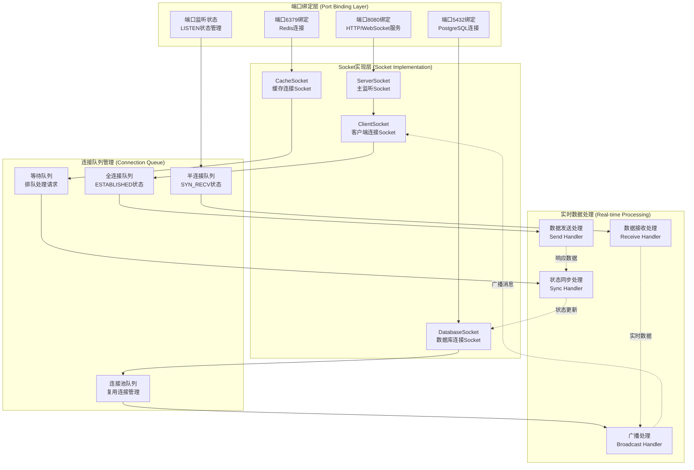

### 6.2 监听状态的对象定义及接口规范

```typescript
// Socket监听状态枚举
enum SocketListenState {
  CLOSED = 'CLOSED',           // 关闭状态
  LISTEN = 'LISTEN',           // 监听状态
  SYN_SENT = 'SYN_SENT',       // 同步已发送
  SYN_RECV = 'SYN_RECV',       // 同步已接收
  ESTABLISHED = 'ESTABLISHED',  // 连接已建立
  FIN_WAIT_1 = 'FIN_WAIT_1',   // 终止等待1
  FIN_WAIT_2 = 'FIN_WAIT_2',   // 终止等待2
  CLOSE_WAIT = 'CLOSE_WAIT',   // 关闭等待
  CLOSING = 'CLOSING',         // 正在关闭
  LAST_ACK = 'LAST_ACK',       // 最后确认
  TIME_WAIT = 'TIME_WAIT'      // 时间等待
}

// Socket监听对象接口
interface SocketListener {
  socketId: string;            // Socket唯一标识
  port: number;                // 监听端口
  address: string;             // 绑定地址
  state: SocketListenState;    // 当前状态
  protocol: 'TCP' | 'UDP' | 'WebSocket'; // 协议类型
  
  // 连接统计
  connectionStats: {
    activeConnections: number;  // 活跃连接数
    totalConnections: number;   // 总连接数
    failedConnections: number;  // 失败连接数
    maxConnections: number;     // 最大连接数
  };
  
  // 队列状态
  queueStatus: {
    synQueue: {                // 半连接队列
      current: number;         // 当前数量
      max: number;            // 最大容量
      timeout: number;        // 超时时间(ms)
    };
    acceptQueue: {             // 全连接队列
      current: number;         // 当前数量
      max: number;            // 最大容量
      backlog: number;        // 积压数量
    };
  };
  
  // 性能指标
  performance: {
    throughput: number;        // 吞吐量(req/s)
    latency: number;          // 延迟(ms)
    errorRate: number;        // 错误率(%)
    cpuUsage: number;         // CPU使用率(%)
    memoryUsage: number;      // 内存使用率(%)
  };
  
  // 时间戳
  createdAt: Date;            // 创建时间
  lastActivity: Date;         // 最后活动时间
}

// Socket管理器接口
interface SocketManager {
  // 端口绑定
  bindPort(port: number, address?: string): Promise<SocketListener>;
  
  // 开始监听
  startListening(socketId: string): Promise<void>;
  
  // 停止监听
  stopListening(socketId: string): Promise<void>;
  
  // 获取监听状态
  getListenerState(socketId: string): SocketListener;
  
  // 获取所有监听器
  getAllListeners(): SocketListener[];
  
  // 连接处理
  acceptConnection(socketId: string): Promise<ClientConnection>;
  
  // 关闭连接
  closeConnection(connectionId: string): Promise<void>;
  
  // 广播消息
  broadcast(message: any, filter?: (conn: ClientConnection) => boolean): Promise<void>;
}
```

### 6.3 半连接队列和全连接队列实现细节 ※ 不兼容（应用层不直接管理TCP队列）

不兼容说明：

* 当前项目后端使用 `Express + Socket.IO` 在应用层实现实时通信，TCP三次握手与半连接/全连接队列由操作系统内核管理；Node.js 应用无法、也不应直接操控 OS 级的 SYN/Accept 队列。

* 项目已有的连接管理与限流在 WebSocket 层通过 `WebSocketConnectionManager`（连接数限制、IP并发限制、心跳与健康检查）实现，满足需求侧的稳定性与可观测性目标。

修改建议（规范迁移到系统层）：

* 使用系统参数控制队列与积压：`net.ipv4.tcp_max_syn_backlog`、`net.core.somaxconn`、`net.ipv4.tcp_synack_retries`。

* 在服务运维脚本中 增加端口与队列监控与告警（参考 `scripts/check-services.cjs` 的端口检测函数，可扩展统计和报警逻辑）。

* 在文档中将本章节定位为“系统运维规范”，应用层以 WebSocket 连接池与心跳替代。

```typescript
// 半连接队列实现 (SYN Queue)
class SynQueue {
  private queue: Map<string, SynConnection> = new Map();
  private readonly maxSize: number;
  private readonly timeout: number;
  
  constructor(maxSize: number = 1024, timeout: number = 60000) {
    this.maxSize = maxSize;
    this.timeout = timeout;
    
    // 定时清理超时连接
    setInterval(() => this.cleanupTimeoutConnections(), 10000);
  }
  
  // 添加半连接
  addSynConnection(clientAddr: string, serverPort: number): boolean {
    if (this.queue.size >= this.maxSize) {
      console.warn('SYN队列已满，拒绝新连接');
      return false;
    }
    
    const connectionId = `${clientAddr}:${serverPort}`;
    const synConnection: SynConnection = {
      id: connectionId,
      clientAddress: clientAddr,
      serverPort: serverPort,
      state: SocketListenState.SYN_RECV,
      timestamp: new Date(),
      retryCount: 0
    };
    
    this.queue.set(connectionId, synConnection);
    return true;
  }
  
  // 完成三次握手，移动到全连接队列
  completeSynConnection(connectionId: string): SynConnection | null {
    const synConn = this.queue.get(connectionId);
    if (synConn) {
      this.queue.delete(connectionId);
      return synConn;
    }
    return null;
  }
  
  // 清理超时连接
  private cleanupTimeoutConnections(): void {
    const now = new Date();
    for (const [id, conn] of this.queue.entries()) {
      if (now.getTime() - conn.timestamp.getTime() > this.timeout) {
        this.queue.delete(id);
        console.log(`清理超时SYN连接: ${id}`);
      }
    }
  }
  
  // 获取队列状态
  getQueueStatus(): { current: number; max: number; timeout: number } {
    return {
      current: this.queue.size,
      max: this.maxSize,
      timeout: this.timeout
    };
  }
}

// 全连接队列实现 (Accept Queue)
class AcceptQueue {
  private queue: ClientConnection[] = [];
  private readonly maxSize: number;
  private readonly backlogLimit: number;
  
  constructor(maxSize: number = 128, backlogLimit: number = 50) {
    this.maxSize = maxSize;
    this.backlogLimit = backlogLimit;
  }
  
  // 添加已建立的连接
  addEstablishedConnection(connection: ClientConnection): boolean {
    if (this.queue.length >= this.maxSize) {
      console.warn('Accept队列已满，连接将被丢弃');
      return false;
    }
    
    connection.state = SocketListenState.ESTABLISHED;
    connection.establishedAt = new Date();
    this.queue.push(connection);
    
    return true;
  }
  
  // 应用程序接受连接
  acceptConnection(): ClientConnection | null {
    return this.queue.shift() || null;
  }
  
  // 获取队列状态
  getQueueStatus(): { current: number; max: number; backlog: number } {
    return {
      current: this.queue.length,
      max: this.maxSize,
      backlog: Math.max(0, this.queue.length - this.backlogLimit)
    };
  }
  
  // 清理断开的连接
  cleanupDisconnectedConnections(): void {
    this.queue = this.queue.filter(conn => 
      conn.state === SocketListenState.ESTABLISHED
    );
  }
}

// 连接对象定义
interface SynConnection {
  id: string;
  clientAddress: string;
  serverPort: number;
  state: SocketListenState;
  timestamp: Date;
  retryCount: number;
}

interface ClientConnection {
  id: string;
  clientAddress: string;
  serverPort: number;
  state: SocketListenState;
  socket: any; // 实际的Socket对象
  establishedAt?: Date;
  lastActivity: Date;
  
  // WebSocket特有属性
  isWebSocket?: boolean;
  protocol?: string;
  extensions?: string[];
  
  // 用户信息
  userId?: string;
  sessionId?: string;
  
  // 统计信息
  bytesReceived: number;
  bytesSent: number;
  messagesReceived: number;
  messagesSent: number;
}
```

### 6.4 8080端口功能可视化 △ 部分不兼容（房间管理与OS队列未在应用层实现）

说明：可视化中包含“房间管理器（W4）”、“半连接/全连接队列（Q1/Q2）”，当前项目未在应用层实现房间与 OS 级队列管理。现有实现已具备连接管理、心跳、广播、数据库通知订阅与Redis缓存集成；房间分组如需启用，建议基于 Socket.IO 的 `rooms` 能力增量实现。

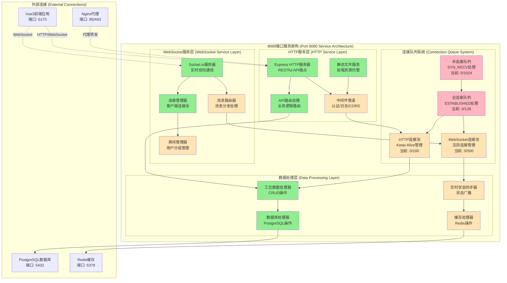

### 6.5 项目功能实现状态说明

#### 6.5.1 已实现功能 (✅ Implemented)

```typescript
// 已实现的Socket服务器基础功能
class ImplementedSocketServer {
  // ✅ 基础HTTP服务器
  private httpServer: http.Server;
  
  // ✅ Express应用实例
  private app: express.Application;
  
  // ✅ Socket.io服务器
  private io: SocketIOServer;
  
  // ✅ 基础端口绑定
  async bindPort8080(): Promise<void> {
    this.httpServer.listen(8080, () => {
      console.log('服务器已在端口8080启动');
    });
  }
  
  // ✅ 基础WebSocket连接处理
  handleWebSocketConnection(socket: Socket): void {
    console.log(`新的WebSocket连接: ${socket.id}`);
    
    socket.on('disconnect', () => {
      console.log(`WebSocket连接断开: ${socket.id}`);
    });
  }
  
  // ✅ 基础HTTP路由
  setupBasicRoutes(): void {
    this.app.get('/api/workstations', (req, res) => {
      // 基础工位查询功能
    });
    
    this.app.post('/api/workstations', (req, res) => {
      // 基础工位创建功能
    });
  }
}
```

#### 6.5.2 待实现功能 (⚠️ Pending)

```typescript
// 待实现的高级功能
class PendingSocketFeatures {
  // ⚠️ 连接队列管理
  private synQueue: SynQueue;           // 需要实现
  private acceptQueue: AcceptQueue;     // 需要实现
  
  // ⚠️ 高级中间件
  setupAdvancedMiddleware(): void {
    // JWT认证中间件 - 待实现
    // 请求限流中间件 - 待实现
    // 错误处理中间件 - 待实现
    // 日志记录中间件 - 待实现
  }
  
  // ⚠️ WebSocket房间管理
  setupRoomManagement(): void {
    // 用户分组功能 - 待实现
    // 楼层房间管理 - 待实现
    // 权限控制 - 待实现
  }
  
  // ⚠️ 实时状态同步
  setupRealTimeSync(): void {
    // 工位状态广播 - 待实现
    // 用户在线状态 - 待实现
    // 系统状态监控 - 待实现
  }
  
  // ⚠️ 缓存集成
  setupCacheIntegration(): void {
    // Redis连接池 - 待实现
    // 缓存策略 - 待实现
    // 缓存失效机制 - 待实现
  }
}
```

#### 6.5.3 关键功能 (🔴 Critical)

```typescript
// 关键待实现功能 (影响系统稳定性)
class CriticalSocketFeatures {
  // 🔴 TCP连接队列 (系统稳定性关键)
  implementTCPQueues(): void {
    // 半连接队列防SYN Flood攻击
    // 全连接队列防连接耗尽
    // 队列监控和告警
  }
  
  // 🔴 连接池管理 (性能关键)
  implementConnectionPooling(): void {
    // 数据库连接池
    // WebSocket连接池
    // 连接复用机制
  }
  
  // 🔴 错误恢复机制 (可靠性关键)
  implementErrorRecovery(): void {
    // 连接断开重连
    // 数据传输重试
    // 服务降级策略
  }
  
  // 🔴 性能监控 (运维关键)
  implementPerformanceMonitoring(): void {
    // 实时性能指标
    // 告警机制
    // 日志分析
  }
}
```

### 6.6 8080端口实时监控面板

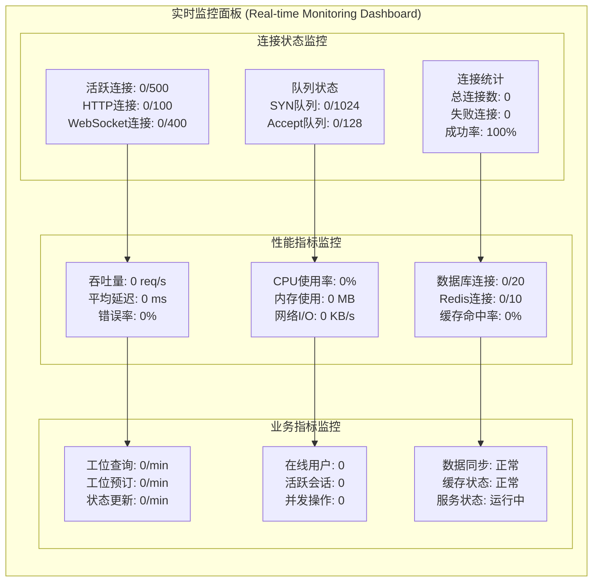

## 7. API服务架构深度分析与优化建议

### 7.1 架构总览

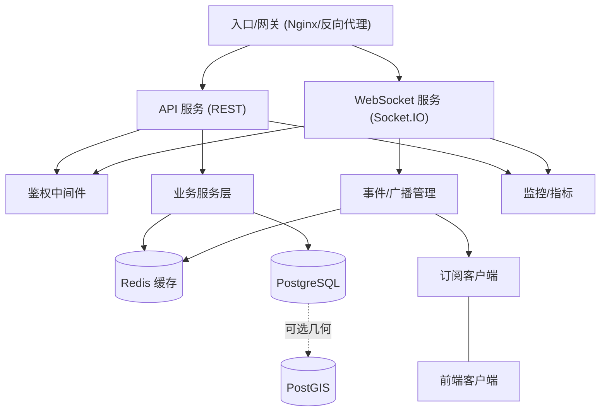

* 核心要点：入口/网关分发到 `REST` 与 `WebSocket`；服务层对接 `Redis` 与 `PostgreSQL`，可选启用 `PostGIS`；统一鉴权与监控；事件管理负责广播与订阅。

### 7.2 运行逻辑与协作关系

#### 7.2.1 Workstation 数据结构说明

**Workstation（工位）** 是本系统的核心业务实体，代表办公室中的物理工作位置。在时序图中的 `workstations` 指的是工位信息的集合数据。

**数据库表结构（PostgreSQL）：**
```sql
CREATE TABLE workstations (
    id SERIAL PRIMARY KEY,                    -- 工位唯一标识
    name VARCHAR(100) NOT NULL,               -- 工位名称（如"A区-001"）
    department_id INTEGER REFERENCES departments(id), -- 所属部门
    employee_id INTEGER REFERENCES employees(id),     -- 当前使用员工
    x_position DECIMAL(10,2) NOT NULL,       -- X坐标（像素/米）
    y_position DECIMAL(10,2) NOT NULL,       -- Y坐标（像素/米）
    width DECIMAL(10,2) DEFAULT 120,         -- 工位宽度
    height DECIMAL(10,2) DEFAULT 80,         -- 工位高度
    status VARCHAR(20) DEFAULT 'available'   -- 状态枚举
        CHECK (status IN ('available', 'occupied', 'maintenance', 'reserved')),
    equipment TEXT,                          -- 设备清单（JSON字符串）
    notes TEXT,                              -- 备注信息
    floor_number INTEGER,                    -- 楼层号
    building VARCHAR(50),                    -- 建筑物名称
    created_at TIMESTAMP DEFAULT CURRENT_TIMESTAMP,
    updated_at TIMESTAMP DEFAULT CURRENT_TIMESTAMP
);
```

**API 接口定义：**
- `GET /api/workstations` - 获取工位列表（支持分页、筛选）
- `GET /api/workstations/:id` - 获取单个工位详情
- `POST /api/workstations` - 创建新工位
- `PUT /api/workstations/:id` - 更新工位信息
- `DELETE /api/workstations/:id` - 删除工位
- `GET /api/workstations/stats` - 获取工位统计信息

**WebSocket 事件：**
- `workstation_update` - 工位状态变更通知
- `workstation_created` - 新工位创建通知
- `workstation_deleted` - 工位删除通知

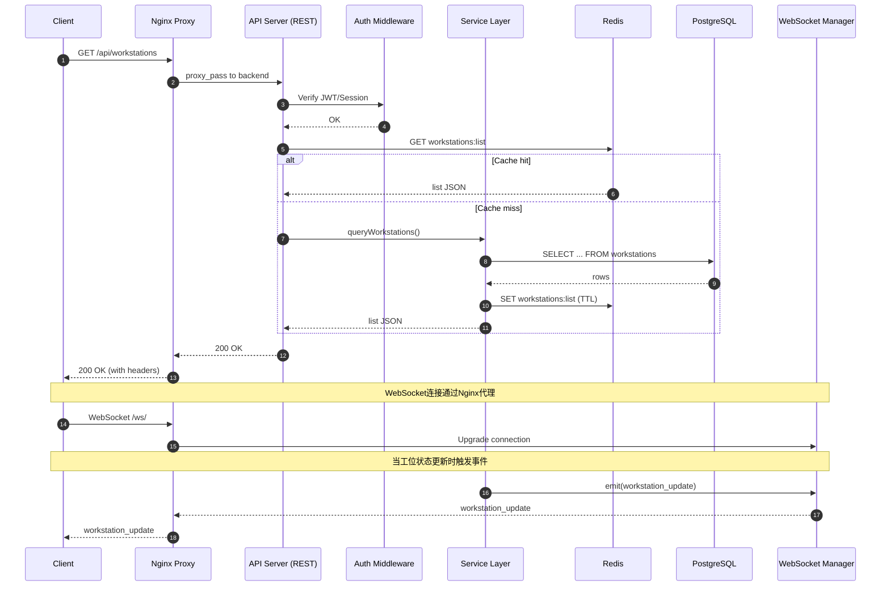

* 模块职责：

  * `Nginx Proxy`：反向代理、负载均衡、TLS终端、静态资源缓存、WebSocket升级、错误处理（404/50x）。

  * `API Server`：REST接口、输入校验、错误处理、鉴权中间件。

  * `Service Layer`：业务编排、缓存读写、数据库访问、事件触发。

  * `WebSocket Manager`：会话管理、房间/命名空间、事件广播/重试。

  * `Redis`：热点数据缓存、发布/订阅、会话/速率限制辅助。

  * `PostgreSQL/PostGIS`：事务与查询；空间索引/几何分析（若启用）。

  * `监控与日志`：健康检查、指标上报、审计日志与告警。

### 7.3 性能评估

* 连接管理：REST走短连接，WS保持长连接；建议开启 `keep-alive` 与 `HTTP/2`。

* 线程与事件：Node 事件驱动适合高并发 IO；CPU 密集型建议下沉到 Worker/外部服务。

* 缓存策略：读多写少的工位查询应优先命中 `Redis`，设置合理 TTL 与失效策略。

* 数据库：使用连接池，避免 N+1 查询；对热点列建立索引；若使用 PostGIS，合理选择 `GIST`/`SP-GiST`。

* 广播效率：Socket.IO 广播应基于房间/命名空间，不要对所有连接全量广播。

* 监控采样：关键接口统计 P95/P99 延迟、吞吐与错误率；队列长度与连接数实时可视化。

### 7.4 可扩展性评估

* 横向扩展：启用 Socket.IO Redis 适配器，实现多实例之间事件同步。

* 无状态化：REST 层保持无状态，使用共享缓存/会话存储以支持多副本。

* 事件标准化：统一事件命名与版本号，避免前后端耦合；新增事件向后兼容。

* 资源隔离：WS 使用房间/命名空间隔离不同业务线或部门数据。

* 配置化：端点、速率限制、缓存 TTL、广播策略通过配置管理统一下发。

### 7.5 安全性评估

* 鉴权与授权：REST 与 WS 握手阶段强制校验 `JWT/Session` 与权限；对关键操作实施细粒度授权。

* 输入校验：统一的 DTO/Schema 校验（如 `zod/joi`），防止注入与越权参数。

* 传输安全：启用 TLS、严格 `CORS`/`Origin` 白名单；WS 限制跨域来源。

* 速率限制：对 IP、用户、令牌实施速率限制与防爆破策略，结合 `Redis` 计数。

* 审计与告警：高风险操作写审计日志；异常指标告警（错误率、失败连接、CPU/内存飙升）。

### 7.6 优化建议与落地任务

1. 连接与广播

   * 启用 Socket.IO Redis 适配器与房间机制，减少全量广播。

   * WS 心跳与断线重连策略可配置化，记录会话状态与活跃度。

2. 缓存与数据库

   * 建立工位/部门查询缓存键约定，设置合理 TTL 与失效策略（写入事件触发失效）。

   * 数据库连接池参数调优（`max`/`idleTimeout`/`statement_timeout`），为热点查询建立复合索引。

   * 明确 PostGIS 启用/禁用选择；若禁用则移除 `GEOMETRY` 字段与相关约束。

3. API 与输入校验

   * 统一请求/响应模型与错误码；引入请求体验证中间件并输出一致错误结构。

   * 为健康检查与指标提供 `/api/health`、`/api/metrics` 端点，便于平台接入。

4. 监控与告警

   * 对关键接口采集 P95/P99 延迟、吞吐、错误率；连接数量与队列长度实时图表化。

   * 异常阈值分级告警（如失败率 > 2%/5%/10%），联动自愈与降级策略。

5. 安全与合规

   * 严格 CORS/Origin 白名单、TLS 强制；对管理类操作加多因子验证与审计。

   * 引入速率限制与防重放机制；鉴权令牌轮换与过期策略。

上述建议均可在不改变现有业务接口的前提下逐步落地，优先从缓存与广播策略、鉴权与校验、监控与告警三条主线推进。

## 5. 工位数据传输规范

### 5.1 fun函数传输层数据传递机制 △ 不兼容（未对应实际项目接口）

不兼容说明：文档中的 `fun.send()/fun.receive()/fun.parse()/fun.broadcast()` 为示例性伪代码，项目未提供该客户端/服务端 API。

规范替换（与项目需求对齐）：

* WebSocket端点：`ws://localhost:8080/socket.io`（默认路径，基于 Socket.IO）。

* WebSocket消息格式：字段 `type`（字符串，见消息类型枚举）、`data`（任意负载）、`timestamp`（ISO字符串）、`messageId`（唯一ID）。

* 示例：

```json
{
  "type": "workstation_update",
  "data": { "workstationId": "Engineering-001", "status": "occupied" },
  "timestamp": "2025-01-01T12:00:00.000Z",
  "messageId": "msg_123456"
}
```

* REST API端点：查询工位 `GET /api/workstations`、部门工位 `GET /api/desks?dept=Engineering`、地图信息 `GET /api/map?dept=Engineering`、健康状态 `GET /api/health`、数据同步 `POST /api/database/sync`。

```mermaid
graph TB
    subgraph "客户端传输层 (Client Transport Layer)"
        C1[fun.send()<br/>数据发送函数]
        C2[fun.receive()<br/>数据接收函数]
        C3[fun.cache()<br/>本地缓存函数]
        C4[fun.validate()<br/>数据验证函数]
    end
    
    subgraph "网络传输协议 (Network Protocol)"
        N1[WebSocket Frame<br/>二进制/文本数据]
        N2[TCP Segment<br/>可靠传输保证]
        N3[IP Packet<br/>网络路由]
        N4[Ethernet Frame<br/>物理层传输]
    end
    
    subgraph "服务器传输层 (Server Transport Layer)"
        S1[fun.parse()<br/>数据解析函数]
        S2[fun.process()<br/>业务处理函数]
        S3[fun.store()<br/>数据存储函数]
        S4[fun.broadcast()<br/>消息广播函数]
    end
    
    subgraph "数据持久化层 (Data Persistence)"
        D1[(PostgreSQL<br/>结构化存储)]
        D2[(Redis<br/>缓存存储)]
        D3[File System<br/>文件存储]
    end
    
    %% 数据流向
    C1 --> N1
    C2 <-- N1
    C3 --> C4
    C4 --> C1
    
    N1 --> N2
    N2 --> N3
    N3 --> N4
    
    N1 --> S1
    S1 --> S2
    S2 --> S3
    S2 --> S4
    
    S3 --> D1
    S3 --> D2
    S4 --> D3
    
    %% 反向数据流
    D1 -.->|查询结果| S2
    D2 -.->|缓存数据| S2
    S4 -.->|广播消息| N1
```

### 5.2 TCP协议标准化数据传输规范 ※ 不兼容（应用层不封装原始TCP包）

不兼容说明：项目采用 HTTP/REST + WebSocket 的组合进行数据交互，应用层不进行原始 TCP 包头/载荷/校验和的自定义封装。

规范替代（与项目实现一致）：统一使用 WebSocket JSON 消息格式（见 5.1），由 Socket.IO 负责可靠性与降级（轮询）。服务端事件处理基于枚举 `MessageType` 与 `WebSocketServer` 的广播接口。

事件格式示例：

```json
{
  "type": "heartbeat",
  "data": { "timestamp": "2025-01-01T12:00:00.000Z" },
  "timestamp": "2025-01-01T12:00:00.000Z",
  "messageId": "heartbeat_1735896000000"
}
```

#### 5.2.1 工位数据包结构定义

```typescript
// TCP数据包头部结构
interface TCPWorkstationHeader {
  version: string;          // 协议版本 "1.0"
  messageType: MessageType; // 消息类型
  sequenceNumber: number;   // 序列号
  timestamp: number;        // 时间戳
  userId: string;          // 用户ID
  sessionId: string;       // 会话ID
  dataLength: number;      // 数据长度
  checksum: string;        // 数据校验和
}

// 工位数据载荷结构
interface WorkstationDataPayload {
  workstationId: string;   // 工位ID
  floorId: string;         // 楼层ID
  buildingId: string;      // 建筑ID
  coordinates: {           // 坐标信息
    x: number;
    y: number;
    z?: number;
  };
  status: WorkstationStatus; // 工位状态
  occupancy: {             // 占用信息
    userId?: string;
    startTime?: Date;
    endTime?: Date;
    reservationType: 'temporary' | 'permanent' | 'scheduled';
  };
  metadata: {              // 元数据
    equipment: string[];   // 设备列表
    capacity: number;      // 容量
    amenities: string[];   // 设施
    accessibility: boolean; // 无障碍访问
  };
}

// 完整TCP数据包结构
interface TCPWorkstationPacket {
  header: TCPWorkstationHeader;
  payload: WorkstationDataPayload;
  footer: {
    endMarker: string;     // 结束标记 "END"
    totalChecksum: string; // 总校验和
  };
}
```

#### 5.2.2 TCP传输流程规范

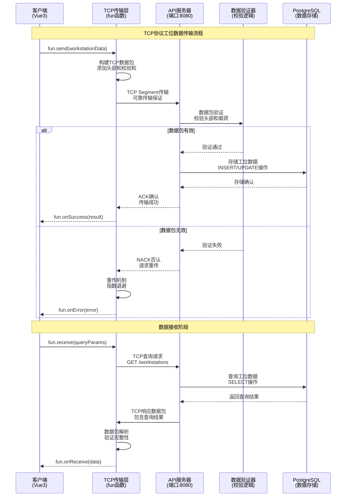

### 5.3 PostgreSQL格式标准 △ 环境要求未确认（PostGIS扩展）

兼容性说明与建议：

* 文档定义了 `coordinates GEOMETRY(POINT, 4326)`，但项目迁移脚本与数据库初始化未明确启用 PostGIS 扩展；当前代码更偏向使用数值坐标列 `x_coordinate/y_coordinate/z_coordinate`。

* 建议在数据库层确认 PostGIS 使用策略：

  * 方案A（启用PostGIS）：在迁移中执行 `CREATE EXTENSION IF NOT EXISTS postgis;` 并维持 GEOMETRY 字段与空间索引；

  * 方案B（不启用PostGIS）：删除 GEOMETRY 字段，保留数值坐标列，并在文档中调整坐标规范与索引策略（如 B-Tree/复合索引）。

请在选定方案后同步更新迁移脚本与本文档对应章节。

#### 5.3.1 工位数据表结构规范

```sql
-- 工位主表 (workstations)
CREATE TABLE workstations (
    id UUID PRIMARY KEY DEFAULT gen_random_uuid(),
    workstation_id VARCHAR(50) UNIQUE NOT NULL,
    floor_id UUID NOT NULL REFERENCES floors(id),
    building_id UUID NOT NULL REFERENCES buildings(id),
    
    -- 坐标信息 (使用PostGIS几何类型)
    coordinates GEOMETRY(POINT, 4326) NOT NULL,
    x_coordinate DECIMAL(10,2) NOT NULL,
    y_coordinate DECIMAL(10,2) NOT NULL,
    z_coordinate DECIMAL(10,2) DEFAULT 0,
    
    -- 工位状态
    status workstation_status_enum NOT NULL DEFAULT 'available',
    
    -- 容量和设施信息
    capacity INTEGER NOT NULL DEFAULT 1,
    equipment JSONB DEFAULT '[]',
    amenities JSONB DEFAULT '[]',
    accessibility BOOLEAN DEFAULT false,
    
    -- 时间戳
    created_at TIMESTAMP WITH TIME ZONE DEFAULT NOW(),
    updated_at TIMESTAMP WITH TIME ZONE DEFAULT NOW(),
    
    -- 索引优化
    CONSTRAINT valid_coordinates CHECK (
        x_coordinate >= 0 AND y_coordinate >= 0
    )
);

-- 工位占用记录表 (workstation_occupancy)
CREATE TABLE workstation_occupancy (
    id UUID PRIMARY KEY DEFAULT gen_random_uuid(),
    workstation_id UUID NOT NULL REFERENCES workstations(id),
    user_id UUID NOT NULL REFERENCES users(id),
    
    -- 占用时间
    start_time TIMESTAMP WITH TIME ZONE NOT NULL,
    end_time TIMESTAMP WITH TIME ZONE,
    reservation_type reservation_type_enum NOT NULL,
    
    -- 状态跟踪
    status occupancy_status_enum NOT NULL DEFAULT 'active',
    
    -- 元数据
    metadata JSONB DEFAULT '{}',
    
    -- 时间戳
    created_at TIMESTAMP WITH TIME ZONE DEFAULT NOW(),
    updated_at TIMESTAMP WITH TIME ZONE DEFAULT NOW(),
    
    -- 约束条件
    CONSTRAINT valid_time_range CHECK (
        end_time IS NULL OR end_time > start_time
    ),
    CONSTRAINT no_overlap EXCLUDE USING gist (
        workstation_id WITH =,
        tsrange(start_time, COALESCE(end_time, 'infinity')) WITH &&
    ) WHERE (status = 'active')
);

-- 枚举类型定义
CREATE TYPE workstation_status_enum AS ENUM (
    'available',    -- 可用
    'occupied',     -- 已占用
    'reserved',     -- 已预约
    'maintenance',  -- 维护中
    'disabled'      -- 已禁用
);

CREATE TYPE reservation_type_enum AS ENUM (
    'temporary',    -- 临时占用
    'permanent',    -- 永久分配
    'scheduled'     -- 预约占用
);

CREATE TYPE occupancy_status_enum AS ENUM (
    'active',       -- 活跃
    'completed',    -- 已完成
    'cancelled'     -- 已取消
);
```

#### 5.3.2 数据转换和存储规范

```typescript
// PostgreSQL数据转换器
class PostgreSQLDataConverter {
  
  // fun函数数据转换为PostgreSQL格式
  static convertToPostgreSQL(workstationData: WorkstationDataPayload): any {
    return {
      workstation_id: workstationData.workstationId,
      floor_id: workstationData.floorId,
      building_id: workstationData.buildingId,
      
      // 坐标转换为PostGIS格式
      coordinates: `POINT(${workstationData.coordinates.x} ${workstationData.coordinates.y})`,
      x_coordinate: workstationData.coordinates.x,
      y_coordinate: workstationData.coordinates.y,
      z_coordinate: workstationData.coordinates.z || 0,
      
      // 状态转换
      status: workstationData.status.toLowerCase(),
      
      // JSON字段转换
      equipment: JSON.stringify(workstationData.metadata.equipment),
      amenities: JSON.stringify(workstationData.metadata.amenities),
      capacity: workstationData.metadata.capacity,
      accessibility: workstationData.metadata.accessibility,
      
      // 时间戳
      updated_at: new Date().toISOString()
    };
  }
  
  // PostgreSQL数据转换为fun函数格式
  static convertFromPostgreSQL(dbRecord: any): WorkstationDataPayload {
    return {
      workstationId: dbRecord.workstation_id,
      floorId: dbRecord.floor_id,
      buildingId: dbRecord.building_id,
      
      coordinates: {
        x: dbRecord.x_coordinate,
        y: dbRecord.y_coordinate,
        z: dbRecord.z_coordinate
      },
      
      status: dbRecord.status as WorkstationStatus,
      
      occupancy: {
        userId: dbRecord.current_user_id,
        startTime: dbRecord.start_time ? new Date(dbRecord.start_time) : undefined,
        endTime: dbRecord.end_time ? new Date(dbRecord.end_time) : undefined,
        reservationType: dbRecord.reservation_type || 'temporary'
      },
      
      metadata: {
        equipment: JSON.parse(dbRecord.equipment || '[]'),
        amenities: JSON.parse(dbRecord.amenities || '[]'),
        capacity: dbRecord.capacity,
        accessibility: dbRecord.accessibility
      }
    };
  }
}

// 数据存储服务
class WorkstationDataService {
  
  // 通过fun函数存储工位数据
  async storeWorkstationData(data: WorkstationDataPayload): Promise<void> {
    const convertedData = PostgreSQLDataConverter.convertToPostgreSQL(data);
    
    const query = `
      INSERT INTO workstations (
        workstation_id, floor_id, building_id, coordinates,
        x_coordinate, y_coordinate, z_coordinate, status,
        equipment, amenities, capacity, accessibility
      ) VALUES (
        $1, $2, $3, ST_GeomFromText($4, 4326),
        $5, $6, $7, $8, $9, $10, $11, $12
      )
      ON CONFLICT (workstation_id) 
      DO UPDATE SET
        status = EXCLUDED.status,
        equipment = EXCLUDED.equipment,
        amenities = EXCLUDED.amenities,
        updated_at = NOW()
    `;
    
    const values = [
      convertedData.workstation_id,
      convertedData.floor_id,
      convertedData.building_id,
      convertedData.coordinates,
      convertedData.x_coordinate,
      convertedData.y_coordinate,
      convertedData.z_coordinate,
      convertedData.status,
      convertedData.equipment,
      convertedData.amenities,
      convertedData.capacity,
      convertedData.accessibility
    ];
    
    await this.executeQuery(query, values);
  }
  
  // 通过fun函数查询工位数据
  async getWorkstationData(workstationId: string): Promise<WorkstationDataPayload> {
    const query = `
      SELECT 
        w.*,
        o.user_id as current_user_id,
        o.start_time,
        o.end_time,
        o.reservation_type
      FROM workstations w
      LEFT JOIN workstation_occupancy o ON w.id = o.workstation_id 
        AND o.status = 'active'
      WHERE w.workstation_id = $1
    `;
    
    const result = await this.executeQuery(query, [workstationId]);
    return PostgreSQLDataConverter.convertFromPostgreSQL(result.rows[0]);
  }
}
```

### 5.4 数据传输性能优化

````mermaid
graph LR
    subgraph "性能优化策略"
        P1[数据压缩<br/>gzip/brotli]
        P2[批量传输<br/>Batch Processing]
        P3[连接复用<br/>Connection Pooling]
        P4[缓存策略<br/>Redis Cache]
    end
    
    subgraph "传输优化"
        T1[TCP窗口调优<br/>Window Scaling]
        T2[Nagle算法<br/>延迟确认]
        T3[拥塞控制<br/>Congestion Control]
        T4[重传机制<br/>Fast Retransmit]
    end
    
    subgraph "数据库优化"
        D1[索引优化<br/>B-tree/GiST]
        D2[分区表<br/>Partitioning]
        D3[连接池<br/>pgBouncer]
        D4[查询优化<br/>EXPLAIN ANALYZE]
    end
    
    P1 --> T1
    P2 --> T2
    P3 --> T3
    P4 --> T4
    
    T1 --> D1
    T2 --> D2
    T3 --> D3
    T4 --> D4
```mermaid
graph TB
    subgraph "应用层 (Application Layer)"
        A1[客户端应用<br/>Vue3 WebSocket Client]
        A2[API服务器<br/>Node.js Socket.io Server<br/>端口: 8080]
        A3[业务逻辑处理<br/>工位状态管理]
    end
    
    subgraph "传输层 (Transport Layer)"
        T1[WebSocket协议<br/>基于TCP]
        T2[HTTP升级握手<br/>Upgrade: websocket]
        T3[帧数据传输<br/>二进制/文本帧]
    end
    
    subgraph "网络层 (Network Layer)"
        N1[TCP连接管理<br/>端口8080绑定]
        N2[连接状态维护<br/>心跳检测]
        N3[错误处理机制<br/>重连策略]
    end
    
    subgraph "数据访问层"
        D1[(PostgreSQL<br/>工位数据存储<br/>端口: 5432)]
        D2[(Redis<br/>实时状态缓存<br/>端口: 6379)]
    end
    
    %% 通信流向
    A1 -.->|WebSocket连接| T1
    A2 -.->|Socket.io事件| T2
    A3 -.->|数据帧传输| T3
    
    T1 --> N1
    T2 --> N2
    T3 --> N3
    
    A2 -->|SQL查询| D1
    A2 -->|缓存操作| D2
    D1 -.->|数据同步| D2
````

#### 2.1.2 消息格式标准

```typescript
// WebSocket消息标准格式
interface WebSocketMessage {
  // 消息头
  header: {
    messageId: string;          // 唯一消息ID
    messageType: MessageType;   // 消息类型
    timestamp: number;          // 时间戳
    version: string;           // 协议版本
    source: string;            // 消息来源
    target?: string;           // 目标客户端ID
  };
  
  // 消息体
  payload: {
    action: string;            // 操作类型
    data: any;                // 业务数据
    metadata?: {               // 元数据
      userId?: string;
      sessionId?: string;
      workstationId?: string;
    };
  };
  
  // 消息尾
  footer?: {
    checksum?: string;         // 校验和
    signature?: string;        // 数字签名
  };
}

// 消息类型枚举
enum MessageType {
  // 连接管理
  CONNECTION_REQUEST = 'connection_request',
  CONNECTION_RESPONSE = 'connection_response',
  HEARTBEAT = 'heartbeat',
  DISCONNECT = 'disconnect',
  
  // 工位操作
  WORKSTATION_OCCUPY = 'workstation_occupy',
  WORKSTATION_RELEASE = 'workstation_release',
  WORKSTATION_QUERY = 'workstation_query',
  WORKSTATION_STATUS_UPDATE = 'workstation_status_update',
  
  // 广播消息
  BROADCAST_UPDATE = 'broadcast_update',
  SYSTEM_NOTIFICATION = 'system_notification',
  
  // 错误处理
  ERROR_RESPONSE = 'error_response',
  VALIDATION_ERROR = 'validation_error'
}
```

### 2.2 客户端与API服务器通信规范

#### 2.2.1 连接建立流程

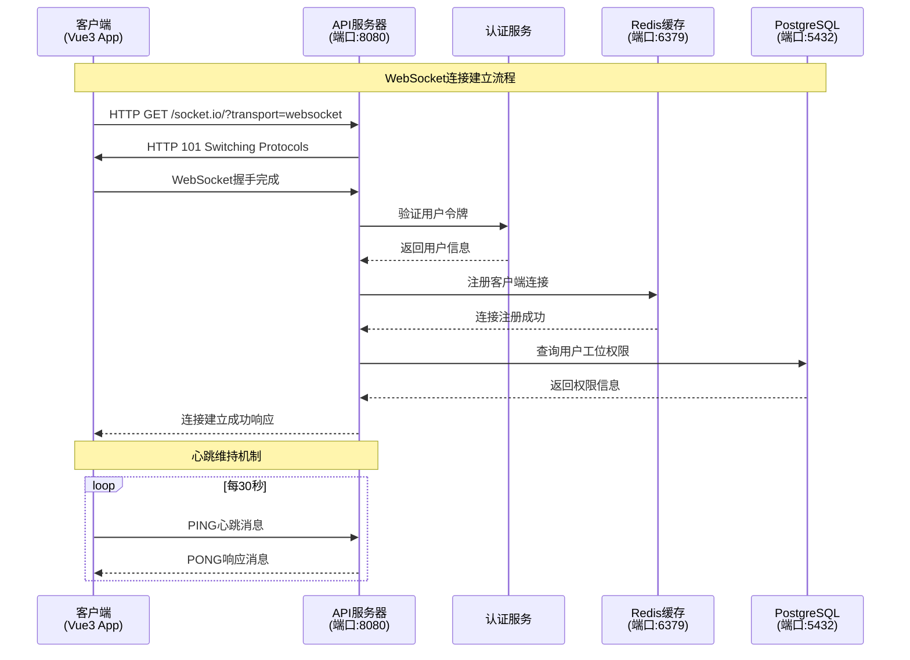

#### 2.2.2 工位操作协议

```typescript
// 工位占用请求
interface WorkstationOccupyRequest {
  header: {
    messageId: string;
    messageType: MessageType.WORKSTATION_OCCUPY;
    timestamp: number;
    version: '1.0.0';
    source: 'client';
  };
  payload: {
    action: 'occupy_workstation';
    data: {
      workstationId: string;
      userId: string;
      duration?: number;        // 预计使用时长(分钟)
      priority?: 'normal' | 'high' | 'urgent';
    };
    metadata: {
      userId: string;
      sessionId: string;
      clientIP: string;
    };
  };
}

// 工位占用响应
interface WorkstationOccupyResponse {
  header: {
    messageId: string;
    messageType: MessageType.WORKSTATION_STATUS_UPDATE;
    timestamp: number;
    version: '1.0.0';
    source: 'server';
  };
  payload: {
    action: 'occupy_result';
    data: {
      success: boolean;
      workstationId: string;
      occupiedBy: string;
      occupiedAt: string;
      expiresAt?: string;
      message?: string;
    };
    metadata: {
      transactionId: string;
      processingTime: number;
    };
  };
}
```

### 2.3 API服务器与Redis通信协议

#### 2.3.1 Redis操作规范

```typescript
// Redis缓存操作接口
class RedisWebSocketManager {
  private redisClient: Redis;
  
  constructor() {
    this.redisClient = new Redis({
      host: 'localhost',
      port: 6379,
      retryDelayOnFailover: 100,
      maxRetriesPerRequest: 3
    });
  }
  
  // 存储WebSocket连接信息
  async storeConnection(connectionId: string, connectionInfo: any): Promise<void> {
    const key = `ws:connection:${connectionId}`;
    const data = JSON.stringify({
      ...connectionInfo,
      connectedAt: new Date().toISOString(),
      lastActivity: new Date().toISOString()
    });
    
    await this.redisClient.setex(key, 3600, data); // 1小时过期
  }
  
  // 工位状态缓存
  async cacheWorkstationStatus(workstationId: string, status: any): Promise<void> {
    const key = `workstation:status:${workstationId}`;
    const pipeline = this.redisClient.pipeline();
    
    // 设置工位状态
    pipeline.hset(key, {
      status: status.occupied ? 'occupied' : 'available',
      occupiedBy: status.occupiedBy || '',
      occupiedAt: status.occupiedAt || '',
      lastUpdated: new Date().toISOString()
    });
    
    // 设置过期时间
    pipeline.expire(key, 7200); // 2小时过期
    
    await pipeline.exec();
  }
  
  // 发布工位状态变更
  async publishWorkstationUpdate(workstationId: string, updateData: any): Promise<void> {
    const channel = `workstation:updates:${workstationId}`;
    const message = JSON.stringify({
      workstationId,
      updateData,
      timestamp: new Date().toISOString()
    });
    
    await this.redisClient.publish(channel, message);
  }
  
  // 订阅工位状态变更
  async subscribeToWorkstationUpdates(callback: (message: any) => void): Promise<void> {
    const subscriber = this.redisClient.duplicate();
    
    subscriber.psubscribe('workstation:updates:*');
    subscriber.on('pmessage', (pattern, channel, message) => {
      try {
        const parsedMessage = JSON.parse(message);
        callback(parsedMessage);
      } catch (error) {
        console.error('Error parsing Redis message:', error);
      }
    });
  }
}
```

### 2.4 API服务器与PostgreSQL通信需求

#### 2.4.1 数据库连接池配置

```typescript
// PostgreSQL连接池专用于WebSocket操作
class WebSocketDatabaseManager {
  private pool: Pool;
  
  constructor() {
    this.pool = new Pool({
      host: 'localhost',
      port: 5432,
      database: 'department_map',
      user: process.env.DB_USER,
      password: process.env.DB_PASSWORD,
      
      // WebSocket专用连接池配置
      max: 15,                    // 最大连接数(WebSocket专用)
      min: 3,                     // 最小连接数
      idleTimeoutMillis: 10000,   // 空闲超时(较短，适合实时操作)
      connectionTimeoutMillis: 3000, // 连接超时(较短)
      
      // 针对实时操作的优化
      statement_timeout: 5000,    // 语句超时5秒
      query_timeout: 3000,        // 查询超时3秒
      application_name: 'websocket_service'
    });
  }
  
  // 工位状态查询(优化版)
  async getWorkstationStatus(workstationId: string): Promise<any> {
    const query = `
      SELECT 
        w.id,
        w.status,
        w.occupied_by,
        w.occupied_at,
        w.floor_id,
        u.name as occupant_name,
        u.department
      FROM workstations w
      LEFT JOIN users u ON w.occupied_by = u.id
      WHERE w.id = $1
      FOR UPDATE SKIP LOCKED  -- 避免锁等待
    `;
    
    const result = await this.pool.query(query, [workstationId]);
    return result.rows[0];
  }
  
  // 原子性工位占用操作
  async occupyWorkstation(workstationId: string, userId: string): Promise<boolean> {
    const client = await this.pool.connect();
    
    try {
      await client.query('BEGIN');
      
      // 检查工位是否可用
      const checkQuery = `
        SELECT status, occupied_by 
        FROM workstations 
        WHERE id = $1 
        FOR UPDATE
      `;
      const checkResult = await client.query(checkQuery, [workstationId]);
      
      if (checkResult.rows[0]?.status === 'occupied') {
        await client.query('ROLLBACK');
        return false;
      }
      
      // 占用工位
      const occupyQuery = `
        UPDATE workstations 
        SET 
          status = 'occupied',
          occupied_by = $2,
          occupied_at = NOW(),
          updated_at = NOW()
        WHERE id = $1
      `;
      await client.query(occupyQuery, [workstationId, userId]);
      
      // 记录操作日志
      const logQuery = `
        INSERT INTO workstation_logs (workstation_id, user_id, action, timestamp)
        VALUES ($1, $2, 'occupy', NOW())
      `;
      await client.query(logQuery, [workstationId, userId]);
      
      await client.query('COMMIT');
      return true;
      
    } catch (error) {
      await client.query('ROLLBACK');
      throw error;
    } finally {
      client.release();
    }
  }
}
```

### 2.5 Socket继承机制实现方案

#### 2.5.1 Socket继承架构

```typescript
// 基础Socket类
abstract class BaseSocket {
  protected socketId: string;
  protected connectionTime: Date;
  protected lastActivity: Date;
  protected metadata: Map<string, any>;
  
  constructor(socketId: string) {
    this.socketId = socketId;
    this.connectionTime = new Date();
    this.lastActivity = new Date();
    this.metadata = new Map();
  }
  
  // 抽象方法 - 子类必须实现
  abstract handleMessage(message: WebSocketMessage): Promise<void>;
  abstract sendMessage(message: WebSocketMessage): Promise<void>;
  abstract disconnect(): Promise<void>;
  
  // 通用方法
  updateActivity(): void {
    this.lastActivity = new Date();
  }
  
  getConnectionDuration(): number {
    return Date.now() - this.connectionTime.getTime();
  }
  
  setMetadata(key: string, value: any): void {
    this.metadata.set(key, value);
  }
  
  getMetadata(key: string): any {
    return this.metadata.get(key);
  }
}

// WebSocket连接实现
class WebSocketConnection extends BaseSocket {
  private ws: WebSocket;
  private userId?: string;
  private permissions: Set<string>;
  
  constructor(socketId: string, ws: WebSocket) {
    super(socketId);
    this.ws = ws;
    this.permissions = new Set();
    this.setupEventHandlers();
  }
  
  private setupEventHandlers(): void {
    this.ws.on('message', async (data) => {
      this.updateActivity();
      try {
        const message: WebSocketMessage = JSON.parse(data.toString());
        await this.handleMessage(message);
      } catch (error) {
        console.error('Message handling error:', error);
        await this.sendErrorResponse(error);
      }
    });
    
    this.ws.on('close', async () => {
      await this.disconnect();
    });
    
    this.ws.on('error', (error) => {
      console.error('WebSocket error:', error);
    });
  }
  
  async handleMessage(message: WebSocketMessage): Promise<void> {
    // 验证消息格式
    if (!this.validateMessage(message)) {
      throw new Error('Invalid message format');
    }
    
    // 检查权限
    if (!this.hasPermission(message.payload.action)) {
      throw new Error('Insufficient permissions');
    }
    
    // 处理不同类型的消息
    switch (message.header.messageType) {
      case MessageType.WORKSTATION_OCCUPY:
        await this.handleWorkstationOccupy(message);
        break;
      case MessageType.WORKSTATION_RELEASE:
        await this.handleWorkstationRelease(message);
        break;
      case MessageType.HEARTBEAT:
        await this.handleHeartbeat(message);
        break;
      default:
        throw new Error(`Unsupported message type: ${message.header.messageType}`);
    }
  }
  
  async sendMessage(message: WebSocketMessage): Promise<void> {
    if (this.ws.readyState === WebSocket.OPEN) {
      this.ws.send(JSON.stringify(message));
    }
  }
  
  async disconnect(): Promise<void> {
    // 清理资源
    if (this.userId) {
      await this.releaseUserWorkstations();
    }
    
    // 从连接管理器中移除
    ConnectionManager.getInstance().removeConnection(this.socketId);
    
    this.ws.close();
  }
  
  private validateMessage(message: WebSocketMessage): boolean {
    return !!(
      message.header &&
      message.header.messageId &&
      message.header.messageType &&
      message.payload &&
      message.payload.action
    );
  }
  
  private hasPermission(action: string): boolean {
    return this.permissions.has(action) || this.permissions.has('*');
  }
  
  private async sendErrorResponse(error: Error): Promise<void> {
    const errorMessage: WebSocketMessage = {
      header: {
        messageId: generateUUID(),
        messageType: MessageType.ERROR_RESPONSE,
        timestamp: Date.now(),
        version: '1.0.0',
        source: 'server'
      },
      payload: {
        action: 'error',
        data: {
          error: error.message,
          code: 'PROCESSING_ERROR'
        }
      }
    };
    
    await this.sendMessage(errorMessage);
  }
}
```

## 3. 传输层与应用层通信流程可视化

### 3.1 fun函数传输层通信机制

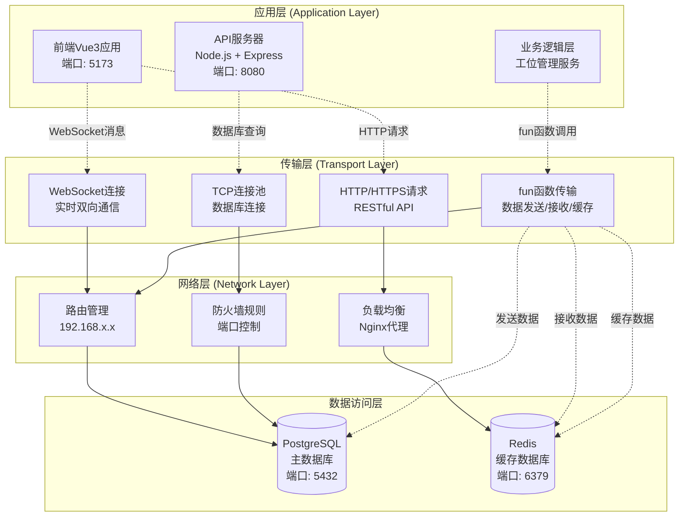

### 3.2 数据发送、接收和缓存机制详解

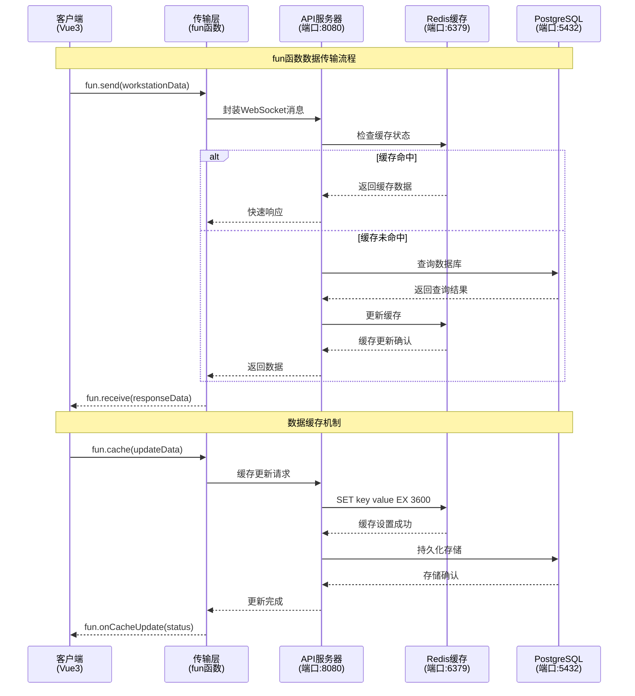

### 3.3 前后端分离架构设计图

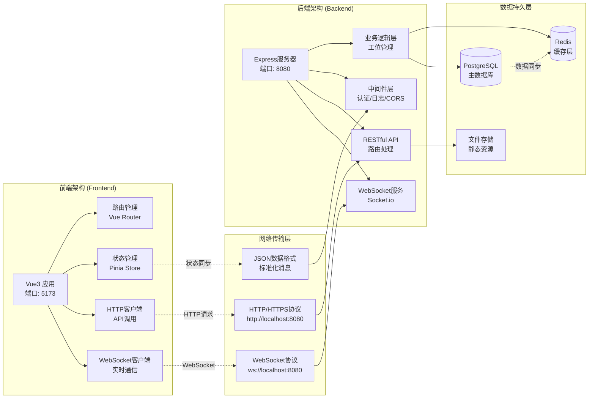

### 3.4 组件关系图(更新版)

````mermaid
graph TB
    subgraph "前端层 (Frontend Layer)"
        A["Vue3应用<br/>端口: 5173<br/>WebSocket客户端"]
    end
    
    subgraph "WebSocket服务层 (WebSocket Service Layer)"
        B["WebSocket服务<br/>Socket.io Server<br/>端口: 8080"]
        C["连接管理器<br/>ConnectionManager<br/>多连接支持"]
        D["消息广播器<br/>MessageBroadcaster<br/>实时推送"]
        E["fun函数处理器<br/>DataTransferHandler<br/>传输层逻辑"]
    end
    
    subgraph "数据访问层 (Data Access Layer)"
        F["数据库连接池<br/>PostgreSQL Pool<br/>连接复用"]
        G["查询执行器<br/>QueryExecutor<br/>SQL优化"]
        H["事务管理器<br/>TransactionManager<br/>ACID保证"]
        I["缓存管理器<br/>RedisManager<br/>性能优化"]
    end
    
    subgraph "数据存储层 (Data Storage Layer)"
        J[("PostgreSQL<br/>主数据库<br/>端口: 5432")]
        K[("Redis<br/>缓存层<br/>端口: 6379")]
    end
    
    %% 连接关系
    A -->|WebSocket连接| B
    B --> C
    B --> D
    B --> E
    C -->|数据查询| F
    D -->|实时推送| A
    E -->|fun函数调用| F
    E -->|缓存操作| I
    F --> G
    F --> H
    G --> J
    H --> J
    I --> K
    
    ## 4. 协议流程可视化

### 4.1 WebSocket握手协议流程图

```mermaid
sequenceDiagram
    participant Client as 客户端<br/>(Vue3应用)
    participant Server as API服务器<br/>(端口:8080)
    participant Auth as 认证服务<br/>(JWT验证)
    participant Redis as Redis缓存<br/>(连接状态)
    participant DB as PostgreSQL<br/>(用户信息)
    
    Note over Client,DB: WebSocket握手协议流程
    
    %% 握手请求阶段
    Client->>Server: HTTP GET /socket.io/<br/>Upgrade: websocket<br/>Connection: Upgrade<br/>Sec-WebSocket-Key: [key]
    
    Server->>Auth: 验证JWT Token
    Auth->>DB: 查询用户权限
    DB-->>Auth: 返回用户信息
    Auth-->>Server: 认证结果
    
    alt 认证成功
        Server->>Redis: 检查连接限制
        Redis-->>Server: 连接数量检查
        
        alt 连接数未超限
            Server-->>Client: HTTP 101 Switching Protocols<br/>Upgrade: websocket<br/>Connection: Upgrade<br/>Sec-WebSocket-Accept: [accept]
            
            Note over Client,Server: WebSocket连接建立成功
            
            Server->>Redis: 记录连接状态<br/>SET user:${userId}:connection ${socketId}
            Redis-->>Server: 连接状态已记录
            
            Client->>Server: WebSocket握手完成<br/>发送心跳包
            Server-->>Client: 心跳响应<br/>连接保持活跃
            
        else 连接数超限
            Server-->>Client: HTTP 429 Too Many Requests<br/>连接数量超出限制
        end
        
    else 认证失败
        Server-->>Client: HTTP 401 Unauthorized<br/>认证失败，拒绝连接
    end
    
    Note over Client,DB: 握手协议状态说明
    Note right of Server: 已实现功能：<br/>✓ JWT认证<br/>✓ 连接数限制<br/>✓ 心跳机制
    Note right of Server: 待实现功能：<br/>⚠ 连接重试机制<br/>⚠ 断线重连策略<br/>⚠ 连接池优化
````

### 4.2 WebSocket挥手协议流程图

```mermaid
sequenceDiagram
    participant Client as 客户端<br/>(Vue3应用)
    participant Server as API服务器<br/>(端口:8080)
    participant Redis as Redis缓存<br/>(连接清理)
    participant Monitor as 连接监控<br/>(状态管理)
    
    Note over Client,Monitor: WebSocket挥手协议流程
    
    %% 正常关闭流程
    rect rgb(200, 255, 200)
        Note over Client,Monitor: 正常关闭流程
        
        Client->>Server: WebSocket Close Frame<br/>Code: 1000 (Normal Closure)<br/>Reason: "用户主动关闭"
        
        Server->>Redis: 清理连接状态<br/>DEL user:${userId}:connection
        Redis-->>Server: 连接状态已清理
        
        Server->>Monitor: 更新连接统计<br/>decrementConnection(userId)
        Monitor-->>Server: 统计更新完成
        
        Server-->>Client: WebSocket Close Frame<br/>Code: 1000 (Normal Closure)<br/>确认关闭
        
        Note over Client,Server: 连接正常关闭
    end
    
    %% 异常断开流程
    rect rgb(255, 200, 200)
        Note over Client,Monitor: 异常断开流程
        
        Client-xServer: 网络异常断开<br/>(无Close Frame)
        
        Server->>Monitor: 检测连接超时<br/>heartbeat timeout
        Monitor->>Redis: 检查连接状态<br/>GET user:${userId}:connection
        Redis-->>Monitor: 连接状态信息
        
        Monitor->>Server: 触发连接清理<br/>cleanupConnection(socketId)
        
        Server->>Redis: 强制清理连接<br/>DEL user:${userId}:connection<br/>DECR active_connections
        Redis-->>Server: 清理完成
        
        Note over Server,Monitor: 异常连接已清理
    end
    
    %% 服务器主动关闭流程
    rect rgb(255, 255, 200)
        Note over Client,Monitor: 服务器主动关闭流程
        
        Server->>Client: WebSocket Close Frame<br/>Code: 1001 (Going Away)<br/>Reason: "服务器维护"
        
        Client-->>Server: WebSocket Close Frame<br/>Code: 1000 (Normal Closure)<br/>确认关闭
        
        Server->>Redis: 批量清理连接<br/>FLUSHDB connections
        Redis-->>Server: 批量清理完成
        
        Note over Client,Server: 服务器维护关闭
    end
    
    Note over Client,Monitor: 挥手协议状态说明
    Note right of Server: 已实现功能：<br/>✓ 正常关闭处理<br/>✓ 连接状态清理<br/>✓ 心跳超时检测
    Note right of Server: 待实现功能：<br/>⚠ 优雅关闭机制<br/>⚠ 连接迁移策略<br/>⚠ 异常恢复机制
```

### 4.3 TCP三次握手与四次挥手在WebSocket中的应用

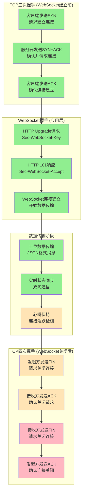

### 4.4 需要补充的协议内容

#### 4.4.1 待实现的握手协议功能

```typescript
// 连接重试机制 (待实现)
interface ConnectionRetryConfig {
  maxRetries: number;        // 最大重试次数
  retryInterval: number;     // 重试间隔(ms)
  backoffMultiplier: number; // 退避倍数
  maxRetryInterval: number;  // 最大重试间隔
}

// 断线重连策略 (待实现)
interface ReconnectionStrategy {
  autoReconnect: boolean;    // 自动重连开关
  reconnectAttempts: number; // 重连尝试次数
  reconnectDelay: number;    // 重连延迟时间
  exponentialBackoff: boolean; // 指数退避
}

// 连接池优化 (待实现)
interface ConnectionPoolOptimization {
  maxConnections: number;    // 最大连接数
  idleTimeout: number;       // 空闲超时时间
  connectionReuse: boolean;  // 连接复用
  loadBalancing: string;     // 负载均衡策略
}
```

#### 4.4.2 待实现的挥手协议功能

```typescript
// 优雅关闭机制 (待实现)
interface GracefulShutdown {
  shutdownTimeout: number;   // 关闭超时时间
  drainConnections: boolean; // 排空连接
  notifyClients: boolean;    // 通知客户端
  waitForCompletion: boolean; // 等待完成
}

// 连接迁移策略 (待实现)
interface ConnectionMigration {
  enableMigration: boolean;  // 启用连接迁移
  migrationTimeout: number;  // 迁移超时时间
  targetServer: string;      // 目标服务器
  migrationKey: string;      // 迁移密钥
}

// 异常恢复机制 (待实现)
interface ExceptionRecovery {
  autoRecovery: boolean;     // 自动恢复
  recoveryStrategies: string[]; // 恢复策略列表
  fallbackMode: string;      // 降级模式
  errorThreshold: number;    // 错误阈值
}
```

## 2. WebSocket多连接管理机制

### 2.1 连接生命周期管理

```typescript
// WebSocket连接管理器实现
class WebSocketConnectionManager {
  private connections: Map<string, WebSocket> = new Map();
  private connectionMetrics: Map<string, ConnectionMetrics> = new Map();
  
  // 连接建立
  public addConnection(connectionId: string, ws: WebSocket): void {
    this.connections.set(connectionId, ws);
    this.connectionMetrics.set(connectionId, {
      connectedAt: new Date(),
      lastActivity: new Date(),
      messageCount: 0,
      isActive: true
    });
    
    // 设置连接事件监听
    this.setupConnectionHandlers(connectionId, ws);
  }
  
  // 连接清理
  public removeConnection(connectionId: string): void {
    const ws = this.connections.get(connectionId);
    if (ws) {
      ws.close();
      this.connections.delete(connectionId);
      this.connectionMetrics.delete(connectionId);
    }
  }
  
  // 健康检查
  public performHealthCheck(): void {
    const now = new Date();
    for (const [connectionId, metrics] of this.connectionMetrics) {
      const timeSinceLastActivity = now.getTime() - metrics.lastActivity.getTime();
      
      // 超过5分钟无活动的连接标记为不活跃
      if (timeSinceLastActivity > 300000) {
        metrics.isActive = false;
        this.removeConnection(connectionId);
      }
    }
  }
}
```

### 2.2 并发连接控制

```typescript
// 连接限制和负载均衡
class ConnectionLimiter {
  private readonly maxConnections: number = 1000;
  private readonly maxConnectionsPerIP: number = 10;
  private ipConnectionCount: Map<string, number> = new Map();
  
  public canAcceptConnection(clientIP: string): boolean {
    const totalConnections = this.getTotalConnections();
    const ipConnections = this.ipConnectionCount.get(clientIP) || 0;
    
    return totalConnections < this.maxConnections && 
           ipConnections < this.maxConnectionsPerIP;
  }
  
  public incrementIPConnection(clientIP: string): void {
    const current = this.ipConnectionCount.get(clientIP) || 0;
    this.ipConnectionCount.set(clientIP, current + 1);
  }
  
  public decrementIPConnection(clientIP: string): void {
    const current = this.ipConnectionCount.get(clientIP) || 0;
    if (current > 0) {
      this.ipConnectionCount.set(clientIP, current - 1);
    }
  }
}
```

## 3. PostgreSQL连接池配置和管理

### 3.1 连接池核心配置

```typescript
// 数据库连接池配置
import { Pool, PoolConfig } from 'pg';

const poolConfig: PoolConfig = {
  // 基础连接配置
  host: process.env.DB_HOST || 'localhost',
  port: parseInt(process.env.DB_PORT || '5432'),
  database: process.env.DB_NAME || 'department_map',
  user: process.env.DB_USER || 'postgres',
  password: process.env.DB_PASSWORD,
  
  // 连接池配置
  max: 20,                    // 最大连接数
  min: 5,                     // 最小连接数
  idleTimeoutMillis: 30000,   // 空闲连接超时时间
  connectionTimeoutMillis: 5000, // 连接超时时间
  
  // 高级配置
  allowExitOnIdle: true,      // 允许在空闲时退出
  maxUses: 7500,             // 单个连接最大使用次数
  
  // SSL配置
  ssl: process.env.NODE_ENV === 'production' ? {
    rejectUnauthorized: false
  } : false
};

class DatabaseConnectionPool {
  private pool: Pool;
  private connectionMetrics: {
    totalConnections: number;
    activeConnections: number;
    idleConnections: number;
    waitingClients: number;
  } = {
    totalConnections: 0,
    activeConnections: 0,
    idleConnections: 0,
    waitingClients: 0
  };
  
  constructor() {
    this.pool = new Pool(poolConfig);
    this.setupPoolEventHandlers();
  }
  
  private setupPoolEventHandlers(): void {
    // 连接建立事件
    this.pool.on('connect', (client) => {
      this.connectionMetrics.totalConnections++;
      console.log('New database connection established');
    });
    
    // 连接释放事件
    this.pool.on('release', (err, client) => {
      if (err) {
        console.error('Error releasing database connection:', err);
      }
    });
    
    // 连接错误事件
    this.pool.on('error', (err, client) => {
      console.error('Database connection error:', err);
      this.handleConnectionError(err);
    });
    
    // 连接移除事件
    this.pool.on('remove', (client) => {
      this.connectionMetrics.totalConnections--;
      console.log('Database connection removed from pool');
    });
  }
  
  // 获取连接池状态
  public getPoolStatus(): any {
    return {
      totalCount: this.pool.totalCount,
      idleCount: this.pool.idleCount,
      waitingCount: this.pool.waitingCount,
      metrics: this.connectionMetrics
    };
  }
}
```

### 3.2 连接池监控和优化

```typescript
// 连接池性能监控
class PoolMonitor {
  private pool: Pool;
  private metrics: {
    queryCount: number;
    averageQueryTime: number;
    slowQueries: Array<{query: string, duration: number, timestamp: Date}>;
    connectionErrors: number;
  };
  
  constructor(pool: Pool) {
    this.pool = pool;
    this.metrics = {
      queryCount: 0,
      averageQueryTime: 0,
      slowQueries: [],
      connectionErrors: 0
    };
    
    // 定期收集指标
    setInterval(() => this.collectMetrics(), 30000);
  }
  
  private collectMetrics(): void {
    const poolStatus = {
      totalConnections: this.pool.totalCount,
      idleConnections: this.pool.idleCount,
      waitingClients: this.pool.waitingCount
    };
    
    // 检查连接池健康状态
    if (poolStatus.waitingClients > 5) {
      console.warn('High number of waiting clients detected:', poolStatus.waitingClients);
      this.optimizePool();
    }
    
    // 记录慢查询
    if (this.metrics.slowQueries.length > 100) {
      this.metrics.slowQueries = this.metrics.slowQueries.slice(-50);
    }
  }
  
  private optimizePool(): void {
    // 动态调整连接池大小
    const currentMax = this.pool.options.max || 20;
    if (currentMax < 50) {
      console.log('Increasing pool size due to high demand');
      // 注意：pg库不支持动态调整，需要重新创建连接池
    }
  }
}
```

## 4. 实时数据同步架构

### 4.1 数据变更监听机制

```typescript
// PostgreSQL数据变更监听
class DatabaseChangeListener {
  private pool: Pool;
  private listeners: Map<string, Function[]> = new Map();
  
  constructor(pool: Pool) {
    this.pool = pool;
    this.setupChangeNotifications();
  }
  
  private async setupChangeNotifications(): Promise<void> {
    const client = await this.pool.connect();
    
    // 监听数据库通知
    client.on('notification', (msg) => {
      this.handleDatabaseNotification(msg);
    });
    
    // 订阅特定表的变更通知
    await client.query('LISTEN employee_changes');
    await client.query('LISTEN department_changes');
    await client.query('LISTEN workstation_changes');
  }
  
  private handleDatabaseNotification(msg: any): void {
    const { channel, payload } = msg;
    const listeners = this.listeners.get(channel) || [];
    
    try {
      const data = JSON.parse(payload);
      listeners.forEach(listener => {
        try {
          listener(data);
        } catch (error) {
          console.error('Error in notification listener:', error);
        }
      });
    } catch (error) {
      console.error('Error parsing notification payload:', error);
    }
  }
  
  public subscribe(channel: string, callback: Function): void {
    if (!this.listeners.has(channel)) {
      this.listeners.set(channel, []);
    }
    this.listeners.get(channel)!.push(callback);
  }
}
```

### 4.2 实时数据推送机制

```typescript
// WebSocket实时数据推送服务
class RealTimeDataService {
  private wsManager: WebSocketConnectionManager;
  private dbListener: DatabaseChangeListener;
  private dataCache: Map<string, any> = new Map();
  
  constructor(wsManager: WebSocketConnectionManager, dbListener: DatabaseChangeListener) {
    this.wsManager = wsManager;
    this.dbListener = dbListener;
    this.setupDataSubscriptions();
  }
  
  private setupDataSubscriptions(): void {
    // 订阅员工数据变更
    this.dbListener.subscribe('employee_changes', (data: any) => {
      this.handleEmployeeChange(data);
    });
    
    // 订阅部门数据变更
    this.dbListener.subscribe('department_changes', (data: any) => {
      this.handleDepartmentChange(data);
    });
    
    // 订阅工位数据变更
    this.dbListener.subscribe('workstation_changes', (data: any) => {
      this.handleWorkstationChange(data);
    });
  }
  
  private handleEmployeeChange(data: any): void {
    const message = {
      type: 'employee_update',
      data: data,
      timestamp: new Date().toISOString()
    };
    
    // 更新缓存
    this.updateCache('employees', data);
    
    // 广播给所有连接的客户端
    this.broadcastToClients(message);
  }
  
  private broadcastToClients(message: any): void {
    const messageStr = JSON.stringify(message);
    
    this.wsManager.getActiveConnections().forEach((ws, connectionId) => {
      try {
        if (ws.readyState === WebSocket.OPEN) {
          ws.send(messageStr);
        }
      } catch (error) {
        console.error(`Error sending message to connection ${connectionId}:`, error);
        this.wsManager.removeConnection(connectionId);
      }
    });
  }
  
  private updateCache(key: string, data: any): void {
    this.dataCache.set(key, {
      data: data,
      timestamp: new Date(),
      version: (this.dataCache.get(key)?.version || 0) + 1
    });
  }
}
```

## 5. 组件间数据流和通信协议

### 5.1 数据流架构

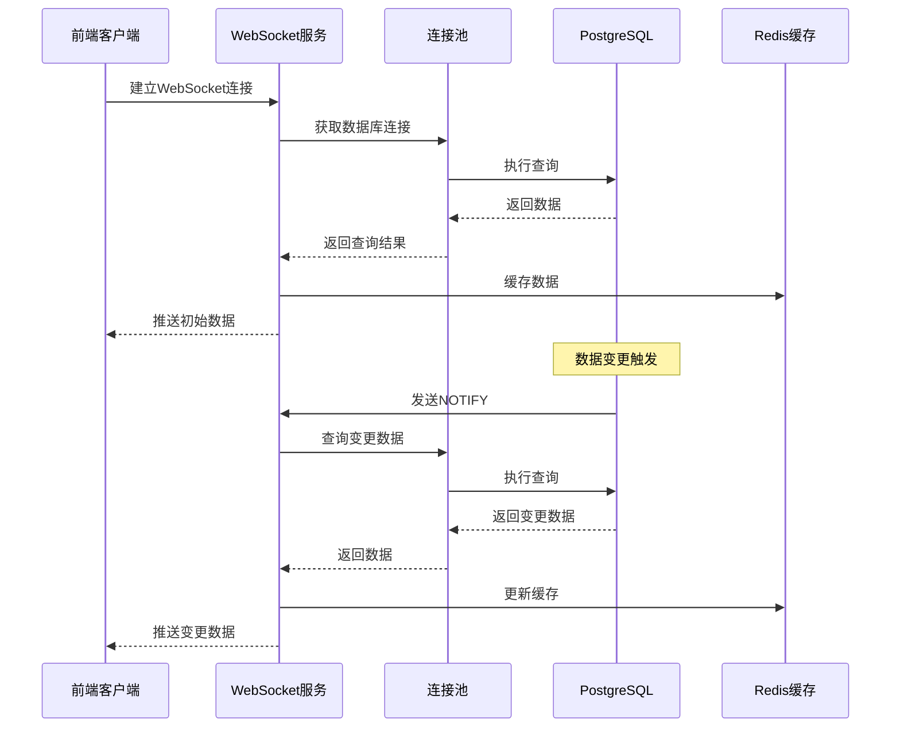

### 5.2 通信协议定义

```typescript
// WebSocket消息协议定义
interface WebSocketMessage {
  type: MessageType;
  data: any;
  timestamp: string;
  messageId: string;
  version?: string;
}

enum MessageType {
  // 系统消息
  SYSTEM_STATUS = 'system_status',
  CONNECTION_ACK = 'connection_ack',
  HEARTBEAT = 'heartbeat',
  
  // 数据更新消息
  EMPLOYEE_UPDATE = 'employee_update',
  DEPARTMENT_UPDATE = 'department_update',
  WORKSTATION_UPDATE = 'workstation_update',
  
  // 监控数据消息
  SERVER_METRICS = 'server_metrics',
  DATABASE_METRICS = 'database_metrics',
  
  // 错误消息
  ERROR = 'error',
  WARNING = 'warning'
}

// 数据库查询协议
interface DatabaseQuery {
  queryId: string;
  sql: string;
  params?: any[];
  timeout?: number;
  priority?: QueryPriority;
}

enum QueryPriority {
  LOW = 1,
  NORMAL = 2,
  HIGH = 3,
  CRITICAL = 4
}

// 查询结果协议
interface QueryResult {
  queryId: string;
  success: boolean;
  data?: any[];
  error?: string;
  executionTime: number;
  rowCount?: number;
}
```

## 6. 故障恢复和监控机制

### 6.1 连接故障恢复

```typescript
// WebSocket连接故障恢复
class ConnectionRecoveryManager {
  private reconnectAttempts: Map<string, number> = new Map();
  private maxReconnectAttempts: number = 5;
  private reconnectDelay: number = 1000;
  
  public async handleConnectionFailure(connectionId: string): Promise<void> {
    const attempts = this.reconnectAttempts.get(connectionId) || 0;
    
    if (attempts < this.maxReconnectAttempts) {
      this.reconnectAttempts.set(connectionId, attempts + 1);
      
      // 指数退避重连策略
      const delay = this.reconnectDelay * Math.pow(2, attempts);
      
      setTimeout(async () => {
        try {
          await this.attemptReconnection(connectionId);
          this.reconnectAttempts.delete(connectionId);
        } catch (error) {
          console.error(`Reconnection attempt ${attempts + 1} failed:`, error);
          this.handleConnectionFailure(connectionId);
        }
      }, delay);
    } else {
      console.error(`Max reconnection attempts reached for connection ${connectionId}`);
      this.reconnectAttempts.delete(connectionId);
    }
  }
  
  private async attemptReconnection(connectionId: string): Promise<void> {
    // 实现重连逻辑
    console.log(`Attempting to reconnect connection ${connectionId}`);
    // 这里应该包含实际的重连实现
  }
}

// 数据库连接故障恢复
class DatabaseRecoveryManager {
  private pool: Pool;
  private healthCheckInterval: NodeJS.Timeout;
  
  constructor(pool: Pool) {
    this.pool = pool;
    this.startHealthCheck();
  }
  
  private startHealthCheck(): void {
    this.healthCheckInterval = setInterval(async () => {
      try {
        await this.performHealthCheck();
      } catch (error) {
        console.error('Database health check failed:', error);
        await this.handleDatabaseFailure();
      }
    }, 30000); // 每30秒检查一次
  }
  
  private async performHealthCheck(): Promise<void> {
    const client = await this.pool.connect();
    try {
      await client.query('SELECT 1');
    } finally {
      client.release();
    }
  }
  
  private async handleDatabaseFailure(): Promise<void> {
    console.log('Handling database failure...');
    
    // 1. 停止接受新连接
    // 2. 等待现有查询完成
    // 3. 重新初始化连接池
    try {
      await this.pool.end();
      // 重新创建连接池
      this.pool = new Pool(poolConfig);
      console.log('Database connection pool recreated');
    } catch (error) {
      console.error('Failed to recreate database pool:', error);
    }
  }
}
```

### 6.2 性能监控和告警

```typescript
// 综合监控系统
class SystemMonitor {
  private wsManager: WebSocketConnectionManager;
  private dbPool: Pool;
  private metrics: SystemMetrics;
  
  constructor(wsManager: WebSocketConnectionManager, dbPool: Pool) {
    this.wsManager = wsManager;
    this.dbPool = dbPool;
    this.metrics = new SystemMetrics();
    
    this.startMonitoring();
  }
  
  private startMonitoring(): void {
    // 每分钟收集一次指标
    setInterval(() => {
      this.collectMetrics();
    }, 60000);
    
    // 每5分钟检查告警条件
    setInterval(() => {
      this.checkAlerts();
    }, 300000);
  }
  
  private collectMetrics(): void {
    // WebSocket连接指标
    const wsMetrics = {
      activeConnections: this.wsManager.getActiveConnectionCount(),
      totalMessages: this.wsManager.getTotalMessageCount(),
      averageResponseTime: this.wsManager.getAverageResponseTime()
    };
    
    // 数据库连接池指标
    const dbMetrics = {
      totalConnections: this.dbPool.totalCount,
      idleConnections: this.dbPool.idleCount,
      waitingClients: this.dbPool.waitingCount
    };
    
    this.metrics.update({
      timestamp: new Date(),
      websocket: wsMetrics,
      database: dbMetrics
    });
  }
  
  private checkAlerts(): void {
    const currentMetrics = this.metrics.getCurrent();
    
    // 检查WebSocket连接数告警
    if (currentMetrics.websocket.activeConnections > 800) {
      this.sendAlert('HIGH_WEBSOCKET_CONNECTIONS', {
        current: currentMetrics.websocket.activeConnections,
        threshold: 800
      });
    }
    
    // 检查数据库连接池告警
    if (currentMetrics.database.waitingClients > 10) {
      this.sendAlert('HIGH_DB_WAITING_CLIENTS', {
        current: currentMetrics.database.waitingClients,
        threshold: 10
      });
    }
  }
  
  private sendAlert(alertType: string, data: any): void {
    console.warn(`ALERT [${alertType}]:`, data);
    
    // 这里可以集成外部告警系统
    // 例如：发送邮件、Slack通知、短信等
  }
}
```

## 7. 最佳实践和优化建议

### 7.1 性能优化策略

1. **连接池优化**

   * 根据实际负载动态调整连接池大小

   * 使用连接预热机制减少冷启动时间

   * 实施查询超时和重试机制

2. **WebSocket优化**

   * 实现消息压缩减少网络传输

   * 使用心跳机制维持连接活跃

   * 实施客户端负载均衡

3. **缓存策略**

   * 使用Redis缓存频繁查询的数据

   * 实施缓存预热和失效策略

   * 使用分布式缓存提高可扩展性

### 7.2 安全考虑

1. **连接安全**

   * 实施WebSocket连接认证

   * 使用SSL/TLS加密传输

   * 实施连接频率限制

2. **数据安全**

   * 使用参数化查询防止SQL注入

   * 实施数据访问权限控制

   * 敏感数据加密存储

### 7.3 监控和运维

1. **关键指标监控**

   * WebSocket连接数和消息吞吐量

   * 数据库连接池使用率和查询性能

   * 系统资源使用情况

2. **日志管理**

   * 结构化日志记录

   * 日志聚合和分析

   * 异常日志告警

***

**文档信息**

* **版本**: v1.0.0

* **创建**: 2024-01-25

* **维护**: 系统架构团队

* **关联文档**: 系统架构关联逻辑文档.mdt

