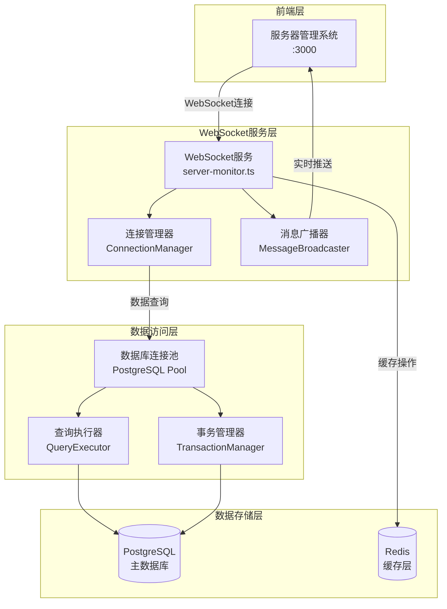

# WebSocket与PostgreSQL组件关联技术文档

## 1. 架构概述

本文档详细描述了系统中WebSocket服务与PostgreSQL数据库之间的技术关联实现，包括多连接管理、数据同步机制、性能优化和故障恢复策略。

### 1.1 组件关系图



## 2. WebSocket多连接管理机制

### 2.1 连接生命周期管理

```typescript
// WebSocket连接管理器实现
class WebSocketConnectionManager {
  private connections: Map<string, WebSocket> = new Map();
  private connectionMetrics: Map<string, ConnectionMetrics> = new Map();
  
  // 连接建立
  public addConnection(connectionId: string, ws: WebSocket): void {
    this.connections.set(connectionId, ws);
    this.connectionMetrics.set(connectionId, {
      connectedAt: new Date(),
      lastActivity: new Date(),
      messageCount: 0,
      isActive: true
    });
    
    // 设置连接事件监听
    this.setupConnectionHandlers(connectionId, ws);
  }
  
  // 连接清理
  public removeConnection(connectionId: string): void {
    const ws = this.connections.get(connectionId);
    if (ws) {
      ws.close();
      this.connections.delete(connectionId);
      this.connectionMetrics.delete(connectionId);
    }
  }
  
  // 健康检查
  public performHealthCheck(): void {
    const now = new Date();
    for (const [connectionId, metrics] of this.connectionMetrics) {
      const timeSinceLastActivity = now.getTime() - metrics.lastActivity.getTime();
      
      // 超过5分钟无活动的连接标记为不活跃
      if (timeSinceLastActivity > 300000) {
        metrics.isActive = false;
        this.removeConnection(connectionId);
      }
    }
  }
}
```

### 2.2 并发连接控制

```typescript
// 连接限制和负载均衡
class ConnectionLimiter {
  private readonly maxConnections: number = 1000;
  private readonly maxConnectionsPerIP: number = 10;
  private ipConnectionCount: Map<string, number> = new Map();
  
  public canAcceptConnection(clientIP: string): boolean {
    const totalConnections = this.getTotalConnections();
    const ipConnections = this.ipConnectionCount.get(clientIP) || 0;
    
    return totalConnections < this.maxConnections && 
           ipConnections < this.maxConnectionsPerIP;
  }
  
  public incrementIPConnection(clientIP: string): void {
    const current = this.ipConnectionCount.get(clientIP) || 0;
    this.ipConnectionCount.set(clientIP, current + 1);
  }
  
  public decrementIPConnection(clientIP: string): void {
    const current = this.ipConnectionCount.get(clientIP) || 0;
    if (current > 0) {
      this.ipConnectionCount.set(clientIP, current - 1);
    }
  }
}
```

## 3. PostgreSQL连接池配置和管理

### 3.1 连接池核心配置

```typescript
// 数据库连接池配置
import { Pool, PoolConfig } from 'pg';

const poolConfig: PoolConfig = {
  // 基础连接配置
  host: process.env.DB_HOST || 'localhost',
  port: parseInt(process.env.DB_PORT || '5432'),
  database: process.env.DB_NAME || 'department_map',
  user: process.env.DB_USER || 'postgres',
  password: process.env.DB_PASSWORD,
  
  // 连接池配置
  max: 20,                    // 最大连接数
  min: 5,                     // 最小连接数
  idleTimeoutMillis: 30000,   // 空闲连接超时时间
  connectionTimeoutMillis: 5000, // 连接超时时间
  
  // 高级配置
  allowExitOnIdle: true,      // 允许在空闲时退出
  maxUses: 7500,             // 单个连接最大使用次数
  
  // SSL配置
  ssl: process.env.NODE_ENV === 'production' ? {
    rejectUnauthorized: false
  } : false
};

class DatabaseConnectionPool {
  private pool: Pool;
  private connectionMetrics: {
    totalConnections: number;
    activeConnections: number;
    idleConnections: number;
    waitingClients: number;
  } = {
    totalConnections: 0,
    activeConnections: 0,
    idleConnections: 0,
    waitingClients: 0
  };
  
  constructor() {
    this.pool = new Pool(poolConfig);
    this.setupPoolEventHandlers();
  }
  
  private setupPoolEventHandlers(): void {
    // 连接建立事件
    this.pool.on('connect', (client) => {
      this.connectionMetrics.totalConnections++;
      console.log('New database connection established');
    });
    
    // 连接释放事件
    this.pool.on('release', (err, client) => {
      if (err) {
        console.error('Error releasing database connection:', err);
      }
    });
    
    // 连接错误事件
    this.pool.on('error', (err, client) => {
      console.error('Database connection error:', err);
      this.handleConnectionError(err);
    });
    
    // 连接移除事件
    this.pool.on('remove', (client) => {
      this.connectionMetrics.totalConnections--;
      console.log('Database connection removed from pool');
    });
  }
  
  // 获取连接池状态
  public getPoolStatus(): any {
    return {
      totalCount: this.pool.totalCount,
      idleCount: this.pool.idleCount,
      waitingCount: this.pool.waitingCount,
      metrics: this.connectionMetrics
    };
  }
}
```

### 3.2 连接池监控和优化

```typescript
// 连接池性能监控
class PoolMonitor {
  private pool: Pool;
  private metrics: {
    queryCount: number;
    averageQueryTime: number;
    slowQueries: Array<{query: string, duration: number, timestamp: Date}>;
    connectionErrors: number;
  };
  
  constructor(pool: Pool) {
    this.pool = pool;
    this.metrics = {
      queryCount: 0,
      averageQueryTime: 0,
      slowQueries: [],
      connectionErrors: 0
    };
    
    // 定期收集指标
    setInterval(() => this.collectMetrics(), 30000);
  }
  
  private collectMetrics(): void {
    const poolStatus = {
      totalConnections: this.pool.totalCount,
      idleConnections: this.pool.idleCount,
      waitingClients: this.pool.waitingCount
    };
    
    // 检查连接池健康状态
    if (poolStatus.waitingClients > 5) {
      console.warn('High number of waiting clients detected:', poolStatus.waitingClients);
      this.optimizePool();
    }
    
    // 记录慢查询
    if (this.metrics.slowQueries.length > 100) {
      this.metrics.slowQueries = this.metrics.slowQueries.slice(-50);
    }
  }
  
  private optimizePool(): void {
    // 动态调整连接池大小
    const currentMax = this.pool.options.max || 20;
    if (currentMax < 50) {
      console.log('Increasing pool size due to high demand');
      // 注意：pg库不支持动态调整，需要重新创建连接池
    }
  }
}
```

## 4. 实时数据同步架构

### 4.1 数据变更监听机制

```typescript
// PostgreSQL数据变更监听
class DatabaseChangeListener {
  private pool: Pool;
  private listeners: Map<string, Function[]> = new Map();
  
  constructor(pool: Pool) {
    this.pool = pool;
    this.setupChangeNotifications();
  }
  
  private async setupChangeNotifications(): Promise<void> {
    const client = await this.pool.connect();
    
    // 监听数据库通知
    client.on('notification', (msg) => {
      this.handleDatabaseNotification(msg);
    });
    
    // 订阅特定表的变更通知
    await client.query('LISTEN employee_changes');
    await client.query('LISTEN department_changes');
    await client.query('LISTEN workstation_changes');
  }
  
  private handleDatabaseNotification(msg: any): void {
    const { channel, payload } = msg;
    const listeners = this.listeners.get(channel) || [];
    
    try {
      const data = JSON.parse(payload);
      listeners.forEach(listener => {
        try {
          listener(data);
        } catch (error) {
          console.error('Error in notification listener:', error);
        }
      });
    } catch (error) {
      console.error('Error parsing notification payload:', error);
    }
  }
  
  public subscribe(channel: string, callback: Function): void {
    if (!this.listeners.has(channel)) {
      this.listeners.set(channel, []);
    }
    this.listeners.get(channel)!.push(callback);
  }
}
```

### 4.2 实时数据推送机制

```typescript
// WebSocket实时数据推送服务
class RealTimeDataService {
  private wsManager: WebSocketConnectionManager;
  private dbListener: DatabaseChangeListener;
  private dataCache: Map<string, any> = new Map();
  
  constructor(wsManager: WebSocketConnectionManager, dbListener: DatabaseChangeListener) {
    this.wsManager = wsManager;
    this.dbListener = dbListener;
    this.setupDataSubscriptions();
  }
  
  private setupDataSubscriptions(): void {
    // 订阅员工数据变更
    this.dbListener.subscribe('employee_changes', (data: any) => {
      this.handleEmployeeChange(data);
    });
    
    // 订阅部门数据变更
    this.dbListener.subscribe('department_changes', (data: any) => {
      this.handleDepartmentChange(data);
    });
    
    // 订阅工位数据变更
    this.dbListener.subscribe('workstation_changes', (data: any) => {
      this.handleWorkstationChange(data);
    });
  }
  
  private handleEmployeeChange(data: any): void {
    const message = {
      type: 'employee_update',
      data: data,
      timestamp: new Date().toISOString()
    };
    
    // 更新缓存
    this.updateCache('employees', data);
    
    // 广播给所有连接的客户端
    this.broadcastToClients(message);
  }
  
  private broadcastToClients(message: any): void {
    const messageStr = JSON.stringify(message);
    
    this.wsManager.getActiveConnections().forEach((ws, connectionId) => {
      try {
        if (ws.readyState === WebSocket.OPEN) {
          ws.send(messageStr);
        }
      } catch (error) {
        console.error(`Error sending message to connection ${connectionId}:`, error);
        this.wsManager.removeConnection(connectionId);
      }
    });
  }
  
  private updateCache(key: string, data: any): void {
    this.dataCache.set(key, {
      data: data,
      timestamp: new Date(),
      version: (this.dataCache.get(key)?.version || 0) + 1
    });
  }
}
```

## 5. 组件间数据流和通信协议

### 5.1 数据流架构


### 5.2 通信协议定义

```typescript
// WebSocket消息协议定义
interface WebSocketMessage {
  type: MessageType;
  data: any;
  timestamp: string;
  messageId: string;
  version?: string;
}

enum MessageType {
  // 系统消息
  SYSTEM_STATUS = 'system_status',
  CONNECTION_ACK = 'connection_ack',
  HEARTBEAT = 'heartbeat',
  
  // 数据更新消息
  EMPLOYEE_UPDATE = 'employee_update',
  DEPARTMENT_UPDATE = 'department_update',
  WORKSTATION_UPDATE = 'workstation_update',
  
  // 监控数据消息
  SERVER_METRICS = 'server_metrics',
  DATABASE_METRICS = 'database_metrics',
  
  // 错误消息
  ERROR = 'error',
  WARNING = 'warning'
}

// 数据库查询协议
interface DatabaseQuery {
  queryId: string;
  sql: string;
  params?: any[];
  timeout?: number;
  priority?: QueryPriority;
}

enum QueryPriority {
  LOW = 1,
  NORMAL = 2,
  HIGH = 3,
  CRITICAL = 4
}

// 查询结果协议
interface QueryResult {
  queryId: string;
  success: boolean;
  data?: any[];
  error?: string;
  executionTime: number;
  rowCount?: number;
}
```

## 6. 故障恢复和监控机制

### 6.1 连接故障恢复

```typescript
// WebSocket连接故障恢复
class ConnectionRecoveryManager {
  private reconnectAttempts: Map<string, number> = new Map();
  private maxReconnectAttempts: number = 5;
  private reconnectDelay: number = 1000;
  
  public async handleConnectionFailure(connectionId: string): Promise<void> {
    const attempts = this.reconnectAttempts.get(connectionId) || 0;
    
    if (attempts < this.maxReconnectAttempts) {
      this.reconnectAttempts.set(connectionId, attempts + 1);
      
      // 指数退避重连策略
      const delay = this.reconnectDelay * Math.pow(2, attempts);
      
      setTimeout(async () => {
        try {
          await this.attemptReconnection(connectionId);
          this.reconnectAttempts.delete(connectionId);
        } catch (error) {
          console.error(`Reconnection attempt ${attempts + 1} failed:`, error);
          this.handleConnectionFailure(connectionId);
        }
      }, delay);
    } else {
      console.error(`Max reconnection attempts reached for connection ${connectionId}`);
      this.reconnectAttempts.delete(connectionId);
    }
  }
  
  private async attemptReconnection(connectionId: string): Promise<void> {
    // 实现重连逻辑
    console.log(`Attempting to reconnect connection ${connectionId}`);
    // 这里应该包含实际的重连实现
  }
}

// 数据库连接故障恢复
class DatabaseRecoveryManager {
  private pool: Pool;
  private healthCheckInterval: NodeJS.Timeout;
  
  constructor(pool: Pool) {
    this.pool = pool;
    this.startHealthCheck();
  }
  
  private startHealthCheck(): void {
    this.healthCheckInterval = setInterval(async () => {
      try {
        await this.performHealthCheck();
      } catch (error) {
        console.error('Database health check failed:', error);
        await this.handleDatabaseFailure();
      }
    }, 30000); // 每30秒检查一次
  }
  
  private async performHealthCheck(): Promise<void> {
    const client = await this.pool.connect();
    try {
      await client.query('SELECT 1');
    } finally {
      client.release();
    }
  }
  
  private async handleDatabaseFailure(): Promise<void> {
    console.log('Handling database failure...');
    
    // 1. 停止接受新连接
    // 2. 等待现有查询完成
    // 3. 重新初始化连接池
    try {
      await this.pool.end();
      // 重新创建连接池
      this.pool = new Pool(poolConfig);
      console.log('Database connection pool recreated');
    } catch (error) {
      console.error('Failed to recreate database pool:', error);
    }
  }
}
```

### 6.2 性能监控和告警

```typescript
// 综合监控系统
class SystemMonitor {
  private wsManager: WebSocketConnectionManager;
  private dbPool: Pool;
  private metrics: SystemMetrics;
  
  constructor(wsManager: WebSocketConnectionManager, dbPool: Pool) {
    this.wsManager = wsManager;
    this.dbPool = dbPool;
    this.metrics = new SystemMetrics();
    
    this.startMonitoring();
  }
  
  private startMonitoring(): void {
    // 每分钟收集一次指标
    setInterval(() => {
      this.collectMetrics();
    }, 60000);
    
    // 每5分钟检查告警条件
    setInterval(() => {
      this.checkAlerts();
    }, 300000);
  }
  
  private collectMetrics(): void {
    // WebSocket连接指标
    const wsMetrics = {
      activeConnections: this.wsManager.getActiveConnectionCount(),
      totalMessages: this.wsManager.getTotalMessageCount(),
      averageResponseTime: this.wsManager.getAverageResponseTime()
    };
    
    // 数据库连接池指标
    const dbMetrics = {
      totalConnections: this.dbPool.totalCount,
      idleConnections: this.dbPool.idleCount,
      waitingClients: this.dbPool.waitingCount
    };
    
    this.metrics.update({
      timestamp: new Date(),
      websocket: wsMetrics,
      database: dbMetrics
    });
  }
  
  private checkAlerts(): void {
    const currentMetrics = this.metrics.getCurrent();
    
    // 检查WebSocket连接数告警
    if (currentMetrics.websocket.activeConnections > 800) {
      this.sendAlert('HIGH_WEBSOCKET_CONNECTIONS', {
        current: currentMetrics.websocket.activeConnections,
        threshold: 800
      });
    }
    
    // 检查数据库连接池告警
    if (currentMetrics.database.waitingClients > 10) {
      this.sendAlert('HIGH_DB_WAITING_CLIENTS', {
        current: currentMetrics.database.waitingClients,
        threshold: 10
      });
    }
  }
  
  private sendAlert(alertType: string, data: any): void {
    console.warn(`ALERT [${alertType}]:`, data);
    
    // 这里可以集成外部告警系统
    // 例如：发送邮件、Slack通知、短信等
  }
}
```

## 7. 最佳实践和优化建议

### 7.1 性能优化策略

1. **连接池优化**
   - 根据实际负载动态调整连接池大小
   - 使用连接预热机制减少冷启动时间
   - 实施查询超时和重试机制

2. **WebSocket优化**
   - 实现消息压缩减少网络传输
   - 使用心跳机制维持连接活跃
   - 实施客户端负载均衡

3. **缓存策略**
   - 使用Redis缓存频繁查询的数据
   - 实施缓存预热和失效策略
   - 使用分布式缓存提高可扩展性

### 7.2 安全考虑

1. **连接安全**
   - 实施WebSocket连接认证
   - 使用SSL/TLS加密传输
   - 实施连接频率限制

2. **数据安全**
   - 使用参数化查询防止SQL注入
   - 实施数据访问权限控制
   - 敏感数据加密存储

### 7.3 监控和运维

1. **关键指标监控**
   - WebSocket连接数和消息吞吐量
   - 数据库连接池使用率和查询性能
   - 系统资源使用情况

2. **日志管理**
   - 结构化日志记录
   - 日志聚合和分析
   - 异常日志告警

---

**文档信息**
- **版本**: v1.0.0
- **创建**: 2024-01-25
- **维护**: 系统架构团队
- **关联文档**: 系统架构关联逻辑文档.md