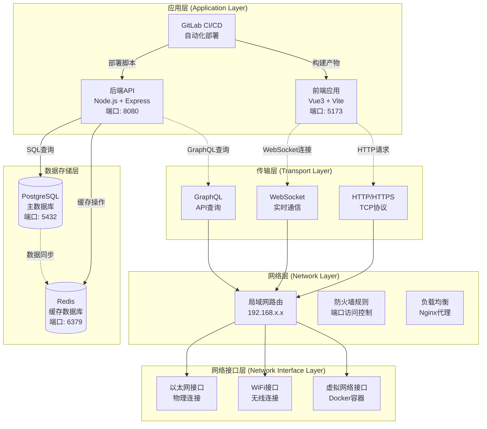
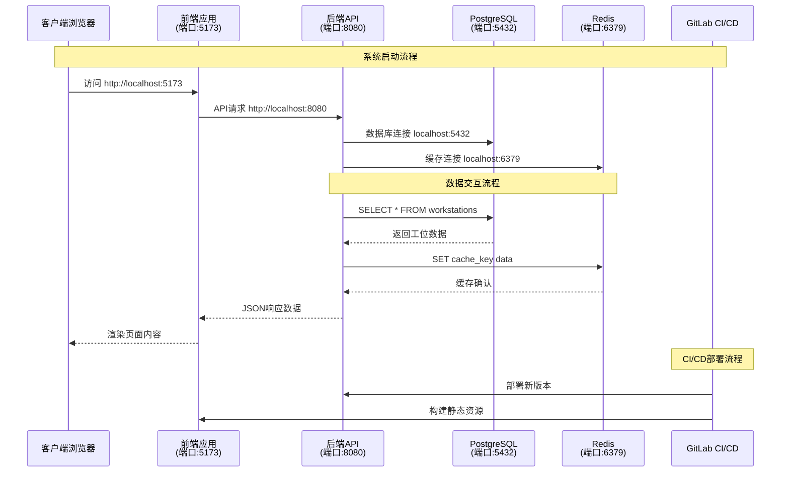
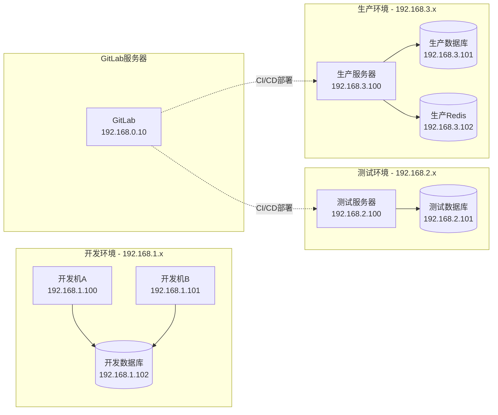
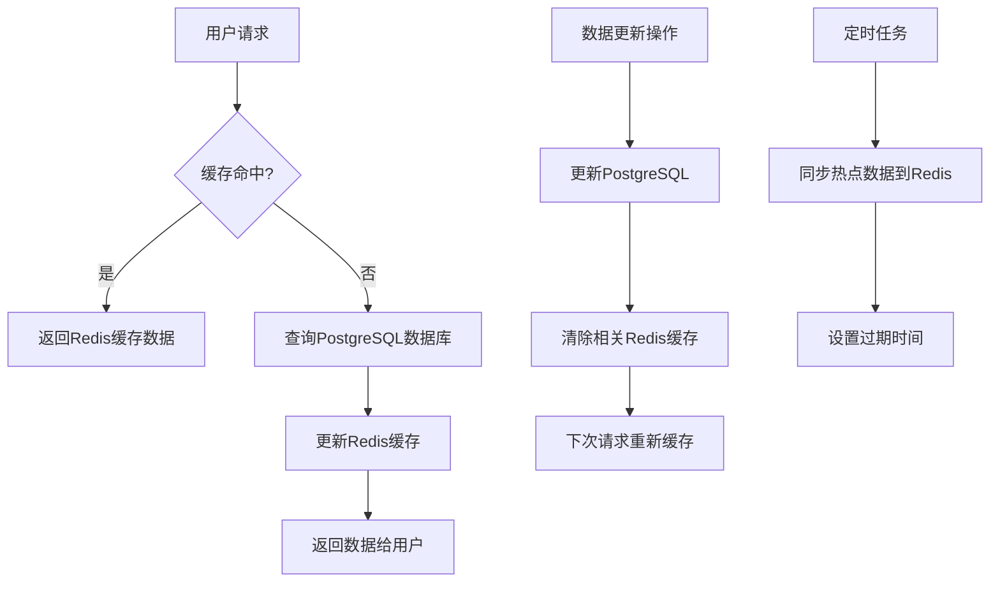

# 部门地图系统 - 网络架构图解

## 📋 概述

本文档详细说明了部门地图系统的网络架构，包括四层网络模型、端口通信流向、数据库交互以及GitLab集成方式。

## 🏗️ 四层网络模型架构图

### 完整系统架构图



### 端口通信流向图



### 局域网通信架构



## 🔧 技术栈详细说明

### 应用层技术栈

| 组件 | 技术 | 端口 | 协议 | 说明 |
|------|------|------|------|------|
| 前端应用 | Vue3 + Vite | 5173 | HTTP/HTTPS | 用户界面，座位地图可视化 |
| 后端API | Node.js + Express | 8080 | HTTP/REST | 业务逻辑，数据处理 |
| WebSocket | Socket.io | 8080 | WebSocket | 实时座位状态同步 |
| GraphQL | Apollo Server | 8080 | HTTP/GraphQL | 灵活的数据查询接口 |

### 传输层协议

| 协议 | 用途 | 特点 |
|------|------|------|
| **HTTP/1.1** | 标准Web请求 | 无状态，请求-响应模式 |
| **HTTPS** | 安全Web请求 | TLS加密，证书验证 |
| **WebSocket** | 实时双向通信 | 持久连接，低延迟 |
| **TCP** | 可靠数据传输 | 面向连接，数据完整性保证 |

### 网络层配置

| 配置项 | 值 | 说明 |
|--------|----|----|
| **子网掩码** | 255.255.255.0 | /24网络，支持254个设备 |
| **网关地址** | 192.168.x.1 | 路由器/交换机地址 |
| **DNS服务器** | 192.168.x.1, 8.8.8.8 | 域名解析服务 |
| **防火墙规则** | 允许5173,8080,5432,6379 | 端口访问控制 |

### 网络接口层

| 接口类型 | 技术 | 带宽 | 说明 |
|----------|------|------|------|
| **以太网** | IEEE 802.3 | 1Gbps | 有线网络连接 |
| **WiFi** | IEEE 802.11ac | 300Mbps | 无线网络连接 |
| **虚拟接口** | Docker Bridge | 1Gbps | 容器网络隔离 |

## 🔄 数据库交互流程

### PostgreSQL 与 Redis 数据同步



### 数据库连接池配置

```typescript
// PostgreSQL连接池
const pgConfig = {
  host: 'localhost',
  port: 5432,
  database: 'department_map',
  user: 'postgres',
  password: 'password',
  max: 20,          // 最大连接数
  idleTimeoutMillis: 30000,
  connectionTimeoutMillis: 2000
}

// Redis连接池
const redisConfig = {
  host: 'localhost',
  port: 6379,
  password: null,
  db: 0,
  maxRetriesPerRequest: 3,
  retryDelayOnFailover: 100,
  lazyConnect: true
}
```

## 🚀 GitLab 集成方式

### CI/CD 流水线配置

```yaml
# .gitlab-ci.yml
stages:
  - build
  - test
  - deploy

variables:
  NODE_VERSION: "18"
  POSTGRES_VERSION: "14"
  REDIS_VERSION: "7"

build_frontend:
  stage: build
  image: node:${NODE_VERSION}
  script:
    - npm install
    - npm run build
  artifacts:
    paths:
      - dist/

build_backend:
  stage: build
  image: node:${NODE_VERSION}
  script:
    - cd api
    - npm install
    - npm run build
  artifacts:
    paths:
      - api/dist/

test:
  stage: test
  services:
    - postgres:${POSTGRES_VERSION}
    - redis:${REDIS_VERSION}
  script:
    - npm run test
    - npm run test:e2e

deploy_staging:
  stage: deploy
  script:
    - docker-compose -f docker-compose.staging.yml up -d
  environment:
    name: staging
    url: http://staging.department-map.local

deploy_production:
  stage: deploy
  script:
    - docker-compose -f docker-compose.prod.yml up -d
  environment:
    name: production
    url: http://department-map.local
  only:
    - main
```

### GitLab Runner 网络配置

```toml
# /etc/gitlab-runner/config.toml
[[runners]]
  name = "department-map-runner"
  url = "https://gitlab.company.com/"
  token = "your-token"
  executor = "docker"
  
  [runners.docker]
    image = "node:18"
    network_mode = "bridge"
    extra_hosts = [
      "postgres:192.168.1.102",
      "redis:192.168.1.103"
    ]
```

## 🔒 网络安全配置

### 防火墙规则

```bash
# 允许前端端口
sudo ufw allow 5173/tcp

# 允许后端API端口
sudo ufw allow 8080/tcp

# 限制数据库端口仅本地访问
sudo ufw allow from 192.168.0.0/16 to any port 5432
sudo ufw allow from 192.168.0.0/16 to any port 6379

# 允许GitLab CI/CD访问
sudo ufw allow from 192.168.0.10 to any port 22
```

### SSL/TLS 配置

```nginx
# nginx.conf
server {
    listen 443 ssl http2;
    server_name department-map.local;
    
    ssl_certificate /path/to/certificate.crt;
    ssl_certificate_key /path/to/private.key;
    
    location / {
        proxy_pass http://localhost:5173;
        proxy_set_header Host $host;
        proxy_set_header X-Real-IP $remote_addr;
    }
    
    location /api {
        proxy_pass http://localhost:8080;
        proxy_set_header Host $host;
        proxy_set_header X-Real-IP $remote_addr;
    }
}
```

## ⚡ 性能优化配置

### 网络优化

| 配置项 | 推荐值 | 说明 |
|--------|--------|------|
| **TCP窗口大小** | 64KB | 提高数据传输效率 |
| **连接超时** | 30秒 | 避免长时间等待 |
| **Keep-Alive** | 启用 | 复用HTTP连接 |
| **Gzip压缩** | 启用 | 减少传输数据量 |

### 缓存策略

```typescript
// Redis缓存策略
const cacheStrategies = {
  // 工位数据 - 1小时过期
  workstations: {
    ttl: 3600,
    pattern: 'workstation:*'
  },
  
  // 部门数据 - 24小时过期
  departments: {
    ttl: 86400,
    pattern: 'department:*'
  },
  
  // 用户会话 - 30分钟过期
  sessions: {
    ttl: 1800,
    pattern: 'session:*'
  }
}
```

## 🔧 网络故障排除

### 常见问题诊断

| 问题 | 症状 | 解决方案 |
|------|------|----------|
| **端口被占用** | 服务启动失败 | `netstat -ano \| findstr :端口号` |
| **数据库连接失败** | 连接超时 | 检查防火墙和数据库服务状态 |
| **Redis连接失败** | 缓存不可用 | 重启Redis服务，检查配置 |
| **前后端通信失败** | API请求失败 | 检查CORS配置和网络连通性 |

### 网络诊断命令

```bash
# 检查端口占用
netstat -ano | findstr :5173
netstat -ano | findstr :8080
netstat -ano | findstr :5432
netstat -ano | findstr :6379

# 测试网络连通性
ping 192.168.1.100
telnet localhost 8080

# 检查DNS解析
nslookup department-map.local

# 测试数据库连接
psql -h localhost -p 5432 -U postgres -d department_map
redis-cli -h localhost -p 6379 ping
```

## 📊 监控和日志

### 网络监控指标

| 指标 | 阈值 | 说明 |
|------|------|------|
| **响应时间** | < 200ms | API响应时间 |
| **并发连接数** | < 1000 | 同时连接数 |
| **网络带宽使用率** | < 80% | 网络负载 |
| **数据库连接池使用率** | < 90% | 连接池健康度 |

### 日志配置

```typescript
// 网络请求日志
const networkLogger = {
  level: 'info',
  format: 'combined',
  transports: [
    new winston.transports.File({ 
      filename: 'logs/network.log',
      maxsize: 10485760, // 10MB
      maxFiles: 5
    })
  ]
}
```

---

## 📝 总结

本网络架构图解详细说明了部门地图系统的四层网络模型，包括：

1. **应用层**: Vue3前端 + Node.js后端 + GitLab CI/CD
2. **传输层**: HTTP/HTTPS + WebSocket + GraphQL协议
3. **网络层**: 局域网路由 + 防火墙 + 负载均衡
4. **网络接口层**: 以太网 + WiFi + 虚拟网络接口

系统通过标准化的端口配置、安全的网络协议和高效的数据库交互，确保了稳定可靠的网络通信。GitLab集成提供了完整的CI/CD流水线，支持自动化部署和版本管理。

通过合理的网络架构设计和性能优化配置，系统能够支持高并发访问和实时数据同步，满足企业级应用的需求。