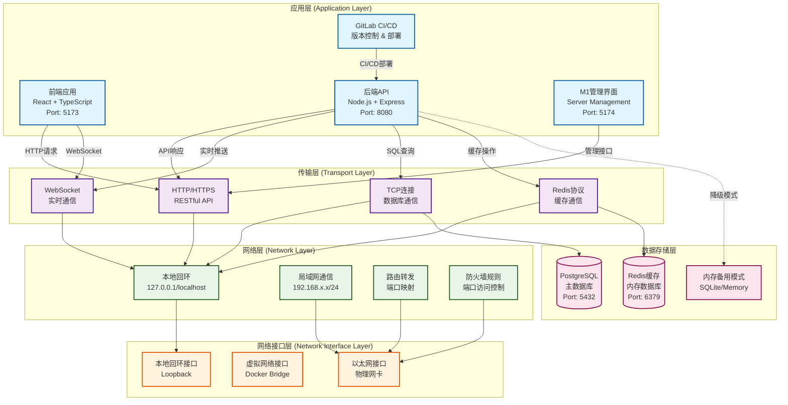
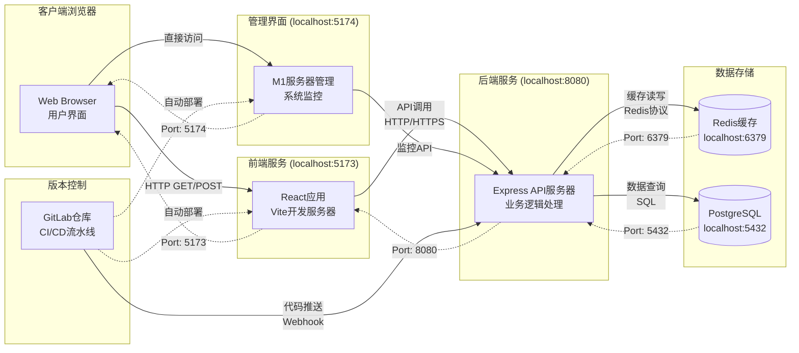
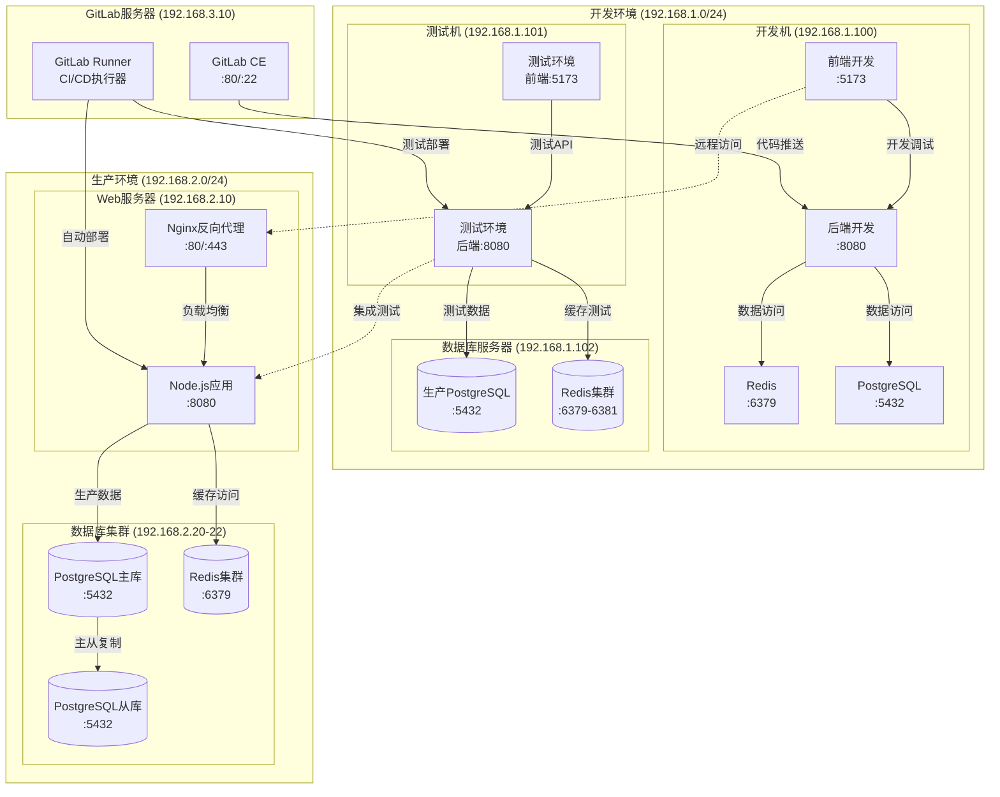
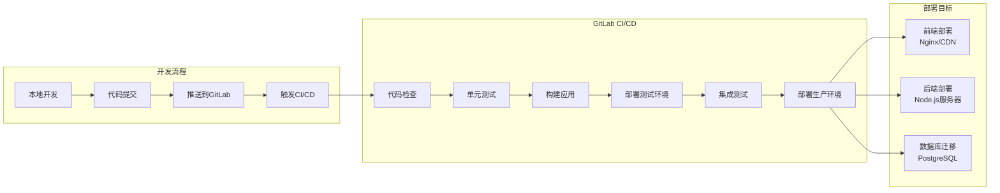

# 网络架构图解文档

## 四层网络模型架构图

### 系统整体架构



### 端口通信流向图



### 局域网通信架构



## 技术栈详细说明

### 协议层级说明

#### 应用层协议
- **HTTP/HTTPS**: RESTful API通信协议
  - 前端与后端API交互
  - 支持GET、POST、PUT、DELETE等方法
  - 使用JSON格式数据交换
  
- **WebSocket**: 实时双向通信协议
  - 实时数据推送
  - 用户状态同步
  - 系统通知推送

- **GraphQL**: 查询语言和运行时（可选）
  - 灵活的数据查询
  - 减少网络请求次数
  - 类型安全的API

#### 传输层协议
- **TCP**: 可靠的传输控制协议
  - 数据库连接 (PostgreSQL)
  - Redis缓存连接
  - HTTP/HTTPS底层传输

- **TLS/SSL**: 传输层安全协议
  - HTTPS加密通信
  - 数据库连接加密
  - 证书验证

#### 网络层协议
- **IPv4**: 网络层协议
  - 本地回环: 127.0.0.1
  - 局域网: 192.168.x.x
  - 子网掩码: /24 (255.255.255.0)

- **ICMP**: 网络控制消息协议
  - 网络连通性测试 (ping)
  - 网络故障诊断

#### 数据链路层
- **以太网**: 局域网通信标准
  - MAC地址识别
  - 帧格式数据传输
  - 冲突检测机制

### GitLab集成架构

#### GitLab工作流程



#### GitLab配置文件

**.gitlab-ci.yml 示例**:
```yaml
stages:
  - test
  - build
  - deploy

variables:
  NODE_VERSION: "18"
  POSTGRES_DB: "department_map"
  REDIS_URL: "redis://localhost:6379"

# 测试阶段
test:
  stage: test
  image: node:18
  services:
    - postgres:13
    - redis:6
  script:
    - npm install
    - npm run test
    - npm run test:e2e
  coverage: '/Lines\s*:\s*(\d+\.\d+)%/'

# 构建阶段
build:
  stage: build
  image: node:18
  script:
    - npm install
    - npm run build
  artifacts:
    paths:
      - dist/
    expire_in: 1 hour

# 部署阶段
deploy:
  stage: deploy
  image: alpine:latest
  script:
    - apk add --no-cache rsync openssh
    - rsync -avz dist/ user@server:/var/www/html/
  only:
    - main
```

### 网络安全配置

#### 防火墙规则
```bash
# Windows防火墙规则
New-NetFirewallRule -DisplayName "Node.js API" -Direction Inbound -Protocol TCP -LocalPort 8080 -Action Allow
New-NetFirewallRule -DisplayName "React Dev Server" -Direction Inbound -Protocol TCP -LocalPort 5173 -Action Allow
New-NetFirewallRule -DisplayName "Redis" -Direction Inbound -Protocol TCP -LocalPort 6379 -Action Allow
New-NetFirewallRule -DisplayName "PostgreSQL" -Direction Inbound -Protocol TCP -LocalPort 5432 -Action Allow

# Linux iptables规则
iptables -A INPUT -p tcp --dport 8080 -j ACCEPT
iptables -A INPUT -p tcp --dport 5173 -j ACCEPT
iptables -A INPUT -p tcp --dport 6379 -s 127.0.0.1 -j ACCEPT
iptables -A INPUT -p tcp --dport 5432 -s 127.0.0.1 -j ACCEPT
```

#### 网络监控
```bash
# 端口监听状态
netstat -tulpn | grep -E ':(5173|8080|6379|5432)'

# 网络连接状态
ss -tuln | grep -E ':(5173|8080|6379|5432)'

# 实时网络流量监控
iftop -i eth0
```

### 性能优化配置

#### Redis性能调优
```conf
# redis.conf 性能配置
tcp-backlog 511
timeout 0
tcp-keepalive 300
maxclients 10000
maxmemory 2gb
maxmemory-policy allkeys-lru
save 900 1
save 300 10
save 60 10000
```

#### PostgreSQL性能调优
```sql
-- postgresql.conf 关键配置
shared_buffers = 256MB
effective_cache_size = 1GB
work_mem = 4MB
maintenance_work_mem = 64MB
max_connections = 100
```

#### Nginx反向代理配置
```nginx
upstream backend {
    server 127.0.0.1:8080;
    keepalive 32;
}

server {
    listen 80;
    server_name department-map.local;
    
    location / {
        proxy_pass http://127.0.0.1:5173;
        proxy_http_version 1.1;
        proxy_set_header Upgrade $http_upgrade;
        proxy_set_header Connection 'upgrade';
        proxy_set_header Host $host;
        proxy_cache_bypass $http_upgrade;
    }
    
    location /api {
        proxy_pass http://backend;
        proxy_http_version 1.1;
        proxy_set_header Connection "";
        proxy_set_header Host $host;
        proxy_set_header X-Real-IP $remote_addr;
        proxy_set_header X-Forwarded-For $proxy_add_x_forwarded_for;
    }
}
```

## 网络故障排除

### 常见网络问题诊断

#### 连接性测试
```bash
# 测试端口连通性
telnet localhost 8080
telnet localhost 5173
telnet localhost 6379
telnet localhost 5432

# 使用PowerShell测试
Test-NetConnection -ComputerName localhost -Port 8080
Test-NetConnection -ComputerName localhost -Port 5173

# 使用curl测试API
curl -I http://localhost:8080/api/health
curl -I http://localhost:5173
```

#### 网络延迟测试
```bash
# ping测试
ping -c 4 localhost
ping -c 4 192.168.1.1

# 路由跟踪
traceroute 192.168.1.1
tracert 192.168.1.1  # Windows
```

#### 带宽测试
```bash
# 使用iperf3测试带宽
iperf3 -s  # 服务器端
iperf3 -c 192.168.1.100  # 客户端

# 网络吞吐量测试
dd if=/dev/zero bs=1M count=1000 | nc 192.168.1.100 8080
```

### 监控和日志

#### 系统监控
```bash
# 实时系统监控
htop
top

# 网络接口监控
watch -n 1 'cat /proc/net/dev'

# 连接数监控
watch -n 1 'netstat -an | wc -l'
```

#### 日志分析
```bash
# Nginx访问日志
tail -f /var/log/nginx/access.log

# Node.js应用日志
tail -f logs/app.log

# PostgreSQL日志
tail -f /var/log/postgresql/postgresql-13-main.log

# Redis日志
tail -f /var/log/redis/redis-server.log
```

---

*本文档描述了部门地图管理系统的完整网络架构，包括四层网络模型、技术栈说明、GitLab集成方式以及性能优化配置。*