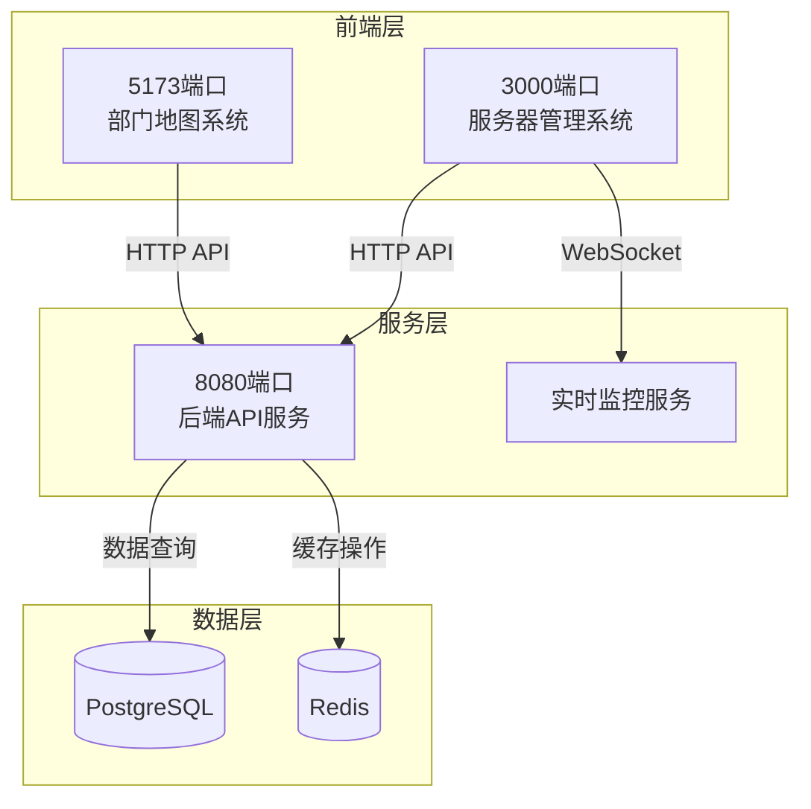

# 端口配置文档

## 1. 端口配置概览

本项目采用多端口架构，每个端口承担不同的职责，确保系统模块化和安全性。

### 1.1 端口分配表

| 端口 | 系统名称 | 主要职责 | 访问路径 | 状态 |
|------|----------|----------|----------|------|
| 5173 | 部门地图系统 | 地图展示、人员搜索、工位管理 | http://localhost:5173/ | 运行中 |
| 3000 | 服务器管理系统 | 服务器监控、系统管理 | http://localhost:3000/server-management.html | 运行中 |
| 8080 | 后端API服务 | 数据接口、业务逻辑 | http://localhost:8080/api/* | 运行中 |

## 2. 端口职责边界

### 2.1 5173端口 - 部门地图系统

**核心职责：**
- 部门地图可视化展示
- 员工搜索和定位功能
- 工位状态管理
- 用户认证和权限控制

**访问控制机制：**
```typescript
// vite.config.ts 访问控制中间件
const accessControlMiddleware = (req, res, next) => {
  // 禁止访问服务器管理页面
  if (req.url.includes('/server-management.html')) {
    res.status(403).json({
      error: 'Access Denied',
      message: '此端口不允许访问服务器管理功能，请使用3000端口'
    });
    return;
  }
  next();
};
```

**防护措施：**
- 严格路径访问控制
- 禁止跨系统页面访问
- 独立的认证状态管理
- 资源隔离和权限验证

### 2.2 3000端口 - 服务器管理系统

**核心职责：**
- M1服务器状态监控
- 系统配置管理
- 用户权限管理
- 数据库连接管理
- 安全策略配置

**访问控制机制：**
```typescript
// vite.server-management.config.ts 路由重定向
const rootRedirectMiddleware = (req, res, next) => {
  if (req.url === '/') {
    res.redirect('/server-management.html');
    return;
  }
  next();
};
```

**防护措施：**
- 根路径自动重定向到管理界面
- 独立的管理员认证系统
- 敏感操作权限验证
- 操作日志记录和审计

### 2.3 8080端口 - 后端API服务

**核心职责：**
- RESTful API接口服务
- 数据库操作和事务管理
- 业务逻辑处理
- API调用监控和统计

**访问控制机制：**
```typescript
// API访问控制和监控
const apiAccessControl = {
  rateLimit: '100 requests/minute',
  authentication: 'JWT Token Required',
  monitoring: 'Real-time API metrics',
  logging: 'Complete request/response logs'
};
```

**防护措施：**
- API访问频率限制
- JWT令牌验证
- 请求参数验证和过滤
- 实时监控和告警机制

## 3. 端口间通信规范

### 3.1 通信架构



### 3.2 通信协议

**HTTP API通信：**
- 统一使用RESTful API规范
- JSON格式数据交换
- 标准HTTP状态码
- 统一错误处理格式

**WebSocket通信：**
- 实时状态推送
- 系统监控数据同步
- 用户在线状态更新

## 4. 安全配置

### 4.1 端口安全策略

**网络层安全：**
- 仅允许本地访问（localhost）
- 防火墙规则配置
- 端口扫描防护

**应用层安全：**
- CORS跨域访问控制
- CSP内容安全策略
- XSS和CSRF防护

### 4.2 访问控制列表

| 端口 | 允许访问的路径 | 禁止访问的路径 | 安全级别 |
|------|----------------|----------------|----------|
| 5173 | /, /login, /map/* | /server-management.html | 中等 |
| 3000 | /server-management.html | 其他所有路径 | 高 |
| 8080 | /api/*, /monitor | /admin/* (需特殊权限) | 高 |

## 5. 故障排除指南

### 5.1 常见问题

**问题1：端口内容重复**
- **症状**：不同端口显示相同内容
- **原因**：访问控制中间件失效
- **解决**：检查vite配置文件中的中间件设置

**问题2：端口无法访问**
- **症状**：浏览器显示连接拒绝
- **原因**：服务未启动或端口被占用
- **解决**：检查进程状态，释放端口或重启服务

**问题3：跨端口访问失败**
- **症状**：API调用返回CORS错误
- **原因**：跨域配置不正确
- **解决**：检查代理配置和CORS设置

### 5.2 诊断命令

```bash
# 检查端口占用情况
netstat -ano | findstr :5173
netstat -ano | findstr :3000
netstat -ano | findstr :8080

# 检查服务运行状态
npm run client:dev     # 启动5173端口
npm run server-management:dev  # 启动3000端口
npm run server:dev     # 启动8080端口

# 测试端口连通性
curl http://localhost:5173/
curl http://localhost:3000/server-management.html
curl http://localhost:8080/api/health
```

### 5.3 监控和日志

**日志位置：**
- 5173端口：浏览器开发者工具控制台
- 3000端口：浏览器开发者工具控制台
- 8080端口：服务器日志文件

**监控指标：**
- 端口响应时间
- API调用成功率
- 错误率统计
- 并发连接数

## 6. 最佳实践

### 6.1 开发规范

1. **端口职责单一原则**
   - 每个端口只负责特定功能
   - 避免功能重叠和内容重复
   - 保持清晰的边界划分

2. **访问控制严格化**
   - 实施最小权限原则
   - 定期审查访问权限
   - 记录所有访问日志

3. **配置文件管理**
   - 使用版本控制管理配置
   - 环境变量分离敏感信息
   - 定期备份配置文件

### 6.2 部署建议

1. **生产环境配置**
   - 使用反向代理（Nginx）
   - 启用HTTPS加密
   - 配置负载均衡

2. **监控和告警**
   - 设置端口健康检查
   - 配置异常告警机制
   - 建立故障恢复流程

3. **性能优化**
   - 启用Gzip压缩
   - 配置静态资源缓存
   - 优化数据库连接池

## 7. 更新记录

| 版本 | 日期 | 更新内容 | 更新人 |
|------|------|----------|--------|
| 1.0.0 | 2024-01-XX | 初始版本，基础端口配置 | 开发团队 |
| 1.1.0 | 2024-01-XX | 修复端口内容重复问题，添加访问控制 | 开发团队 |

---

**注意事项：**
- 本文档需要与代码变更同步更新
- 任何端口配置修改都应该在此文档中记录
- 定期审查和测试端口配置的有效性