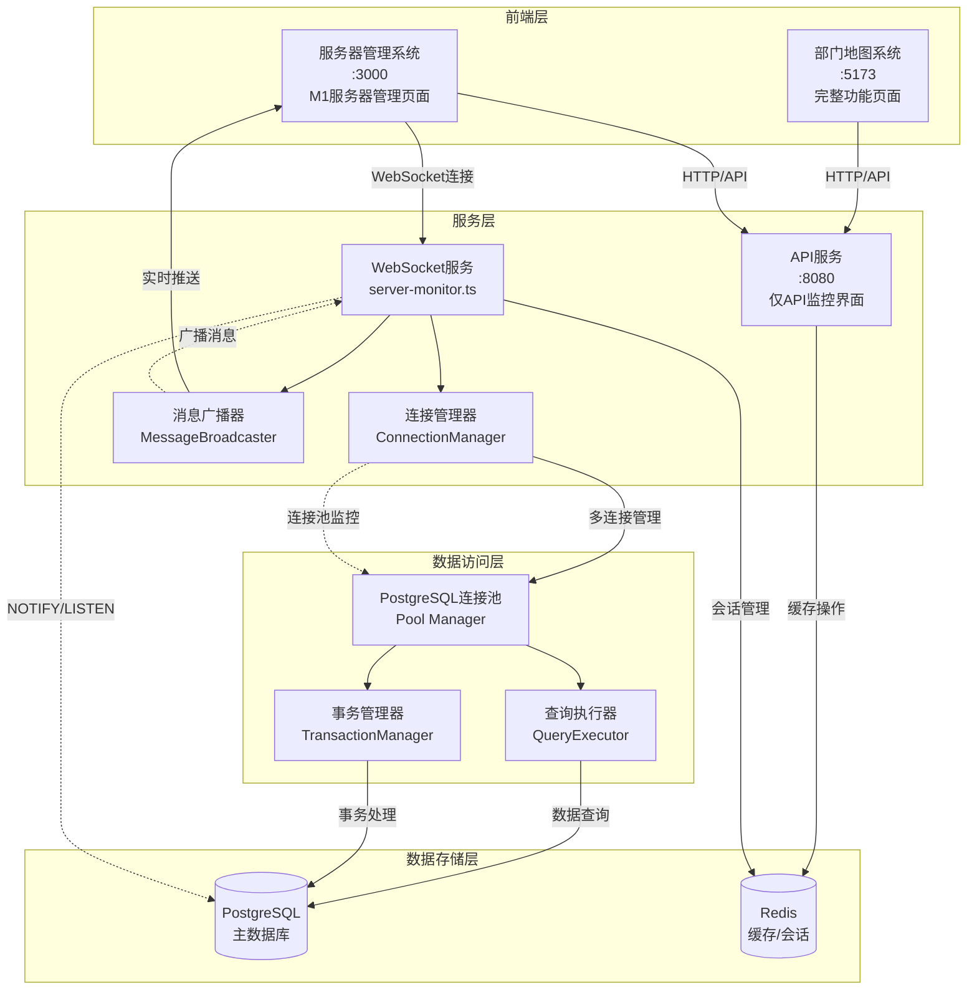
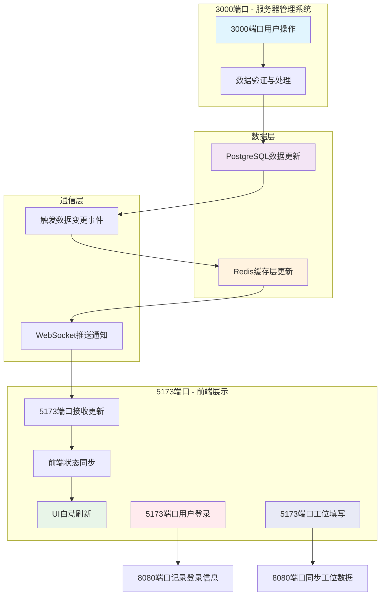
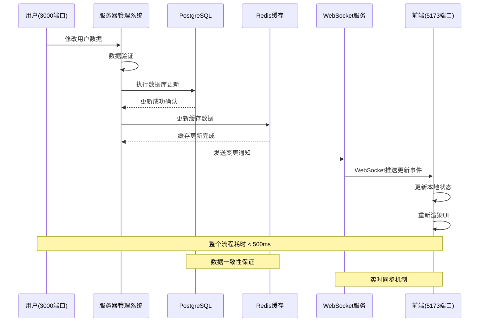
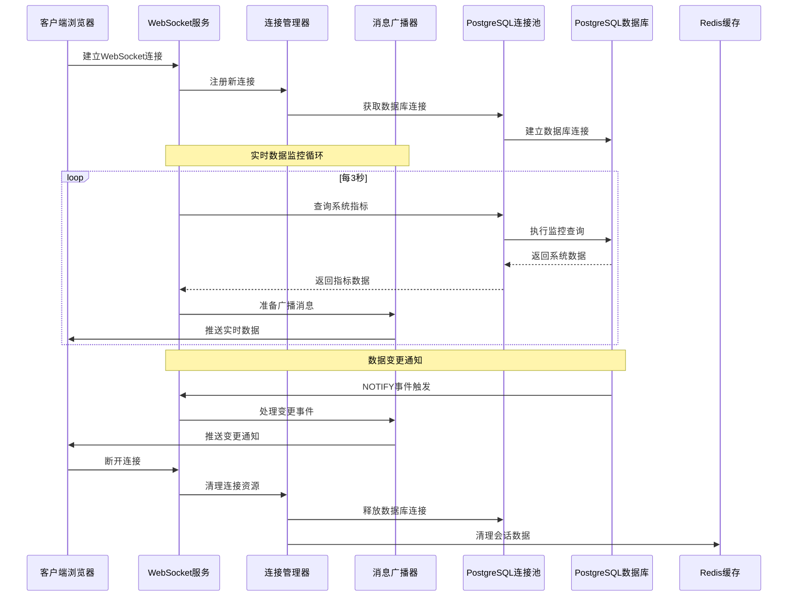

# 系统架构关联逻辑文档

## 1. 架构概览

本项目采用**微前端架构**，由两个独立前端系统和一个统一后端服务组成：

| 系统      | 端口   | 职责             | 入口文件                                                          | 页面内容限制      |
| ------- | ---- | -------------- | ------------------------------------------------------------- | ----------- |
| 部门地图系统  | 5173 | 地图展示、人员搜索、工位管理 | `src/main.tsx` → `App.tsx`                                    | 完整功能页面      |
| 服务器管理系统 | 3000 | 服务器监控、系统管理     | `src/server-management-main.tsx` → `ServerManagementRoot.tsx` | 完整M1服务器管理页面 |
| 后端API服务 | 8080 | 数据接口、业务逻辑      | `api/server.ts`                                               | 仅API调用监控界面  |

## 2. 系统架构图



## 3. 端口配置与职责分工

### 3.1 端口职责明确划分

**8080端口 - API服务层**

* **职责限制**：仅提供API调用情况的监控可视化界面

* **禁止内容**：不得显示M1服务器管理相关内容

* **监控范围**：API请求统计、响应时间、错误率、接口调用频次

* **界面特征**：轻量级监控仪表板，专注于API性能指标

**3000端口 - 服务器管理系统**

* **完整功能**：保留原8080端口的所有M1服务器管理页面内容

* **管理范围**：服务器监控、系统管理、用户管理、安全管理等

* **界面特征**：完整的M1服务器管理仪表板和控制面板

**配置错误修正**

* **问题**：3030端口错误加载了5173端口内容而非M1服务器管理页面

* **解决方案**：修正默认根页面路由配置，确保3030端口正确指向服务器管理系统

* **路由配置**：`vite.server-management.config.ts`中的端口和路由映射需要准确配置

### 3.2 独立部署架构

**技术实现：**

* **入口隔离**：各系统使用独立的HTML入口和TypeScript主文件

* **配置分离**：通过不同的Vite配置文件实现端口和构建隔离

* **资源独立**：各系统拥有独立的依赖管理和资源加载策略

**架构优势：**

* ✅ **模块化开发**：团队可并行开发，降低协作复杂度

* ✅ **独立部署**：支持不同发布周期和灰度策略

* ✅ **故障隔离**：单系统故障不影响其他系统运行

* ✅ **性能优化**：按需加载，减少初始包体积

### 3.2 统一数据服务

两个前端系统通过统一的API服务进行数据交互，确保：

* **数据一致性**：统一的数据模型和业务逻辑

* **权限控制**：集中的认证和授权管理

* **接口标准化**：一致的请求/响应格式

## 4. 系统详细说明

### 4.1 部门地图系统 (5173端口)

**核心功能：**

```typescript
// 主要组件结构
src/
├── main.tsx              // 应用入口
├── App.tsx               // 主应用组件
├── components/
│   ├── DeptMap.tsx       // 地图渲染
│   └── LoginForm.tsx     // 用户认证
└── contexts/
    └── AuthContext.tsx   // 认证状态管理
```

**数据流程：**

1. **认证流程**：`LoginForm` → `AuthContext` → `localStorage(token)` → `API Headers`
2. **地图渲染**：`departmentData.ts` → `DeptMap.tsx` → `SVG渲染`
3. **搜索功能**：`输入防抖(300ms)` → `API调用` → `结果展示` → `地图定位`

**关键配置：**

```typescript
// vite.config.ts
export default defineConfig({
  server: {
    port: 5173,
    proxy: {
      '/api': {
        target: 'http://localhost:8080',
        changeOrigin: true
      }
    }
  }
})
```

### 4.2 服务器管理系统 (3000端口)

**核心功能模块详细说明：**

```typescript
// ServerManagementRoot.tsx 主要模块结构
ServerManagementRoot.tsx
├── 仪表板 (Dashboard)     // 系统概览 + PostgreSQL关键指标
├── 服务器监控 (Monitoring) // 简化版API调用统计 + 跳转8080详情
├── 用户管理 (Users)       // PostgreSQL用户数据管理（原工位管理）
├── 安全管理 (Security)    // 安全策略 + PostgreSQL访问控制
└── 系统设置 (Settings)    // 配置管理 + PostgreSQL连接配置
```

#### 4.2.1 仪表板 (Dashboard)

**功能职责：**

* 显示系统概览信息和运行状态

* 集成PostgreSQL关键指标可视化

  * 数据库连接数、查询性能、存储使用率

  * 实时事务统计、锁等待情况

  * 数据库健康状态监控

```typescript
// PostgreSQL指标集成
const [dbMetrics, setDbMetrics] = useState({
  connections: 0,
  queryPerformance: 0,
  storageUsage: 0,
  transactionCount: 0,
  lockWaits: 0
});

useEffect(() => {
  const fetchDbMetrics = async () => {
    const response = await fetch('/api/database/metrics');
    const metrics = await response.json();
    setDbMetrics(metrics);
  };
  
  const interval = setInterval(fetchDbMetrics, 5000);
  return () => clearInterval(interval);
}, []);
```

#### 4.2.2 服务器监控 (Monitoring)

**功能职责：**

* 实时显示API服务调用次数（简化版统计）

* 提供"查看详情"按钮跳转至8080端口获取完整监控数据

* 显示关键性能指标概览

```typescript
// 简化版API监控
const ApiMonitoringSummary = () => {
  const [apiStats, setApiStats] = useState({
    totalCalls: 0,
    successRate: 0,
    avgResponseTime: 0,
    errorCount: 0
  });

  const handleViewDetails = () => {
    window.open('http://localhost:8080', '_blank');
  };

  return (
    <div className="api-monitoring-summary">
      <div className="stats-grid">
        <div className="stat-item">
          <span>总调用次数</span>
          <span>{apiStats.totalCalls}</span>
        </div>
        <div className="stat-item">
          <span>成功率</span>
          <span>{apiStats.successRate}%</span>
        </div>
      </div>
      <button onClick={handleViewDetails} className="details-btn">
        查看完整监控数据
      </button>
    </div>
  );
};
```

#### 4.2.3 用户管理 (Users)

**功能职责：**

* 管理PostgreSQL用户数据（整合原工位管理功能）

* 支持数据修改并实时保存至PostgreSQL

* 数据变更后自动同步更新前端5173端口显示

```typescript
// 用户数据管理（原工位管理功能）
const UserManagement = () => {
  const [users, setUsers] = useState([]);
  const [workstations, setWorkstations] = useState([]);

  const handleUserUpdate = async (userId, userData) => {
    try {
      // 更新PostgreSQL数据
      await fetch(`/api/users/${userId}`, {
        method: 'PUT',
        headers: { 'Content-Type': 'application/json' },
        body: JSON.stringify(userData)
      });
      
      // 触发Redis缓存更新
      await fetch('/api/cache/invalidate/users');
      
      // 通知前端5173端口同步更新
      broadcastUpdate('user_updated', { userId, userData });
      
      setUsers(prev => prev.map(user => 
        user.id === userId ? { ...user, ...userData } : user
      ));
    } catch (error) {
      console.error('用户数据更新失败:', error);
    }
  };

  return (
    <div className="user-management">
      <UserTable 
        users={users} 
        workstations={workstations}
        onUserUpdate={handleUserUpdate}
      />
    </div>
  );
};
```

#### 4.2.4 安全管理 (Security)

**功能职责：**

* 配置系统安全策略和访问控制

* 集成PostgreSQL访问控制管理

* 管理数据库用户权限和角色

```typescript
// PostgreSQL访问控制管理
const SecurityManagement = () => {
  const [dbUsers, setDbUsers] = useState([]);
  const [permissions, setPermissions] = useState([]);

  const updateDbPermissions = async (userId, newPermissions) => {
    try {
      await fetch('/api/database/permissions', {
        method: 'POST',
        headers: { 'Content-Type': 'application/json' },
        body: JSON.stringify({ userId, permissions: newPermissions })
      });
      
      setPermissions(prev => ({ ...prev, [userId]: newPermissions }));
    } catch (error) {
      console.error('权限更新失败:', error);
    }
  };

  return (
    <div className="security-management">
      <DatabaseUserPermissions 
        users={dbUsers}
        permissions={permissions}
        onPermissionUpdate={updateDbPermissions}
      />
    </div>
  );
};
```

#### 4.2.5 系统设置 (Settings)

**功能职责：**

* 管理系统配置参数和运行环境

* 支持PostgreSQL连接配置调整

* 实时测试数据库连接状态

```typescript
// PostgreSQL连接配置管理
const SystemSettings = () => {
  const [dbConfig, setDbConfig] = useState({
    host: 'localhost',
    port: 5432,
    database: 'department_map',
    maxConnections: 20,
    connectionTimeout: 5000
  });

  const testConnection = async () => {
    try {
      const response = await fetch('/api/database/test-connection', {
        method: 'POST',
        headers: { 'Content-Type': 'application/json' },
        body: JSON.stringify(dbConfig)
      });
      
      const result = await response.json();
      return result.success;
    } catch (error) {
      console.error('连接测试失败:', error);
      return false;
    }
  };

  const saveDbConfig = async () => {
    const isConnected = await testConnection();
    if (isConnected) {
      await fetch('/api/database/config', {
        method: 'PUT',
        headers: { 'Content-Type': 'application/json' },
        body: JSON.stringify(dbConfig)
      });
    }
  };

  return (
    <div className="system-settings">
      <DatabaseConfigForm 
        config={dbConfig}
        onConfigChange={setDbConfig}
        onSave={saveDbConfig}
        onTest={testConnection}
      />
    </div>
  );
};
```

**实时监控实现：**

```typescript
// 性能数据更新
useEffect(() => {
  const interval = setInterval(() => {
    setServerStatus(prev => ({
      ...prev,
      cpu: updateMetric(prev.cpu, 10),
      memory: updateMetric(prev.memory, 8)
    }));
  }, 3000);
  return () => clearInterval(interval);
}, []);
```

### 4.3 后端API服务 (8080端口)

**核心功能：**

* 提供RESTful API接口

* 处理数据库操作和业务逻辑

* 实现WebSocket实时通信

* 集成Redis缓存优化

**组件结构：**

```typescript
// API服务架构
api/
├── routes/           // 路由定义
│   ├── auth.ts      // 认证相关
│   ├── users.ts     // 用户管理
│   └── search.ts    // 搜索功能
├── middleware/       // 中间件
│   ├── auth.ts      // 认证中间件
│   └── cors.ts      // 跨域处理
├── services/         // 业务逻辑
│   ├── database.ts  // 数据库服务
│   └── cache.ts     // 缓存服务
└── websocket/        // WebSocket服务
    └── server-monitor.ts
```

### 4.4 Redis服务职责详解

**Redis服务的五大核心职责：**

#### 4.4.1 中间缓存层

**职责描述：**

* 作为PostgreSQL与前端之间的高速缓存层

* 缓存频繁查询的数据，减少数据库压力

* 提供毫秒级数据访问速度

```typescript
// Redis缓存层实现
class RedisCacheService {
  private redis: Redis;

  async get(key: string): Promise<any> {
    const cached = await this.redis.get(key);
    return cached ? JSON.parse(cached) : null;
  }

  async set(key: string, value: any, ttl: number = 3600): Promise<void> {
    await this.redis.setex(key, ttl, JSON.stringify(value));
  }

  async invalidate(pattern: string): Promise<void> {
    const keys = await this.redis.keys(pattern);
    if (keys.length > 0) {
      await this.redis.del(...keys);
    }
  }
}
```

#### 4.4.2 监听PostgreSQL变更事件

**职责描述：**

* 监听数据库触发器产生的变更通知

* 实时捕获数据增删改操作

* 触发相应的缓存更新和通知机制

```typescript
// PostgreSQL变更监听
class DatabaseChangeListener {
  private redis: Redis;
  private pgClient: Client;

  async startListening(): Promise<void> {
    // 监听PostgreSQL NOTIFY事件
    await this.pgClient.query('LISTEN user_changes');
    await this.pgClient.query('LISTEN workstation_changes');

    this.pgClient.on('notification', async (msg) => {
      const { channel, payload } = msg;
      const changeData = JSON.parse(payload);
      
      // 发布变更事件到Redis
      await this.redis.publish(`db_change:${channel}`, JSON.stringify({
        timestamp: Date.now(),
        operation: changeData.operation,
        table: changeData.table,
        data: changeData.data
      }));
    });
  }
}
```

#### 4.4.3 推送更新通知至前端

**职责描述：**

* 通过Redis Pub/Sub机制推送实时更新

* 向5173端口前端发送数据变更通知

* 支持多客户端同时接收更新

```typescript
// 更新通知推送服务
class UpdateNotificationService {
  private redis: Redis;
  private wsServer: WebSocketServer;

  async broadcastUpdate(channel: string, data: any): Promise<void> {
    // 发布到Redis频道
    await this.redis.publish(`frontend_update:${channel}`, JSON.stringify({
      timestamp: Date.now(),
      type: 'data_update',
      payload: data
    }));

    // 通过WebSocket直接推送给连接的客户端
    this.wsServer.clients.forEach(client => {
      if (client.readyState === WebSocket.OPEN) {
        client.send(JSON.stringify({
          channel,
          data,
          timestamp: Date.now()
        }));
      }
    });
  }

  // 订阅数据库变更事件
  async subscribeToChanges(): Promise<void> {
    const subscriber = this.redis.duplicate();
    
    subscriber.subscribe('db_change:user_changes', 'db_change:workstation_changes');
    
    subscriber.on('message', async (channel, message) => {
      const changeEvent = JSON.parse(message);
      
      // 根据变更类型推送不同的更新
      switch (changeEvent.table) {
        case 'users':
          await this.broadcastUpdate('users', changeEvent.data);
          break;
        case 'workstations':
          await this.broadcastUpdate('workstations', changeEvent.data);
          break;
      }
    });
  }
}
```

#### 4.4.4 维护实时数据一致性

**职责描述：**

* 确保缓存数据与数据库数据的一致性

* 实现缓存失效和更新策略

* 处理并发访问时的数据同步

```typescript
// 数据一致性维护
class DataConsistencyManager {
  private redis: Redis;
  private db: Pool;

  async ensureConsistency(key: string, fetchFromDb: () => Promise<any>): Promise<any> {
    // 尝试从缓存获取
    let data = await this.redis.get(key);
    
    if (!data) {
      // 使用分布式锁防止缓存击穿
      const lockKey = `lock:${key}`;
      const lockAcquired = await this.redis.set(lockKey, '1', 'PX', 5000, 'NX');
      
      if (lockAcquired) {
        try {
          // 从数据库获取最新数据
          const freshData = await fetchFromDb();
          
          // 更新缓存
          await this.redis.setex(key, 3600, JSON.stringify(freshData));
          
          data = JSON.stringify(freshData);
        } finally {
          // 释放锁
          await this.redis.del(lockKey);
        }
      } else {
        // 等待锁释放后重试
        await new Promise(resolve => setTimeout(resolve, 100));
        return this.ensureConsistency(key, fetchFromDb);
      }
    }
    
    return JSON.parse(data);
  }

  async invalidateRelatedCache(table: string, operation: string): Promise<void> {
    const patterns = {
      users: ['user:*', 'users:list', 'dashboard:user_stats'],
      workstations: ['workstation:*', 'workstations:list', 'dashboard:workstation_stats']
    };

    const keysToInvalidate = patterns[table] || [];
    
    for (const pattern of keysToInvalidate) {
      const keys = await this.redis.keys(pattern);
      if (keys.length > 0) {
        await this.redis.del(...keys);
      }
    }
  }
}
```

#### 4.4.5 处理高并发访问请求

**职责描述：**

* 通过连接池管理Redis连接

* 实现请求限流和负载均衡

* 优化高并发场景下的性能表现

```typescript
// 高并发处理服务
class HighConcurrencyHandler {
  private redisPool: Redis[];
  private currentIndex: number = 0;

  constructor(poolSize: number = 10) {
    this.redisPool = Array.from({ length: poolSize }, () => 
      new Redis({
        host: process.env.REDIS_HOST,
        port: parseInt(process.env.REDIS_PORT),
        maxRetriesPerRequest: 3,
        retryDelayOnFailover: 100,
        lazyConnect: true
      })
    );
  }

  // 负载均衡获取Redis连接
  private getRedisConnection(): Redis {
    const connection = this.redisPool[this.currentIndex];
    this.currentIndex = (this.currentIndex + 1) % this.redisPool.length;
    return connection;
  }

  // 批量操作优化
  async batchGet(keys: string[]): Promise<Record<string, any>> {
    const redis = this.getRedisConnection();
    const pipeline = redis.pipeline();
    
    keys.forEach(key => pipeline.get(key));
    
    const results = await pipeline.exec();
    const data: Record<string, any> = {};
    
    results.forEach(([err, result], index) => {
      if (!err && result) {
        data[keys[index]] = JSON.parse(result as string);
      }
    });
    
    return data;
  }

  // 请求限流
  async rateLimitCheck(clientId: string, limit: number = 100): Promise<boolean> {
    const redis = this.getRedisConnection();
    const key = `rate_limit:${clientId}`;
    const current = await redis.incr(key);
    
    if (current === 1) {
      await redis.expire(key, 60); // 1分钟窗口
    }
    
    return current <= limit;
  }
}
```

**路由架构：**

```
api/routes/
├── auth.ts           // 认证服务
├── departments.ts    // 部门管理
├── employees.ts      // 员工信息
├── desks.ts         // 工位管理
├── search.ts        // 搜索服务
├── server-monitor.ts // 监控数据
└── workstations.ts  // 工作站管理
```

**数据层设计：**

```
api/database/
├── connection.ts    // 数据库连接池
├── models.ts       // 数据模型定义
├── dao.ts         // 数据访问层
└── sqlite.ts      // SQLite适配器
```

## 5. 开发和部署

### 5.1 开发命令

```bash
# 独立启动
npm run client:dev              # 部门地图系统 (5173)
npm run server-management:dev   # 服务器管理系统 (3000)
npm run server:dev             # 后端API服务 (8080)

# 全量启动
npm run dev:all                # 同时启动所有服务
```

### 5.2 构建部署

```bash
# 构建命令
npm run build                          # 构建部门地图系统
npm run build:server-management        # 构建服务器管理系统

# 预览测试
npm run preview                        # 预览部门地图系统
npm run preview:server-management      # 预览服务器管理系统
```

### 5.3 配置文件说明

| 文件                                 | 用途        | 关键配置         | 端口职责说明               |
| ---------------------------------- | --------- | ------------ | -------------------- |
| `vite.config.ts`                   | 部门地图系统配置  | 端口5173，API代理 | 完整功能页面，地图展示和人员管理     |
| `vite.server-management.config.ts` | 服务器管理系统配置 | 端口3000，独立构建  | 完整M1服务器管理页面，包含所有管理功能 |
| `api/server.ts`                    | API服务配置   | 端口8080，路由配置  | 仅API调用监控界面，禁止服务器管理内容 |
| `package.json`                     | 项目依赖和脚本   | 启动脚本，依赖管理    | 多端口服务启动脚本配置          |

**端口配置修正要点**

```typescript
// vite.config.ts - 部门地图系统 (5173)
export default defineConfig({
  server: {
    port: 5173,
    proxy: {
      '/api': {
        target: 'http://localhost:8080',
        changeOrigin: true
      }
    }
  },
  build: {
    outDir: 'dist'
  }
})

// vite.server-management.config.ts - 服务器管理系统 (3000)
export default defineConfig({
  server: {
    port: 3000,  // 确保端口正确
    proxy: {
      '/api': {
        target: 'http://localhost:8080',
        changeOrigin: true
      }
    }
  },
  build: {
    outDir: 'dist-server-management'  // 独立构建目录
  }
})

// api/server.ts - API服务 (8080)
const app = express();
const PORT = process.env.PORT || 8080;

// 仅提供API监控界面，不包含M1服务器管理页面
app.get('/', (req, res) => {
  res.send('API监控界面 - 仅显示API调用统计');
});
```

## 6. 数据交互协议

### 6.1 数据同步流程

**完整数据同步流程图：**



**数据流程详细说明：**

#### 6.1.1 主要数据流程（A→I）

**服务器管理系统数据更新流程：**

1. **用户操作触发**：3000端口服务器管理系统接收用户操作请求
2. **数据验证处理**：对输入数据进行格式验证、权限检查和业务逻辑处理
3. **数据库更新**：将验证后的数据写入PostgreSQL主数据库
4. **变更事件触发**：数据库触发器产生NOTIFY事件，通知系统数据已变更
5. **缓存层同步**：Redis缓存层接收变更通知，更新相关缓存数据
6. **实时推送**：WebSocket服务监听Redis变更，向所有连接的客户端推送更新通知
7. **前端接收**：5173端口前端系统通过WebSocket连接接收实时更新
8. **状态同步**：前端应用状态管理器更新本地状态数据
9. **界面刷新**：React组件重新渲染，用户界面自动更新显示最新数据

#### 6.1.2 辅助数据流程（J→K, L→M）

**前端与API服务交互：**

* **用户登录流程**：5173端口用户登录操作通过8080端口API服务记录登录信息

* **工位数据同步**：5173端口工位填写操作通过8080端口API服务同步工位数据

#### 6.1.3 系统分层架构

**各层职责明确：**

* **3000端口服务器管理系统**：负责管理员操作和数据处理

* **数据层**：PostgreSQL主数据库和Redis缓存层协同工作

* **通信层**：WebSocket实时通信和API服务数据交互

* **5173端口前端展示**：用户界面展示和交互操作

**数据同步时序图：**



### 6.2 认证机制

```typescript
// JWT Token认证
const headers = {
  'Authorization': `Bearer ${token}`,
  'Content-Type': 'application/json'
};

// API调用示例
const response = await fetch('/api/search?q=query', { headers });
```

### 6.2 搜索API

```typescript
// 请求格式
GET /api/search?q={query}

// 响应格式
{
  "success": true,
  "data": {
    "employees": [...],
    "workstations": [...],
    "total": 10
  }
}
```

### 6.3 监控数据API

```typescript
// WebSocket连接
const ws = new WebSocket('ws://localhost:8080/monitor');

// 实时数据格式
{
  "type": "server_status",
  "data": {
    "cpu": 45.2,
    "memory": 68.1,
    "disk": 32.5,
    "network": 78.3
  }
}
```

### 6.4 WebSocket多连接管理与交互链路

#### 6.4.1 WebSocket连接架构



#### 6.4.2 多连接管理机制

**连接生命周期管理**

* **连接建立**：自动分配连接ID，设置心跳检测

* **连接监控**：实时跟踪连接状态、消息计数、最后活动时间

* **连接清理**：自动清理超时连接（5分钟无活动）

* **负载均衡**：限制单IP最大连接数（10个），总连接数上限（1000个）

**连接池配置优化**

* **最大连接数**：20个并发数据库连接

* **最小连接数**：5个保持活跃连接

* **空闲超时**：30秒自动回收空闲连接

* **连接复用**：单个连接最大使用7500次后重建

#### 6.4.3 实时数据同步机制

**PostgreSQL NOTIFY/LISTEN机制**

* **数据变更监听**：监听数据库表的INSERT、UPDATE、DELETE事件

* **实时推送**：通过WebSocket立即推送变更通知给客户端

* **事件过滤**：根据用户权限过滤推送内容

**Redis缓存集成**

* **会话管理**：存储WebSocket连接会话信息

* **消息队列**：缓存待推送的消息，确保消息不丢失

* **性能优化**：缓存频繁查询的监控数据，减少数据库压力

> 📋 **详细技术实现请参考**：[WebSocket与PostgreSQL组件关联技术文档](./WebSocket与PostgreSQL组件关联技术文档.md)

## 7. 最佳实践

### 7.1 代码规范

* **组件设计**：单一职责，高内聚低耦合

* **状态管理**：使用React Context或Zustand进行状态管理

* **错误处理**：统一的错误边界和异常处理机制

* **类型安全**：充分利用TypeScript类型系统

### 7.2 性能优化

* **代码分割**：使用React.lazy进行组件懒加载

* **缓存策略**：合理使用浏览器缓存和Redis缓存

* **资源优化**：图片压缩，CSS/JS压缩和合并

* **监控告警**：实时性能监控和异常告警

### 7.3 安全考虑

* **输入验证**：前后端双重数据验证

* **权限控制**：基于角色的访问控制(RBAC)

* **安全头部**：使用Helmet.js设置安全HTTP头

* **HTTPS部署**：生产环境强制使用HTTPS

## 8. 维护指南

### 8.1 版本管理

* 采用**语义化版本控制**(Semantic Versioning)

* 重要修改需更新`CHANGELOG.md`

* Git提交信息格式：`type(scope): description`

### 8.2 监控运维

* **性能监控**：页面加载时间、API响应时间

* **错误监控**：前端错误捕获、后端异常日志

* **业务监控**：用户行为分析、功能使用统计

### 8.3 故障处理

1. **问题定位**：查看日志，确定影响范围
2. **快速恢复**：回滚到稳定版本
3. **根因分析**：深入分析问题原因
4. **预防措施**：完善监控和测试覆盖

***

## 9. 相关技术文档

### 9.1 组件关联技术文档

* [WebSocket与PostgreSQL组件关联技术文档](./WebSocket与PostgreSQL组件关联技术文档.md) - 详细描述WebSocket服务与PostgreSQL数据库的技术关联实现

* [M1阶段API接口文档](./M1/M1_API接口文档.md) - M1阶段的API接口规范和使用说明

### 9.2 文档维护说明

本文档与相关技术文档保持同步更新，确保架构信息的一致性和完整性。当系统架构发生变更时，需要同时更新相关的技术文档。

***

**文档信息**

* **版本**: v2.4.0

* **创建**: 2024-01-25

* **更新**: 2024-12-19

* **维护**: 系统架构团队

**v2.4.0 更新内容**

* 集成完整的系统数据流程图，展示3000端口、5173端口、8080端口间的交互关系

* 添加数据层、通信层、前端展示层的分层架构可视化

* 补充主要数据流程（A→I）和辅助数据流程（J→K, L→M）的详细说明

* 优化数据同步流程描述，包含9个关键步骤的完整说明

* 明确各系统层级职责和数据流转机制

**v2.3.0 更新内容**

* 详细补充3000端口ServerManagementRoot.tsx五大核心模块功能

* 添加完整数据同步流程mermaid图（流程图+时序图）

* 详细说明Redis服务五大职责及实现代码

* 优化PostgreSQL数据库信息反映和实时同步机制

* 完善WebSocket多连接管理与交互链路架构

