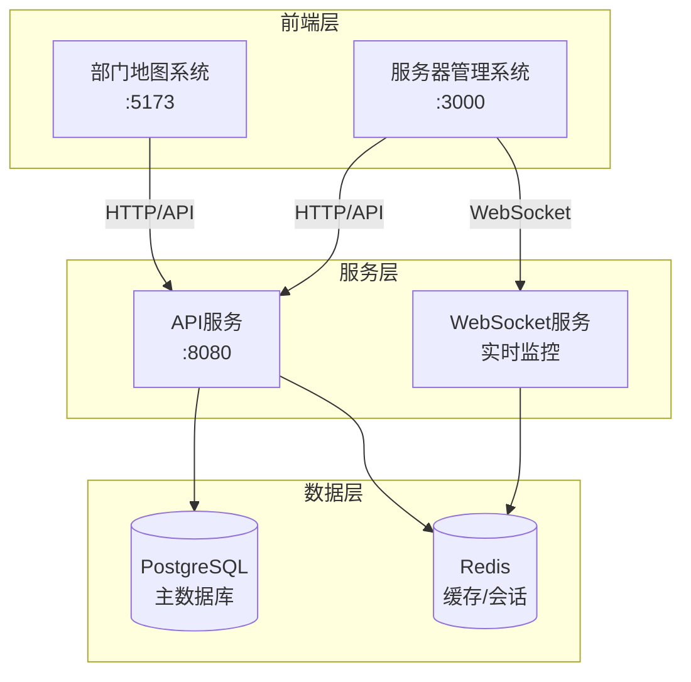

# 系统架构关联逻辑文档

## 1. 架构概览

本项目采用**微前端架构**，由两个独立前端系统和一个统一后端服务组成：

| 系统 | 端口 | 职责 | 入口文件 |
|------|------|------|----------|
| 部门地图系统 | 5173 | 地图展示、人员搜索、工位管理 | `src/main.tsx` → `App.tsx` |
| 服务器管理系统 | 3000 | 服务器监控、系统管理 | `src/server-management-main.tsx` → `ServerManagementRoot.tsx` |
| 后端API服务 | 8080 | 数据接口、业务逻辑 | `api/server.ts` |

## 2. 系统架构图



## 3. 核心特性

### 3.1 独立部署架构

**技术实现：**
- **入口隔离**：各系统使用独立的HTML入口和TypeScript主文件
- **配置分离**：通过不同的Vite配置文件实现端口和构建隔离
- **资源独立**：各系统拥有独立的依赖管理和资源加载策略

**架构优势：**
- ✅ **模块化开发**：团队可并行开发，降低协作复杂度
- ✅ **独立部署**：支持不同发布周期和灰度策略
- ✅ **故障隔离**：单系统故障不影响其他系统运行
- ✅ **性能优化**：按需加载，减少初始包体积

### 3.2 统一数据服务

两个前端系统通过统一的API服务进行数据交互，确保：
- **数据一致性**：统一的数据模型和业务逻辑
- **权限控制**：集中的认证和授权管理
- **接口标准化**：一致的请求/响应格式

## 4. 系统详细说明

### 4.1 部门地图系统 (5173端口)

**核心功能：**
```typescript
// 主要组件结构
src/
├── main.tsx              // 应用入口
├── App.tsx               // 主应用组件
├── components/
│   ├── DeptMap.tsx       // 地图渲染
│   └── LoginForm.tsx     // 用户认证
└── contexts/
    └── AuthContext.tsx   // 认证状态管理
```

**数据流程：**
1. **认证流程**：`LoginForm` → `AuthContext` → `localStorage(token)` → `API Headers`
2. **地图渲染**：`departmentData.ts` → `DeptMap.tsx` → `SVG渲染`
3. **搜索功能**：`输入防抖(300ms)` → `API调用` → `结果展示` → `地图定位`

**关键配置：**
```typescript
// vite.config.ts
export default defineConfig({
  server: {
    port: 5173,
    proxy: {
      '/api': {
        target: 'http://localhost:8080',
        changeOrigin: true
      }
    }
  }
})
```

### 4.2 服务器管理系统 (3000端口)

**核心功能：**
```typescript
// 主要模块结构
ServerManagementRoot.tsx
├── 仪表板 (Dashboard)     // 系统概览
├── 服务器监控 (Monitoring) // 实时性能数据
├── 用户管理 (Users)       // 权限控制
├── 安全管理 (Security)    // 安全策略
└── 系统设置 (Settings)    // 配置管理
```

**实时监控实现：**
```typescript
// 性能数据更新
useEffect(() => {
  const interval = setInterval(() => {
    setServerStatus(prev => ({
      ...prev,
      cpu: updateMetric(prev.cpu, 10),
      memory: updateMetric(prev.memory, 8)
    }));
  }, 3000);
  return () => clearInterval(interval);
}, []);
```

### 4.3 后端API服务 (8080端口)

**路由架构：**
```
api/routes/
├── auth.ts           // 认证服务
├── departments.ts    // 部门管理
├── employees.ts      // 员工信息
├── desks.ts         // 工位管理
├── search.ts        // 搜索服务
├── server-monitor.ts // 监控数据
└── workstations.ts  // 工作站管理
```

**数据层设计：**
```
api/database/
├── connection.ts    // 数据库连接池
├── models.ts       // 数据模型定义
├── dao.ts         // 数据访问层
└── sqlite.ts      // SQLite适配器
```

## 5. 开发和部署

### 5.1 开发命令

```bash
# 独立启动
npm run client:dev              # 部门地图系统 (5173)
npm run server-management:dev   # 服务器管理系统 (3000)
npm run server:dev             # 后端API服务 (8080)

# 全量启动
npm run dev:all                # 同时启动所有服务
```

### 5.2 构建部署

```bash
# 构建命令
npm run build                          # 构建部门地图系统
npm run build:server-management        # 构建服务器管理系统

# 预览测试
npm run preview                        # 预览部门地图系统
npm run preview:server-management      # 预览服务器管理系统
```

### 5.3 配置文件说明

| 文件 | 用途 | 关键配置 |
|------|------|----------|
| `vite.config.ts` | 部门地图系统配置 | 端口5173，API代理 |
| `vite.server-management.config.ts` | 服务器管理系统配置 | 端口3000，独立构建 |
| `package.json` | 项目依赖和脚本 | 启动脚本，依赖管理 |

## 6. 数据交互协议

### 6.1 认证机制

```typescript
// JWT Token认证
const headers = {
  'Authorization': `Bearer ${token}`,
  'Content-Type': 'application/json'
};

// API调用示例
const response = await fetch('/api/search?q=query', { headers });
```

### 6.2 搜索API

```typescript
// 请求格式
GET /api/search?q={query}

// 响应格式
{
  "success": true,
  "data": {
    "employees": [...],
    "workstations": [...],
    "total": 10
  }
}
```

### 6.3 监控数据API

```typescript
// WebSocket连接
const ws = new WebSocket('ws://localhost:8080/monitor');

// 实时数据格式
{
  "type": "server_status",
  "data": {
    "cpu": 45.2,
    "memory": 68.1,
    "disk": 32.5,
    "network": 78.3
  }
}
```

## 7. 最佳实践

### 7.1 代码规范

- **组件设计**：单一职责，高内聚低耦合
- **状态管理**：使用React Context或Zustand进行状态管理
- **错误处理**：统一的错误边界和异常处理机制
- **类型安全**：充分利用TypeScript类型系统

### 7.2 性能优化

- **代码分割**：使用React.lazy进行组件懒加载
- **缓存策略**：合理使用浏览器缓存和Redis缓存
- **资源优化**：图片压缩，CSS/JS压缩和合并
- **监控告警**：实时性能监控和异常告警

### 7.3 安全考虑

- **输入验证**：前后端双重数据验证
- **权限控制**：基于角色的访问控制(RBAC)
- **安全头部**：使用Helmet.js设置安全HTTP头
- **HTTPS部署**：生产环境强制使用HTTPS

## 8. 维护指南

### 8.1 版本管理

- 采用**语义化版本控制**(Semantic Versioning)
- 重要修改需更新`CHANGELOG.md`
- Git提交信息格式：`type(scope): description`

### 8.2 监控运维

- **性能监控**：页面加载时间、API响应时间
- **错误监控**：前端错误捕获、后端异常日志
- **业务监控**：用户行为分析、功能使用统计

### 8.3 故障处理

1. **问题定位**：查看日志，确定影响范围
2. **快速恢复**：回滚到稳定版本
3. **根因分析**：深入分析问题原因
4. **预防措施**：完善监控和测试覆盖

---

**文档信息**
- **版本**: v2.0.0
- **创建**: 2024-01-25
- **更新**: 2024-01-25
- **维护**: 系统架构团队