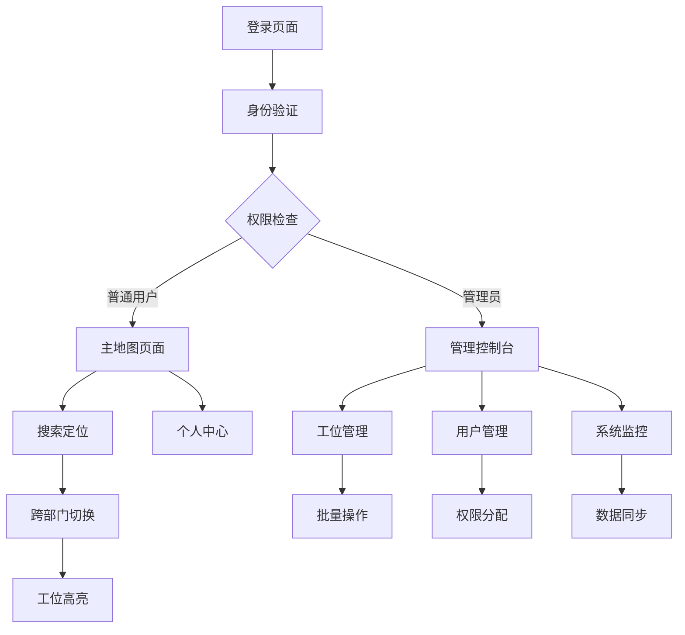

# 部门地图系统产品需求文档 v3.0

## 1. 产品概述

部门地图系统是一个现代化的企业级工位管理和人员定位平台，基于2D室内地图实现工位可视化、人员搜索定位和实时在岗状态显示。系统通过PostgreSQL数据库提供强大的数据存储和查询能力，支持跨部门搜索、实时数据同步和WebSocket通信。

本系统解决企业内部工位管理混乱、人员定位困难、部门协作效率低下等问题，为200+人规模的企业提供高效的空间管理解决方案。

目标市场价值：提升企业空间利用率15-20%，减少人员查找时间60%以上，优化办公协作效率。

## 2. 核心功能

### 2.1 用户角色

| 角色 | 注册方法 | 核心权限 |
|------|----------|----------|
| 普通员工 | 企业邮箱注册 | 查看地图、搜索人员、更新个人状态 |
| 部门管理员 | 管理员邀请升级 | 管理本部门工位分配、查看部门统计 |
| 系统管理员 | 超级管理员分配 | 全系统管理、用户权限控制、数据维护 |

### 2.2 功能模块

我们的部门地图系统包含以下核心页面：

1. **登录注册页面**：用户身份验证、权限验证、密码重置
2. **主地图页面**：部门地图展示、工位状态显示、缩放平移操作、实时状态更新
3. **搜索定位页面**：人员搜索、跨部门定位、重名处理、搜索历史
4. **工位管理页面**：工位分配、状态管理、批量操作、使用统计
5. **个人中心页面**：个人信息管理、状态设置、通知设置
6. **系统管理页面**：用户管理、权限配置、数据同步、系统监控

### 2.3 页面详情

| 页面名称 | 模块名称 | 功能描述 |
|----------|----------|----------|
| 登录注册页面 | 身份验证模块 | 支持邮箱登录、JWT令牌验证、记住登录状态、密码加密存储 |
| 登录注册页面 | 权限控制模块 | 基于角色的访问控制、权限验证中间件、安全登出 |
| 主地图页面 | 地图渲染模块 | SVG地图渲染、0.75x-2x缩放支持、平移操作、LOD细节层次显示 |
| 主地图页面 | 工位展示模块 | 工位状态指示灯（绿色在岗/灰色离岗）、工位编号显示、员工姓名展示 |
| 主地图页面 | 实时同步模块 | WebSocket连接、60-120s状态轮询、断网重连机制、数据一致性检查 |
| 搜索定位页面 | 搜索引擎模块 | 全文搜索、模糊匹配、PostgreSQL GIN索引、中文分词支持 |
| 搜索定位页面 | 跨部门定位模块 | 自动切换部门地图、目标工位高亮、1-2s脉冲动画、重名候选列表 |
| 工位管理页面 | 工位分配模块 | 拖拽分配、批量操作、历史记录、冲突检测 |
| 工位管理页面 | 状态监控模块 | 实时状态更新、使用率统计、异常告警、维护模式 |
| 个人中心页面 | 个人信息模块 | 基本信息编辑、头像上传、联系方式管理 |
| 个人中心页面 | 状态管理模块 | 在岗状态设置、自动心跳、离岗通知、状态历史 |
| 系统管理页面 | 用户管理模块 | 用户CRUD操作、批量导入、权限分配、账户状态管理 |
| 系统管理页面 | 数据同步模块 | 缓存刷新、数据一致性验证、同步状态监控、错误处理 |

## 3. 核心流程

### 普通用户流程
用户登录后进入主地图页面，可以查看当前部门的工位分布和人员状态。通过搜索功能输入同事姓名，系统自动定位到对应工位并高亮显示。如果目标人员在其他部门，系统会自动切换到相应部门地图。用户可以在个人中心更新自己的在岗状态和个人信息。

### 管理员流程
部门管理员登录后可以访问工位管理页面，进行本部门的工位分配和调整。可以查看部门内的工位使用统计，处理工位冲突，设置工位维护状态。系统管理员具有全局权限，可以管理所有用户和部门，监控系统运行状态。

## 4. 用户界面设计

### 4.1 设计风格

- **主色调**：#3B82F6 (蓝色) 作为主色，#10B981 (绿色) 表示在岗状态，#6B7280 (灰色) 表示离岗状态
- **辅助色**：#F59E0B (橙色) 用于警告，#EF4444 (红色) 用于错误提示
- **按钮样式**：圆角设计 (rounded-lg)，支持悬停和点击状态变化
- **字体**：Inter 字体族，标题使用 16-24px，正文使用 14-16px，小字使用 12-14px
- **布局风格**：卡片式设计，顶部导航栏，左侧边栏（管理页面），响应式网格布局
- **图标风格**：Heroicons 图标库，线性风格，24px标准尺寸

### 4.2 页面设计概览

| 页面名称 | 模块名称 | UI元素 |
|----------|----------|--------|
| 登录页面 | 登录表单 | 居中卡片布局，渐变背景，输入框带图标，蓝色主按钮，记住登录复选框 |
| 主地图页面 | 地图容器 | 全屏SVG画布，缩放控制按钮，部门切换标签，搜索框浮层，状态图例 |
| 主地图页面 | 工位元素 | 矩形工位框，圆形状态指示灯，工位编号标签，员工姓名文本，悬停提示卡片 |
| 搜索页面 | 搜索界面 | 顶部搜索栏，实时建议下拉，结果卡片列表，分页控件，筛选侧边栏 |
| 工位管理页面 | 管理界面 | 表格视图，批量操作工具栏，状态筛选器，拖拽排序，模态对话框 |
| 个人中心页面 | 设置面板 | 左侧导航菜单，右侧内容区域，表单组件，头像上传区，保存按钮 |

### 4.3 响应式设计

系统采用移动优先的响应式设计，支持桌面端、平板和手机访问。在移动端优化触摸交互，支持手势缩放和滑动操作。地图组件在小屏幕上自动调整显示密度，确保可用性。

## 5. 技术要求

### 5.1 性能指标
- 搜索响应时间 < 300ms (200人规模)
- 地图切换和聚焦 < 300ms
- 状态刷新间隔 60-120s
- WebSocket推送延迟 ≤ 2s
- 页面首次加载 < 2s

### 5.2 兼容性要求
- 支持现代浏览器 (Chrome 90+, Firefox 88+, Safari 14+, Edge 90+)
- 移动端兼容 iOS 14+ 和 Android 10+
- SVG文本在0.75x-2x缩放范围内保持清晰

### 5.3 安全要求
- JWT令牌认证
- 密码bcrypt加密
- HTTPS传输加密
- SQL注入防护
- XSS攻击防护
- CSRF令牌验证

## 6. 数据要求

### 6.1 数据规模
- 支持10个部门，每部门20-50个工位
- 员工数量200-500人
- 搜索索引支持中文全文检索
- 历史数据保留1年

### 6.2 数据同步
- 实时数据通过WebSocket推送
- 缓存数据5分钟刷新
- 数据一致性30分钟验证
- 全量重建24小时执行

## 7. 集成要求

### 7.1 外部系统集成
- 企业邮箱系统（用户认证）
- HR系统（员工信息同步）
- 门禁系统（在岗状态检测）
- 会议室预订系统（空间管理）

### 7.2 API接口
- RESTful API设计
- OpenAPI 3.0文档
- 版本控制支持
- 错误码标准化

## 8. 部署要求

### 8.1 环境要求
- Node.js 18+ 运行环境
- PostgreSQL 13+ 数据库
- Redis 6+ 缓存服务
- Nginx 反向代理

### 8.2 容器化部署
- Docker容器支持
- Docker Compose编排
- 环境变量配置
- 健康检查机制

## 9. 监控和维护

### 9.1 监控指标
- 系统性能监控
- 用户行为分析
- 错误日志收集
- 数据库性能监控

### 9.2 维护计划
- 定期数据备份
- 系统更新策略
- 故障恢复预案
- 用户培训计划