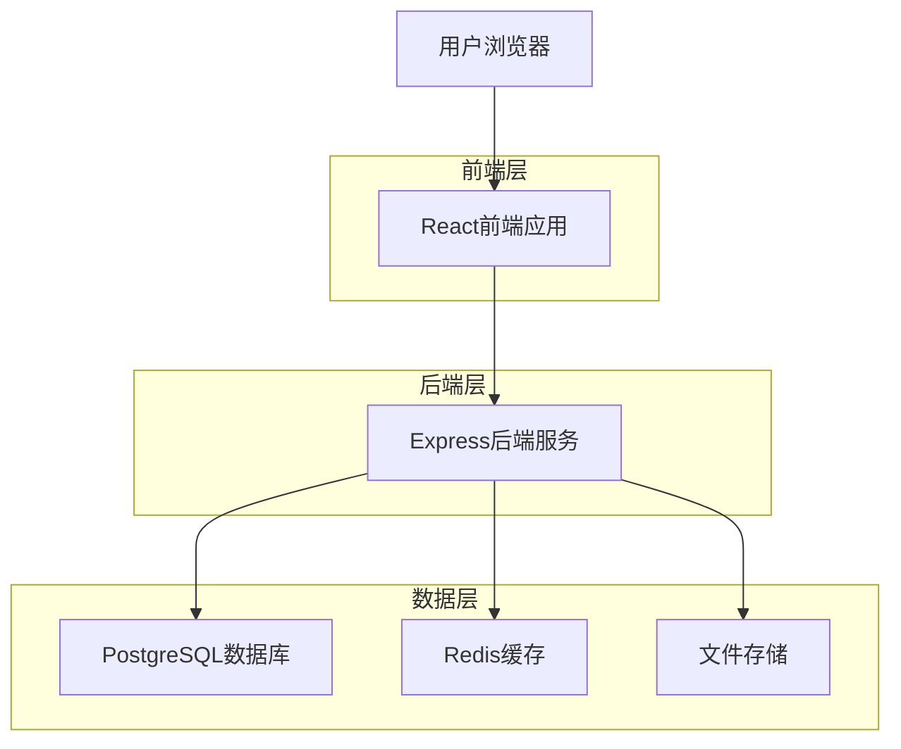
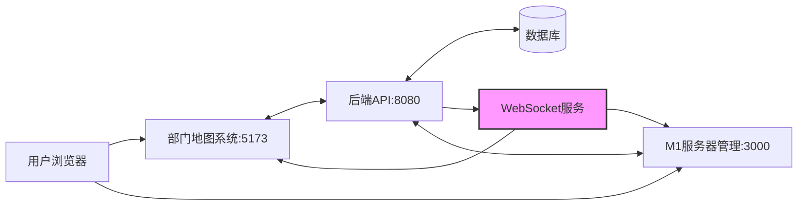
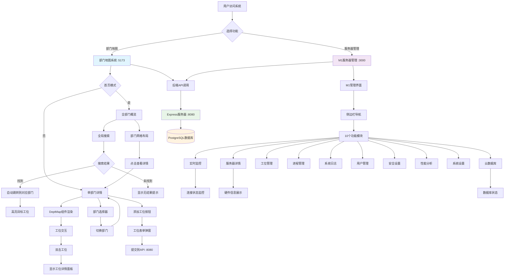
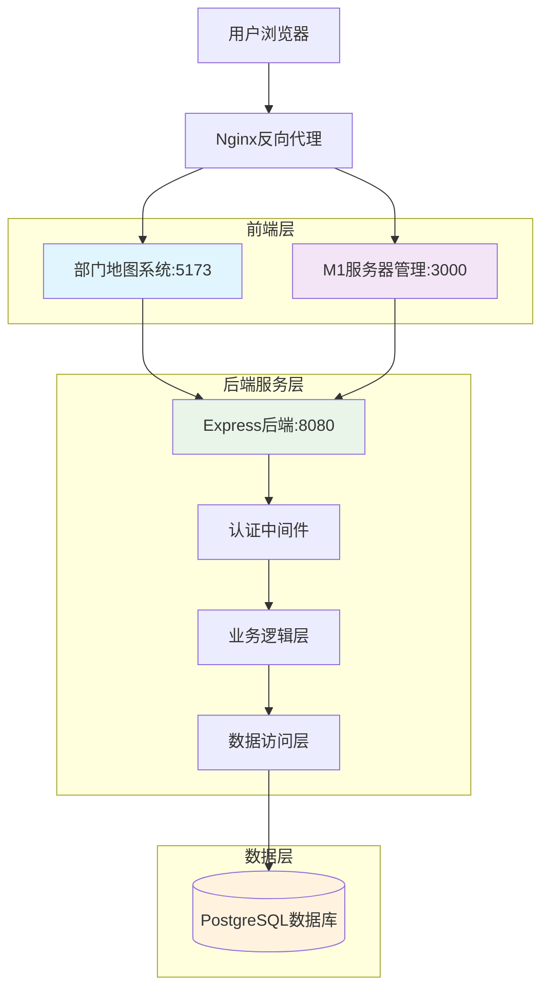
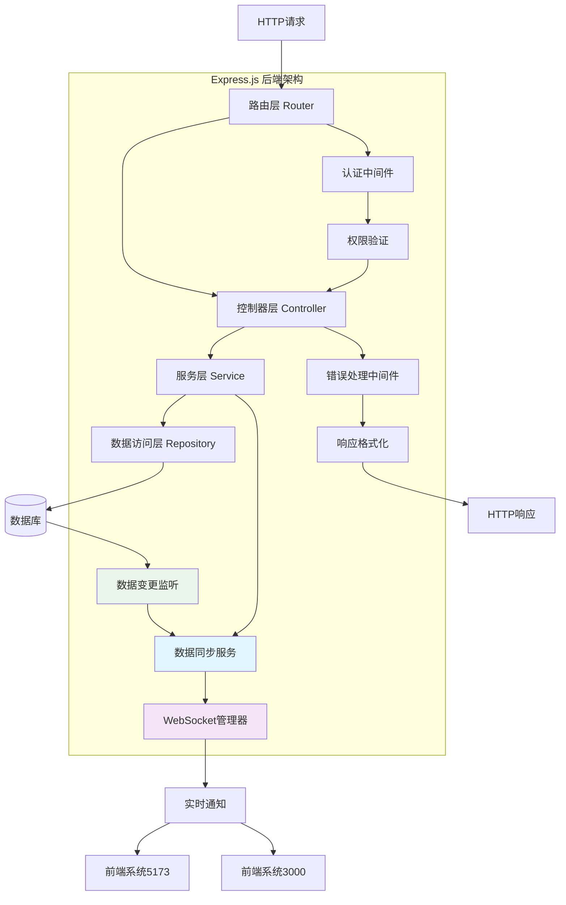
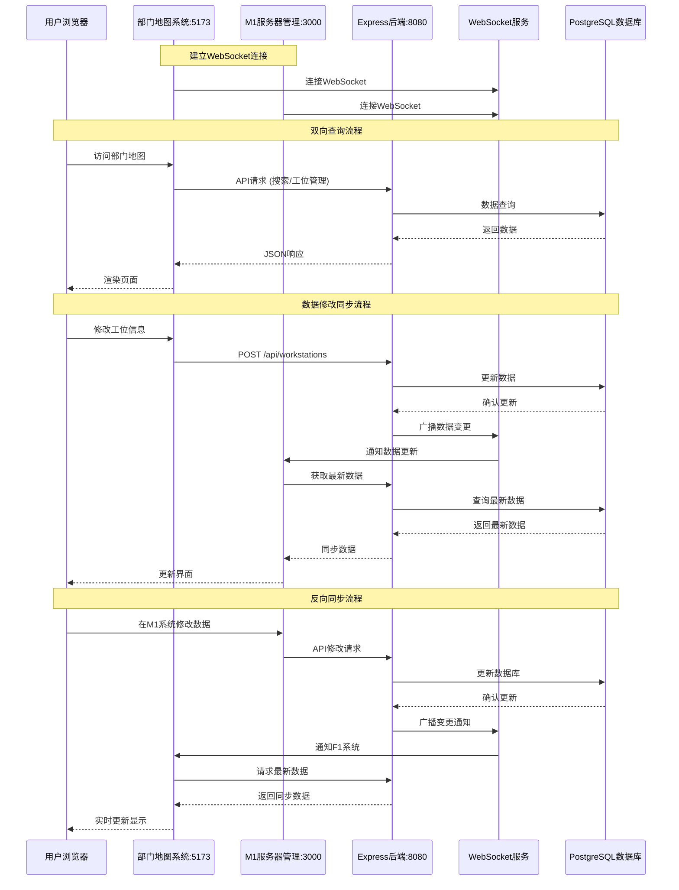
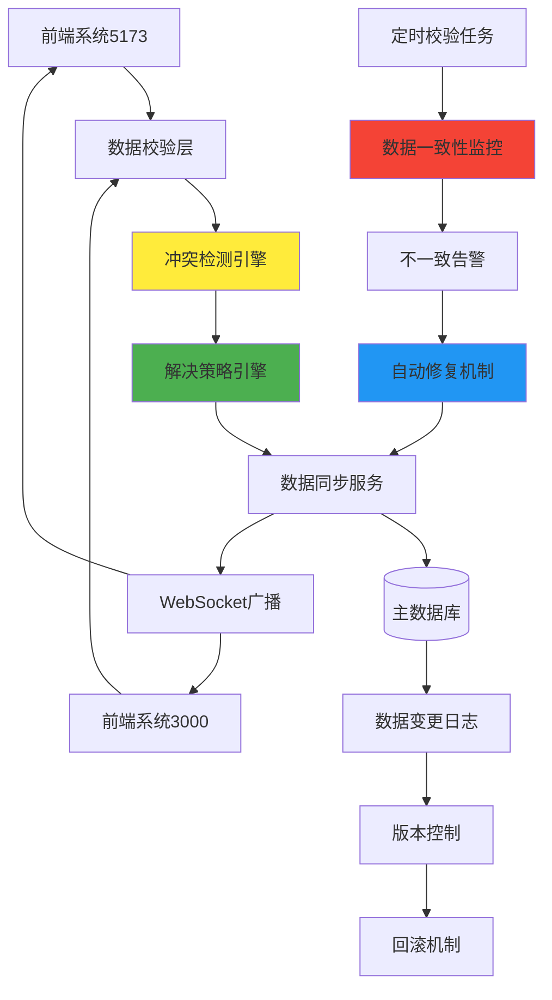
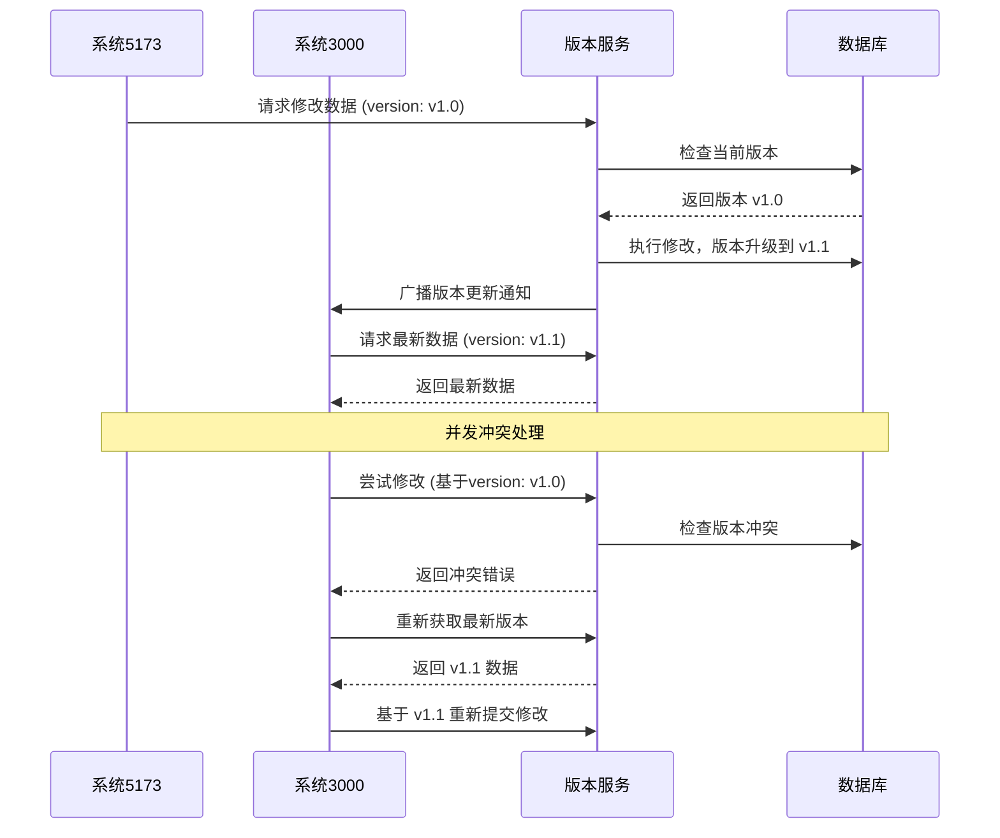
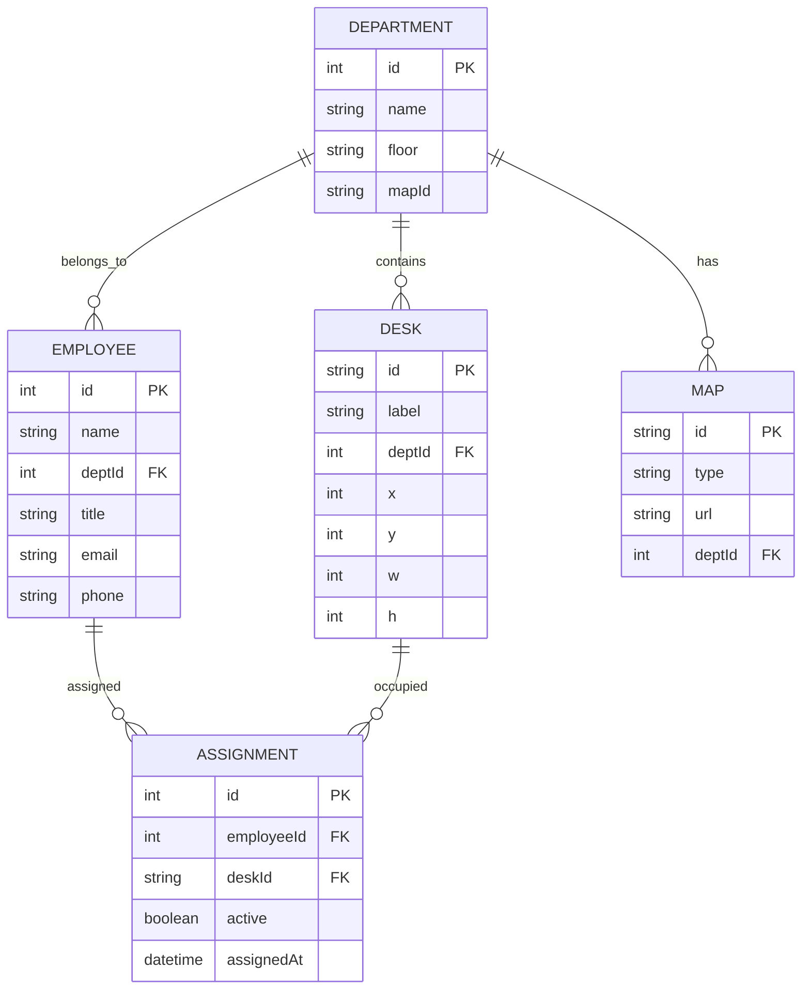

# 部门地图技术架构文档

## 1. Architecture design



## 2. Technology Description

* Frontend: React\@18 + TypeScript\@5 + Vite\@4 + TailwindCSS\@3 + d3-zoom\@3 + Zustand\@4

* Backend: Express\@4 + TypeScript\@5 + Zod\@3 + Prisma\@5

* Database: PostgreSQL\@15 + Redis\@7

* Tools: ESLint + Prettier + Playwright

## 3. 页面层级关系与交互流程

### 3.1 应用整体架构

本系统采用前后端分离架构，包含三个独立运行的服务：

* **部门地图系统**（5173端口）：主要业务功能

* **M1服务器管理系统**（3000端口）：服务器监控管理

* **后端API服务**（8080端口）：数据服务接口

### 3.2 页面层级结构

```
企业管理系统 (App.tsx)
├── 导航栏 (Navigation)
├── 部门地图系统 (/)
│   ├── 首页模式 (HomePage - 全部门概览)
│   │   ├── 部门网格布局
│   │   ├── 搜索功能
│   │   └── 添加工位功能
│   └── 部门详情模式 (DeptMap组件)
│       ├── 单部门地图视图
│       ├── 工位交互面板
│       └── 缩放控制
├── M1服务器管理 (/m1-server)
│   ├── 实时监控 (ServerMonitor)
│   ├── 服务器详情 (ServerDetails)
│   ├── 云数据库管理
│   ├── 工位管理
│   ├── 进程管理
│   ├── 系统日志
│   ├── 用户管理
│   ├── 安全设置
│   ├── 性能分析
│   └── 系统设置
└── 测试页面 (/test-map)
```

### 3.3 端口关联关系

| 端口   | 服务名称      | 主要功能        | 技术栈          |
| ---- | --------- | ----------- | ------------ |
| 5173 | 部门地图系统    | 工位管理、部门地图展示 | React + Vite |
| 3000 | M1服务器管理系统 | 服务器监控、系统管理  | React + Vite |
| 8080 | 后端API服务   | 数据接口、认证服务   | Express.js   |

**通信流向：**



### 3.4 页面跳转触发方式

#### 3.4.1 导航栏跳转

* **部门地图按钮**：`<Link to="/">` → 跳转到首页

* **M1服务器管理按钮**：`<Link to="/m1-server">` → 跳转到服务器管理

* **按钮状态**：根据 `location.pathname` 动态高亮当前页面

#### 3.4.2 部门地图内部跳转

* **首页按钮**：`handleHomeClick()` → 设置 `currentDept = null`

* **部门选择器**：`handleDepartmentChange(dept)` → 切换部门视图

* **部门卡片"查看详情"**：`onClick={() => handleDepartmentChange(dept)}` → 进入部门详情

* **搜索结果点击**：`handleSearchResultClick()` → 自动切换到对应部门并高亮工位

#### 3.4.3 工位交互触发

* **工位点击**：双击工位 → 显示工位详情面板

* **工位高亮**：搜索结果点击 → 设置 `highlightDeskId` → 地图自动居中并高亮

* **缩放控制**：鼠标滚轮、双击 → D3.js缩放行为

#### 3.4.4 M1服务器管理内部导航

* **侧边栏导航**：`setActiveTab(tabId)` → 切换功能模块

* **状态监控**：实时更新连接状态和数据库状态

* **认证控制**：未登录用户自动跳转登录

### 3.5 核心页面关联架构

#### 3.5.1 首页（HomePage组件）

**功能特性：**

* 全部门网格化概览布局

* 每个部门卡片显示缩略地图

* 实时显示总工位数和在线数量

* 全局搜索功能（支持跨部门搜索）

**状态管理：**

```typescript
const [currentDept, setCurrentDept] = useState<string | null>(null);
const [searchQuery, setSearchQuery] = useState('');
const [searchResults, setSearchResults] = useState({...});
const [highlightDeskId, setHighlightDeskId] = useState<string | null>(null);
```

#### 3.5.2 部门地图（DeptMap组件）

**Props接口：**

```typescript
interface DeptMapProps {
  department: string;        // 部门名称
  searchQuery?: string;      // 搜索查询
  isHomepage?: boolean;      // 是否为首页模式
  highlightDeskId?: string;  // 高亮工位ID
}
```

**核心功能：**

* SVG地图渲染（基于D3.js）

* 工位状态可视化（在线/离线颜色区分）

* 缩放和平移交互（0.5x - 3x缩放范围）

* 工位详情面板显示

* 搜索结果高亮定位

#### 3.5.3 部门子地图（工位级别交互）

**交互机制：**

* **LOD渲染**：缩放级别 < 1x 仅显示状态点，≥ 1x 显示员工姓名

* **工位选择**：双击工位触发 `setSelectedDesk(desk)`

* **居中定位**：`focusOnDesk()` 函数实现自动居中和高亮

* **状态轮询**：定时更新工位在线状态

#### 3.5.4 服务器页面（M1ServerManagement）

**模块架构：**

```typescript
const navigationItems: NavigationItem[] = [
  { id: 'monitor', label: '实时监控', component: <ServerMonitor /> },
  { id: 'details', label: '服务器详情', component: <ServerDetails /> },
  { id: 'database', label: '云数据库', component: <DatabaseManagement /> },
  { id: 'workstations', label: '工位管理', component: <WorkstationManagement /> },
  // ... 其他模块
];
```

**状态监控：**

* 连接状态：`connecting` | `connected` | `disconnected`

* 数据库状态：表数量、记录数、最后同步时间

* 实时性能指标监控

### 3.6 完整页面导航流程图



## 4. Route definitions

| Route      | Purpose                | 组件                 | 端口   |
| ---------- | ---------------------- | ------------------ | ---- |
| /          | 部门地图系统首页，显示全部门概览或单部门详情 | HomePage           | 5173 |
| /m1-server | M1服务器管理平台，包含10个功能模块    | M1ServerManagement | 3000 |
| /test-map  | 地图测试页面，用于开发调试          | MapTest            | 5173 |

### 4.1 部门地图系统路由详情

**主路由：** `/` (端口5173)

* **首页模式**：`currentDept === null` → 显示全部门网格布局

* **部门详情模式**：`currentDept !== null` → 显示单个部门的详细地图

* **状态管理**：通过 `useState` 控制页面模式切换

* **URL保持**：单页应用，URL不变，通过内部状态控制视图

### 4.2 M1服务器管理路由详情

**主路由：** `/m1-server` (端口3000)

* **内部导航**：通过 `activeTab` 状态控制显示的功能模块

* **可用模块**：

  * `monitor` - 实时监控

  * `details` - 服务器详情

  * `database` - 云数据库管理

  * `workstations` - 工位管理

  * `processes` - 进程管理

  * `logs` - 系统日志

  * `users` - 用户管理

  * `security` - 安全设置

  * `analytics` - 性能分析

  * `settings` - 系统设置

### 4.3 路由跳转机制

```typescript
// React Router配置
<Routes>
  <Route path="/" element={<HomePage />} />
  <Route path="/m1-server" element={<M1ServerManagement />} />
  <Route path="/test-map" element={<MapTest />} />
</Routes>

// 导航组件中的跳转逻辑
<Link to="/" className={location.pathname === '/' ? 'active' : ''}>
  部门地图
</Link>
<Link to="/m1-server" className={location.pathname === '/m1-server' ? 'active' : ''}>
  M1服务器管理
</Link>
```

## 4. API definitions (后端服务 - 端口8080)

### 4.1 认证相关API

#### 用户登录

```
POST /api/auth/login
```

**Request:**

| 参数名      | 类型     | 必填   | 描述  |
| -------- | ------ | ---- | --- |
| username | string | true | 用户名 |
| password | string | true | 密码  |

**Response:**

```json
{
  "success": true,
  "data": {
    "token": "jwt_token_string",
    "user": {
      "id": "user_id",
      "username": "username",
      "role": "admin|manager|employee"
    }
  }
}
```

### 4.2 搜索相关API

#### 全局搜索

```
GET /api/search?q={query}
```

**Headers:**

```
Authorization: Bearer {token}
Content-Type: application/json
```

**Response:**

```json
{
  "success": true,
  "data": {
    "employees": [
      {
        "name": "张三",
        "department_name": "技术部",
        "position": "软件工程师",
        "desk_id": "desk_001"
      }
    ],
    "workstations": [
      {
        "desk_number": "A001",
        "department_name": "技术部",
        "employee_name": "张三",
        "desk_id": "desk_001"
      }
    ],
    "total": 2
  }
}
```

#### 用户登出

```
POST /api/auth/logout
```

Request: 无需参数

Response:

| Param Name | Param Type | Description |
| ---------- | ---------- | ----------- |
| success    | boolean    | 登出状态        |
| message    | string     | 响应消息        |

Example

```json
{
  "success": true,
  "message": "登出成功"
}
```

### 4.4 WebSocket实时同步API

**WebSocket连接建立**

```
WS /ws/sync
```

连接参数:

| Param Name | Param Type | isRequired | Description                  |
| ---------- | ---------- | ---------- | ---------------------------- |
| token      | string     | true       | 用户认证令牌                       |
| clientType | string     | true       | 客户端类型 (dept-map/server-mgmt) |

**数据同步事件**

工位信息变更通知:

```json
{
  "type": "workstation_update",
  "data": {
    "id": "ws_001",
    "department": "技术部",
    "employee": "张三",
    "status": "occupied",
    "timestamp": "2024-01-15T10:30:00Z"
  },
  "source": "dept-map"
}
```

部门信息变更通知:

```json
{
  "type": "department_update",
  "data": {
    "id": "dept_001",
    "name": "技术部",
    "floor": 3,
    "capacity": 50,
    "timestamp": "2024-01-15T10:30:00Z"
  },
  "source": "server-mgmt"
}
```

### 4.5 数据一致性校验API

**数据校验接口**

```
POST /api/data/validate
```

Request:

| Param Name | Param Type | isRequired | Description                   |
| ---------- | ---------- | ---------- | ----------------------------- |
| dataType   | string     | true       | 数据类型 (workstation/department) |
| clientData | object     | true       | 客户端当前数据                       |

Response:

| Param Name   | Param Type | Description |
| ------------ | ---------- | ----------- |
| isConsistent | boolean    | 数据是否一致      |
| conflicts    | array      | 冲突数据列表      |
| serverData   | object     | 服务器端正确数据    |

**数据同步修复接口**

```
POST /api/data/sync-repair
```

Request:

| Param Name | Param Type | isRequired | Description                          |
| ---------- | ---------- | ---------- | ------------------------------------ |
| conflicts  | array      | true       | 需要修复的冲突数据                            |
| resolution | string     | true       | 解决策略 (server-wins/client-wins/merge) |

Response:

| Param Name      | Param Type | Description |
| --------------- | ---------- | ----------- |
| success         | boolean    | 修复是否成功      |
| updatedData     | object     | 修复后的数据      |
| affectedClients | array      | 需要通知的客户端列表  |

### 4.3 工位管理API

#### 创建工位

```
POST /api/workstations
```

**Request:**

```json
{
  "name": "工位名称",
  "ipAddress": "192.168.1.100",
  "macAddress": "00:11:22:33:44:55",
  "location": "Floor 3, Building A",
  "department": "技术部",
  "status": "available",
  "specifications": {
    "cpu": "Intel i5",
    "memory": "8GB",
    "storage": "256GB SSD",
    "os": "Windows 10"
  },
  "assignedUser": "用户名"
}
```

### 4.4 数据库状态API

#### 获取数据库状态

```
GET /api/database/status
```

**Headers:**

```
Authorization: Bearer {token}
```

**Response:**

```json
{
  "connected": true,
  "tables": 5,
  "totalRecords": 1247,
  "lastSync": "2024-01-15T14:35:20.000Z"
}
```

### 4.5 Core API

**地图数据获取**

```
GET /api/map?dept=Engineering
```

Request:

| Param Name | Param Type | isRequired | Description |
| ---------- | ---------- | ---------- | ----------- |
| dept       | string     | true       | 部门名称        |

Response:

| Param Name | Param Type | Description       |
| ---------- | ---------- | ----------------- |
| map\_id    | string     | 地图唯一标识            |
| type       | string     | 地图类型：svg/png/json |
| url        | string     | 地图文件URL           |
| dept\_name | string     | 部门名称              |

Example:

```json
{
  "map_id": "eng_floor_2",
  "type": "svg",
  "url": "/maps/engineering_floor2.svg",
  "dept_name": "Engineering"
}
```

**工位数据获取**

```
{
  "success": true,
  "message": "登出成功"
}
```

Request:

| Param Name | Param Type | isRequired | Description |
| ---------- | ---------- | ---------- | ----------- |
| dept       | string     | true       | 部门名称        |

Response:

| Param Name   | Param Type | Description         |
| ------------ | ---------- | ------------------- |
| desk\_id     | string     | 工位唯一标识              |
| x            | number     | X坐标                 |
| y            | number     | Y坐标                 |
| w            | number     | 宽度                  |
| h            | number     | 高度                  |
| label        | string     | 工位标签                |
| employee     | string     | 员工姓名                |
| employee\_id | number     | 员工ID                |
| status       | string     | 在岗状态：online/offline |

**人员搜索**

```
GET /api/findUser?name=张三
```

Request:

| Param Name | Param Type | isRequired | Description  |
| ---------- | ---------- | ---------- | ------------ |
| name       | string     | true       | 员工姓名（支持模糊搜索） |

Response:

| Param Name   | Param Type | Description |
| ------------ | ---------- | ----------- |
| employee\_id | number     | 员工ID        |
| name         | string     | 员工姓名        |
| dept         | string     | 所属部门        |
| map\_id      | string     | 地图ID        |
| desk\_id     | string     | 工位ID        |
| x            | number     | 工位X坐标       |
| y            | number     | 工位Y坐标       |
| status       | string     | 在岗状态        |

**状态更新**

```
GET /api/status?dept=Engineering
```

Response:

| Param Name   | Param Type | Description |
| ------------ | ---------- | ----------- |
| desk\_id     | string     | 工位ID        |
| employee\_id | number     | 员工ID        |
| status       | string     | 在岗状态        |
| last\_seen   | number     | 最后活跃时间戳     |

**心跳上报**

```
POST /api/heartbeat
```

Request:

| Param Name | Param Type | isRequired | Description |
| ---------- | ---------- | ---------- | ----------- |
| user\_id   | number     | true       | 用户ID        |
| ts         | number     | true       | 时间戳（毫秒）     |

Response:

| Param Name | Param Type | Description |
| ---------- | ---------- | ----------- |
| success    | boolean    | 操作是否成功      |
| message    | string     | 响应消息        |

### 4.6 API错误处理

**认证失败 (401):**

```json
{
  "success": false,
  "error": "Unauthorized",
  "message": "Invalid or expired token"
}
```

**服务器错误 (500):**

```json
{
  "success": false,
  "error": "Internal Server Error",
  "message": "Database connection failed"
}
```

## 5. Server architecture diagram

### 5.1 整体系统架构



### 5.2 后端服务分层架构



### 5.3 数据流向图



## 6. 数据一致性保障方案

### 6.1 数据一致性架构



### 6.2 数据同步策略

**实时同步机制：**

1. **写时同步**：任一系统修改数据时立即触发同步
2. **读时校验**：读取数据前进行一致性校验
3. **定时全量校验**：每小时进行全量数据一致性检查
4. **冲突解决**：采用时间戳优先 + 业务规则的混合策略

**数据版本控制：**



### 6.3 监控与告警机制

**数据一致性监控指标：**

* 数据同步延迟时间

* 冲突发生频率

* 自动修复成功率

* WebSocket连接状态

* 数据版本差异统计

**告警触发条件：**

* 同步延迟超过5秒

* 1分钟内冲突次数超过10次

* WebSocket连接断开超过30秒

* 数据校验失败率超过1%

## 7. Data model

### 7.1 Data model definition



### 6.2 Data Definition Language

#### 用户表 (users)

```sql
-- 创建用户表
CREATE TABLE users (
    id UUID PRIMARY KEY DEFAULT gen_random_uuid(),
    username VARCHAR(50) UNIQUE NOT NULL,
    email VARCHAR(255) UNIQUE NOT NULL,
    password_hash VARCHAR(255) NOT NULL,
    role VARCHAR(20) DEFAULT 'employee' CHECK (role IN ('admin', 'manager', 'employee')),
    department VARCHAR(100),
    position VARCHAR(100),
    status VARCHAR(20) DEFAULT 'active' CHECK (status IN ('active', 'inactive')),
    created_at TIMESTAMP WITH TIME ZONE DEFAULT NOW(),
    updated_at TIMESTAMP WITH TIME ZONE DEFAULT NOW()
);
```

#### 部门表 (departments)

```sql
-- 创建部门表
CREATE TABLE departments (
    id UUID PRIMARY KEY DEFAULT gen_random_uuid(),
    name VARCHAR(100) UNIQUE NOT NULL,
    description TEXT,
    floor_number INTEGER,
    building VARCHAR(50),
    created_at TIMESTAMP WITH TIME ZONE DEFAULT NOW()
);
```

#### 工位表 (workstations)

```sql
-- 创建工位表
CREATE TABLE workstations (
    id UUID PRIMARY KEY DEFAULT gen_random_uuid(),
    name VARCHAR(100) NOT NULL,
    desk_number VARCHAR(50) UNIQUE NOT NULL,
    department_id UUID REFERENCES departments(id),
    x_position DECIMAL(10,2),
    y_position DECIMAL(10,2),
    width DECIMAL(10,2) DEFAULT 80,
    height DECIMAL(10,2) DEFAULT 60,
    ip_address INET,
    mac_address MACADDR,
    status VARCHAR(20) DEFAULT 'available' CHECK (status IN ('available', 'occupied', 'maintenance')),
    specifications JSONB,
    assigned_user_id UUID REFERENCES users(id),
    created_at TIMESTAMP WITH TIME ZONE DEFAULT NOW(),
    updated_at TIMESTAMP WITH TIME ZONE DEFAULT NOW()
);
```

#### 员工表 (employees)

```sql
-- 创建员工表
CREATE TABLE employees (
    id UUID PRIMARY KEY DEFAULT gen_random_uuid(),
    user_id UUID REFERENCES users(id),
    employee_id VARCHAR(50) UNIQUE NOT NULL,
    name VARCHAR(100) NOT NULL,
    department_id UUID REFERENCES departments(id),
    position VARCHAR(100),
    desk_id UUID REFERENCES workstations(id),
    phone VARCHAR(20),
    email VARCHAR(255),
    status VARCHAR(20) DEFAULT 'offline' CHECK (status IN ('online', 'offline', 'away')),
    last_seen TIMESTAMP WITH TIME ZONE,
    created_at TIMESTAMP WITH TIME ZONE DEFAULT NOW()
);
```

#### 系统日志表 (system\_logs)

```sql
-- 创建系统日志表
CREATE TABLE system_logs (
    id UUID PRIMARY KEY DEFAULT gen_random_uuid(),
    user_id UUID REFERENCES users(id),
    action VARCHAR(100) NOT NULL,
    resource_type VARCHAR(50),
    resource_id UUID,
    details JSONB,
    ip_address INET,
    user_agent TEXT,
    created_at TIMESTAMP WITH TIME ZONE DEFAULT NOW()
);
```

#### 创建索引

```sql
-- 用户表索引
CREATE INDEX idx_users_username ON users(username);
CREATE INDEX idx_users_email ON users(email);
CREATE INDEX idx_users_department ON users(department);

-- 工位表索引
CREATE INDEX idx_workstations_department ON workstations(department_id);
CREATE INDEX idx_workstations_assigned_user ON workstations(assigned_user_id);
CREATE INDEX idx_workstations_status ON workstations(status);

-- 员工表索引
CREATE INDEX idx_employees_name ON employees(name);
CREATE INDEX idx_employees_department ON employees(department_id);
CREATE INDEX idx_employees_desk ON employees(desk_id);
CREATE INDEX idx_employees_status ON employees(status);

-- 系统日志索引
CREATE INDEX idx_system_logs_user ON system_logs(user_id);
CREATE INDEX idx_system_logs_created_at ON system_logs(created_at DESC);
CREATE INDEX idx_system_logs_action ON system_logs(action);
```

#### 初始化数据

```sql
-- 插入默认部门
INSERT INTO departments (name, description, floor_number, building) VALUES
('技术部', '软件开发与技术支持', 3, 'A座'),
('产品部', '产品设计与管理', 3, 'A座'),
('运营部', '运营推广与客户服务', 2, 'A座'),
('人事部', '人力资源管理', 2, 'A座'),
('财务部', '财务管理与会计', 1, 'A座');

-- 插入默认管理员用户
INSERT INTO users (username, email, password_hash, role, department, position) VALUES
('admin', 'admin@company.com', '$2b$10$hashedpassword', 'admin', '技术部', '系统管理员'),
('manager', 'manager@company.com', '$2b$10$hashedpassword', 'manager', '技术部', '技术经理');

-- 插入示例工位数据
INSERT INTO workstations (name, desk_number, department_id, x_position, y_position, ip_address, status) 
SELECT 
    'Workstation ' || generate_series(1, 20),
    'A' || LPAD(generate_series(1, 20)::text, 3, '0'),
    (SELECT id FROM departments WHERE name = '技术部'),
    (generate_series(1, 20) % 5) * 100 + 50,
    ((generate_series(1, 20) - 1) / 5) * 80 + 50,
    ('192.168.1.' || (100 + generate_series(1, 20)))::inet,
    'available';
```

