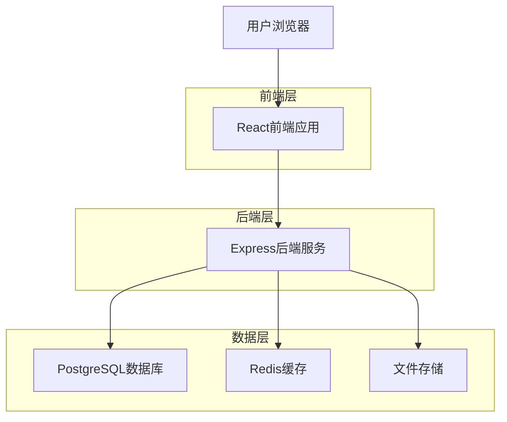
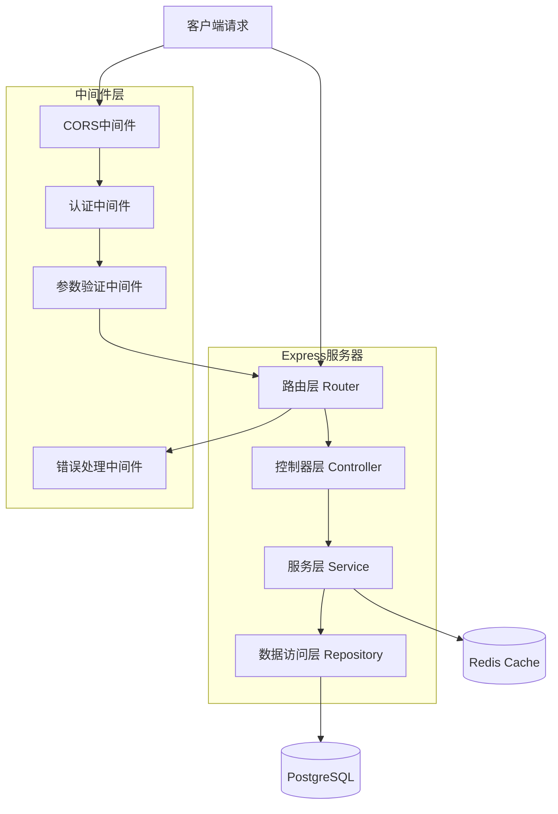
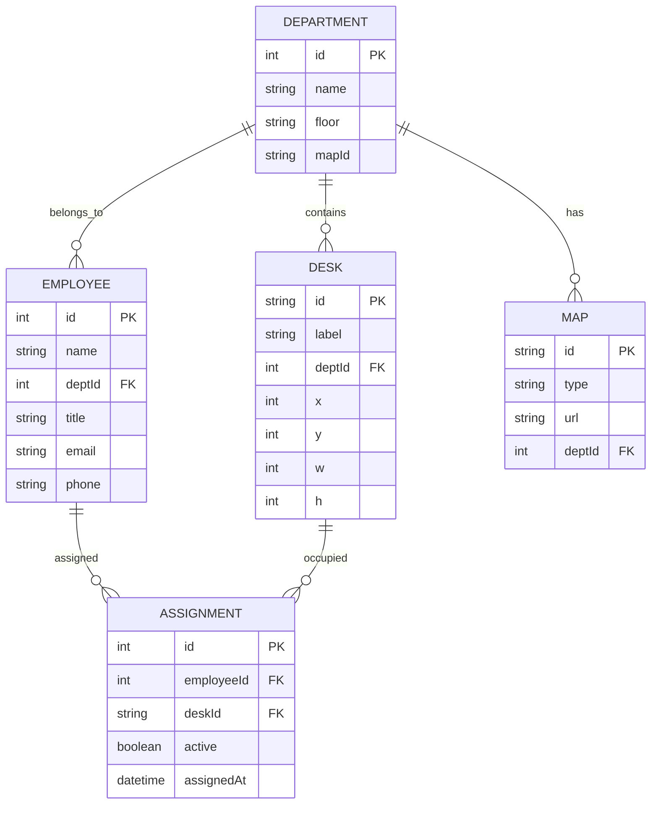

# 部门地图技术架构文档

## 1. Architecture design



## 2. Technology Description

* Frontend: React\@18 + TypeScript\@5 + Vite\@4 + TailwindCSS\@3 + d3-zoom\@3 + Zustand\@4

* Backend: Express\@4 + TypeScript\@5 + Zod\@3 + Prisma\@5

* Database: PostgreSQL\@15 + Redis\@7

* Tools: ESLint + Prettier + Playwright

## 3. Route definitions

| Route    | Purpose               |
| -------- | --------------------- |
| /login   | 登录页面，用户身份认证           |
| /:dept   | 部门地图页面，显示指定部门的地图和工位信息 |
| /search  | 搜索结果页面，显示人员搜索结果       |
| /profile | 个人设置页面，管理个人信息和状态      |
| /admin   | 管理员页面，管理地图和员工数据（可选）   |

## 4. API definitions

### 4.1 Core API

**地图数据获取**

```
GET /api/map?dept=Engineering
```

Request:

| Param Name | Param Type | isRequired | Description |
| ---------- | ---------- | ---------- | ----------- |
| dept       | string     | true       | 部门名称        |

Response:

| Param Name | Param Type | Description       |
| ---------- | ---------- | ----------------- |
| map\_id    | string     | 地图唯一标识            |
| type       | string     | 地图类型：svg/png/json |
| url        | string     | 地图文件URL           |
| dept\_name | string     | 部门名称              |

Example:

```json
{
  "map_id": "eng_floor_2",
  "type": "svg",
  "url": "/maps/engineering_floor2.svg",
  "dept_name": "Engineering"
}
```

**工位数据获取**

```
GET /api/desks?dept=Engineering
```

Request:

| Param Name | Param Type | isRequired | Description |
| ---------- | ---------- | ---------- | ----------- |
| dept       | string     | true       | 部门名称        |

Response:

| Param Name   | Param Type | Description         |
| ------------ | ---------- | ------------------- |
| desk\_id     | string     | 工位唯一标识              |
| x            | number     | X坐标                 |
| y            | number     | Y坐标                 |
| w            | number     | 宽度                  |
| h            | number     | 高度                  |
| label        | string     | 工位标签                |
| employee     | string     | 员工姓名                |
| employee\_id | number     | 员工ID                |
| status       | string     | 在岗状态：online/offline |

**人员搜索**

```
GET /api/findUser?name=张三
```

Request:

| Param Name | Param Type | isRequired | Description  |
| ---------- | ---------- | ---------- | ------------ |
| name       | string     | true       | 员工姓名（支持模糊搜索） |

Response:

| Param Name   | Param Type | Description |
| ------------ | ---------- | ----------- |
| employee\_id | number     | 员工ID        |
| name         | string     | 员工姓名        |
| dept         | string     | 所属部门        |
| map\_id      | string     | 地图ID        |
| desk\_id     | string     | 工位ID        |
| x            | number     | 工位X坐标       |
| y            | number     | 工位Y坐标       |
| status       | string     | 在岗状态        |

**状态更新**

```
GET /api/status?dept=Engineering
```

Response:

| Param Name   | Param Type | Description |
| ------------ | ---------- | ----------- |
| desk\_id     | string     | 工位ID        |
| employee\_id | number     | 员工ID        |
| status       | string     | 在岗状态        |
| last\_seen   | number     | 最后活跃时间戳     |

**心跳上报**

```
POST /api/heartbeat
```

Request:

| Param Name | Param Type | isRequired | Description |
| ---------- | ---------- | ---------- | ----------- |
| user\_id   | number     | true       | 用户ID        |
| ts         | number     | true       | 时间戳（毫秒）     |

Response:

| Param Name | Param Type | Description |
| ---------- | ---------- | ----------- |
| success    | boolean    | 操作是否成功      |
| message    | string     | 响应消息        |

## 5. Server architecture diagram



## 6. Data model

### 6.1 Data model definition



### 6.2 Data Definition Language

**部门表 (departments)**

```sql
-- 创建部门表
CREATE TABLE departments (
    id SERIAL PRIMARY KEY,
    name VARCHAR(100) UNIQUE NOT NULL,
    floor VARCHAR(50),
    map_id VARCHAR(100),
    created_at TIMESTAMP WITH TIME ZONE DEFAULT NOW(),
    updated_at TIMESTAMP WITH TIME ZONE DEFAULT NOW()
);

-- 创建索引
CREATE INDEX idx_departments_name ON departments(name);
```

**地图表 (maps)**

```sql
-- 创建地图表
CREATE TABLE maps (
    id VARCHAR(100) PRIMARY KEY,
    type VARCHAR(20) NOT NULL CHECK (type IN ('svg', 'png', 'json')),
    url VARCHAR(500) NOT NULL,
    dept_id INTEGER REFERENCES departments(id),
    created_at TIMESTAMP WITH TIME ZONE DEFAULT NOW()
);
```

**工位表 (desks)**

```sql
-- 创建工位表
CREATE TABLE desks (
    id VARCHAR(100) PRIMARY KEY,
    label VARCHAR(50) NOT NULL,
    dept_id INTEGER NOT NULL REFERENCES departments(id),
    x INTEGER NOT NULL,
    y INTEGER NOT NULL,
    w INTEGER NOT NULL DEFAULT 60,
    h INTEGER NOT NULL DEFAULT 40,
    created_at TIMESTAMP WITH TIME ZONE DEFAULT NOW()
);

-- 创建索引
CREATE INDEX idx_desks_dept_id ON desks(dept_id);
CREATE INDEX idx_desks_position ON desks(x, y);
```

**员工表 (employees)**

```sql
-- 创建员工表
CREATE TABLE employees (
    id SERIAL PRIMARY KEY,
    name VARCHAR(100) NOT NULL,
    dept_id INTEGER NOT NULL REFERENCES departments(id),
    title VARCHAR(100),
    email VARCHAR(255),
    phone VARCHAR(20),
    created_at TIMESTAMP WITH TIME ZONE DEFAULT NOW(),
    updated_at TIMESTAMP WITH TIME ZONE DEFAULT NOW()
);

-- 创建索引
CREATE INDEX idx_employees_name ON employees(name);
CREATE INDEX idx_employees_dept_id ON employees(dept_id);
CREATE INDEX idx_employees_name_search ON employees USING gin(to_tsvector('simple', name));
```

**工位分配表 (assignments)**

```sql
-- 创建工位分配表
CREATE TABLE assignments (
    id SERIAL PRIMARY KEY,
    employee_id INTEGER NOT NULL REFERENCES employees(id),
    desk_id VARCHAR(100) NOT NULL REFERENCES desks(id),
    active BOOLEAN DEFAULT true,
    assigned_at TIMESTAMP WITH TIME ZONE DEFAULT NOW()
);

-- 创建唯一约束和索引
CREATE UNIQUE INDEX idx_assignments_unique_active ON assignments(employee_id, desk_id, active) WHERE active = true;
CREATE INDEX idx_assignments_employee_id ON assignments(employee_id);
CREATE INDEX idx_assignments_desk_id ON assignments(desk_id);
```

**初始化数据**

```sql
-- 插入部门数据
INSERT INTO departments (name, floor, map_id) VALUES
('Engineering', '2F', 'eng_floor_2'),
('Marketing', '3F', 'mkt_floor_3');

-- 插入地图数据
INSERT INTO maps (id, type, url, dept_id) VALUES
('eng_floor_2', 'svg', '/maps/engineering_floor2.svg', 1),
('mkt_floor_3', 'svg', '/maps/marketing_floor3.svg', 2);

-- 插入工位数据（Engineering部门10个工位）
INSERT INTO desks (id, label, dept_id, x, y) VALUES
('ENG-001', 'E01', 1, 100, 100),
('ENG-002', 'E02', 1, 200, 100),
('ENG-003', 'E03', 1, 300, 100),
('ENG-004', 'E04', 1, 400, 100),
('ENG-005', 'E05', 1, 500, 100),
('ENG-006', 'E06', 1, 100, 200),
('ENG-007', 'E07', 1, 200, 200),
('ENG-008', 'E08', 1, 300, 200),
('ENG-009', 'E09', 1, 400, 200),
('ENG-010', 'E10', 1, 500, 200);

-- 插入员工数据
INSERT INTO employees (name, dept_id, title, email) VALUES
('张三', 1, '前端工程师', 'zhangsan@company.com'),
('李四', 1, '后端工程师', 'lisi@company.com'),
('王五', 1, '全栈工程师', 'wangwu@company.com'),
('赵六', 1, '测试工程师', 'zhaoliu@company.com'),
('钱七', 1, '产品经理', 'qianqi@company.com'),
('孙八', 2, '市场专员', 'sunba@company.com'),
('周九', 2, '销售经理', 'zhoujiu@company.com'),
('吴十', 2, '品牌经理', 'wushi@company.com');

-- 插入工位分配数据
INSERT INTO assignments (employee_id, desk_id, active) VALUES
(1, 'ENG-001', true),
(2, 'ENG-002', true),
(3, 'ENG-003', true),
(4, 'ENG-004', true),
(5, 'ENG-005', true);
```

