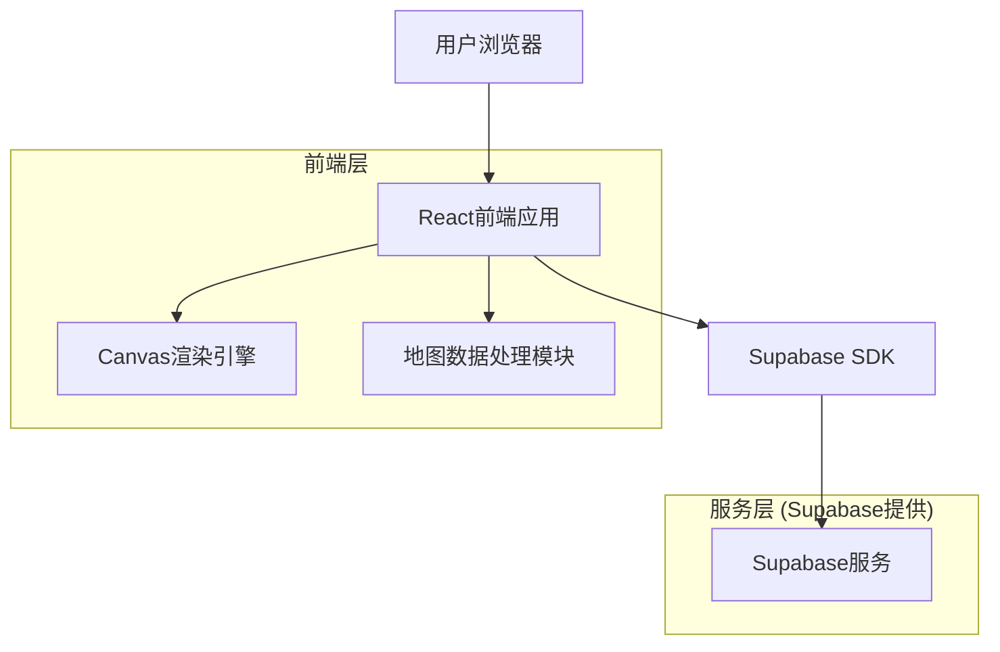
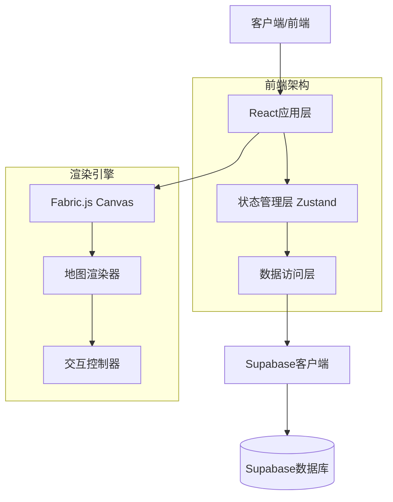
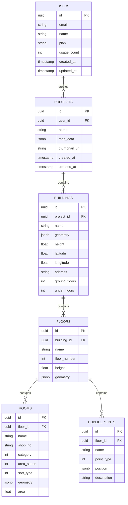

# 室内地图编辑器 - 技术架构文档

## 1. 架构设计



## 2. 技术描述

- **前端**: React@18 + TypeScript@5 + Vite@5 + TailwindCSS@3
- **状态管理**: Zustand@4 (轻量级状态管理)
- **UI组件库**: Ant Design@5 (丰富的企业级组件)
- **图形渲染**: Fabric.js@5 (强大的Canvas操作库)
- **数据存储**: Supabase (PostgreSQL + 实时订阅)
- **文件存储**: Supabase Storage (项目文件和导出数据)

## 3. 路由定义

| 路由 | 用途 |
|------|------|
| / | 首页，重定向到项目管理页面 |
| /login | 登录页面，用户身份验证 |
| /register | 注册页面，新用户注册 |
| /projects | 项目管理页面，显示用户的所有地图项目 |
| /editor/:projectId | 主编辑页面，地图编辑器界面 |
| /profile | 用户个人资料页面，账户设置和订阅管理 |

## 4. API定义

### 4.1 核心API

**项目管理相关**
```
GET /api/projects
```

请求参数：
| 参数名称 | 参数类型 | 是否必需 | 描述 |
|----------|----------|----------|------|
| user_id | string | true | 用户ID |
| page | number | false | 页码，默认1 |
| limit | number | false | 每页数量，默认20 |

响应数据：
| 参数名称 | 参数类型 | 描述 |
|----------|----------|------|
| projects | Project[] | 项目列表 |
| total | number | 项目总数 |

示例响应：
```json
{
  "projects": [
    {
      "id": "uuid",
      "name": "商场A一层",
      "created_at": "2024-01-01T00:00:00Z",
      "updated_at": "2024-01-02T00:00:00Z",
      "thumbnail": "url"
    }
  ],
  "total": 1
}
```

**地图数据相关**
```
POST /api/projects/:id/save
```

请求参数：
| 参数名称 | 参数类型 | 是否必需 | 描述 |
|----------|----------|----------|------|
| map_data | MapData | true | 地图数据对象 |
| auto_save | boolean | false | 是否自动保存 |

响应数据：
| 参数名称 | 参数类型 | 描述 |
|----------|----------|------|
| success | boolean | 保存是否成功 |
| version | number | 数据版本号 |

## 5. 服务器架构图



## 6. 数据模型

### 6.1 数据模型定义



### 6.2 数据定义语言

**用户表 (users)**
```sql
-- 创建用户表
CREATE TABLE users (
    id UUID PRIMARY KEY DEFAULT gen_random_uuid(),
    email VARCHAR(255) UNIQUE NOT NULL,
    name VARCHAR(100) NOT NULL,
    plan VARCHAR(20) DEFAULT 'free' CHECK (plan IN ('free', 'premium')),
    usage_count INTEGER DEFAULT 0,
    created_at TIMESTAMP WITH TIME ZONE DEFAULT NOW(),
    updated_at TIMESTAMP WITH TIME ZONE DEFAULT NOW()
);

-- 设置权限
GRANT SELECT ON users TO anon;
GRANT ALL PRIVILEGES ON users TO authenticated;
```

**项目表 (projects)**
```sql
-- 创建项目表
CREATE TABLE projects (
    id UUID PRIMARY KEY DEFAULT gen_random_uuid(),
    user_id UUID REFERENCES users(id) ON DELETE CASCADE,
    name VARCHAR(200) NOT NULL,
    map_data JSONB DEFAULT '{}',
    thumbnail_url TEXT,
    created_at TIMESTAMP WITH TIME ZONE DEFAULT NOW(),
    updated_at TIMESTAMP WITH TIME ZONE DEFAULT NOW()
);

-- 创建索引
CREATE INDEX idx_projects_user_id ON projects(user_id);
CREATE INDEX idx_projects_updated_at ON projects(updated_at DESC);

-- 设置权限
GRANT SELECT ON projects TO anon;
GRANT ALL PRIVILEGES ON projects TO authenticated;
```

**建筑表 (buildings)**
```sql
-- 创建建筑表
CREATE TABLE buildings (
    id UUID PRIMARY KEY DEFAULT gen_random_uuid(),
    project_id UUID REFERENCES projects(id) ON DELETE CASCADE,
    name VARCHAR(200) NOT NULL,
    geometry JSONB NOT NULL,
    height FLOAT DEFAULT 0,
    latitude FLOAT,
    longitude FLOAT,
    address TEXT,
    ground_floors INTEGER DEFAULT 1,
    under_floors INTEGER DEFAULT 0,
    created_at TIMESTAMP WITH TIME ZONE DEFAULT NOW()
);

-- 创建索引
CREATE INDEX idx_buildings_project_id ON buildings(project_id);

-- 设置权限
GRANT ALL PRIVILEGES ON buildings TO authenticated;
```

**楼层表 (floors)**
```sql
-- 创建楼层表
CREATE TABLE floors (
    id UUID PRIMARY KEY DEFAULT gen_random_uuid(),
    building_id UUID REFERENCES buildings(id) ON DELETE CASCADE,
    name VARCHAR(100) NOT NULL,
    floor_number INTEGER NOT NULL,
    height FLOAT DEFAULT 3.0,
    geometry JSONB NOT NULL,
    created_at TIMESTAMP WITH TIME ZONE DEFAULT NOW()
);

-- 创建索引
CREATE INDEX idx_floors_building_id ON floors(building_id);
CREATE INDEX idx_floors_floor_number ON floors(floor_number);

-- 设置权限
GRANT ALL PRIVILEGES ON floors TO authenticated;
```

**房间表 (rooms)**
```sql
-- 创建房间表
CREATE TABLE rooms (
    id UUID PRIMARY KEY DEFAULT gen_random_uuid(),
    floor_id UUID REFERENCES floors(id) ON DELETE CASCADE,
    name VARCHAR(200) NOT NULL,
    shop_no VARCHAR(50),
    category INTEGER DEFAULT 0,
    area_status INTEGER DEFAULT 0,
    sort_type INTEGER DEFAULT 0,
    geometry JSONB NOT NULL,
    area FLOAT DEFAULT 0,
    created_at TIMESTAMP WITH TIME ZONE DEFAULT NOW()
);

-- 创建索引
CREATE INDEX idx_rooms_floor_id ON rooms(floor_id);
CREATE INDEX idx_rooms_shop_no ON rooms(shop_no);
CREATE INDEX idx_rooms_category ON rooms(category);

-- 设置权限
GRANT ALL PRIVILEGES ON rooms TO authenticated;
```

**公共点位表 (public_points)**
```sql
-- 创建公共点位表
CREATE TABLE public_points (
    id UUID PRIMARY KEY DEFAULT gen_random_uuid(),
    floor_id UUID REFERENCES floors(id) ON DELETE CASCADE,
    name VARCHAR(200) NOT NULL,
    point_type INTEGER NOT NULL, -- 1:入口 2:电梯 3:扶梯 4:楼梯 5:洗手间 6:ATM等
    position JSONB NOT NULL,
    description TEXT,
    created_at TIMESTAMP WITH TIME ZONE DEFAULT NOW()
);

-- 创建索引
CREATE INDEX idx_public_points_floor_id ON public_points(floor_id);
CREATE INDEX idx_public_points_type ON public_points(point_type);

-- 设置权限
GRANT ALL PRIVILEGES ON public_points TO authenticated;

-- 初始化数据
INSERT INTO public_points (floor_id, name, point_type, position, description) VALUES
('00000000-0000-0000-0000-000000000000', '主入口', 1, '{"x": 100, "y": 100}', '商场主要入口'),
('00000000-0000-0000-0000-000000000000', '电梯A', 2, '{"x": 200, "y": 200}', '客用电梯');
```