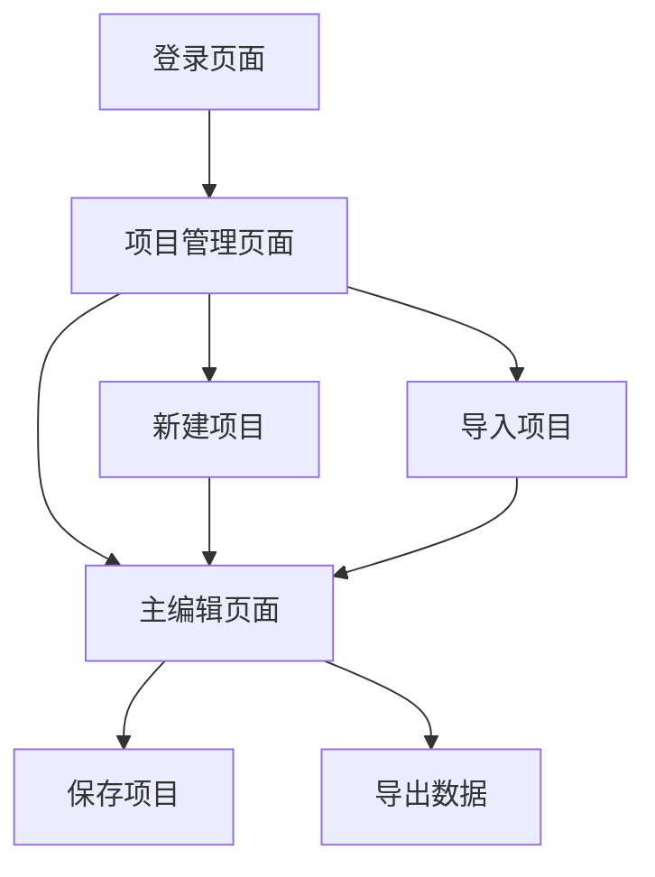

# 室内地图编辑器 - 产品需求文档

## 1. 产品概述

这是一个基于Web技术的室内地图编辑器，用于创建和编辑商场、办公楼等室内空间的平面图。用户可以通过直观的可视化界面绘制建筑结构、房间布局，并添加各种功能点位，最终导出标准化的地图数据用于导航和可视化应用。

产品旨在为商场运营方、建筑设计师和地图数据服务商提供专业的室内地图制作工具，支持复杂的多层建筑结构编辑和丰富的业态标注功能。

## 2. 核心功能

### 2.1 用户角色

| 角色 | 注册方式 | 核心权限 |
|------|----------|----------|
| 普通用户 | 邮箱注册 | 可创建和编辑地图项目，导出基础格式数据 |
| 专业用户 | 邀请码升级 | 可使用高级编辑工具，批量操作，导出多种格式 |

### 2.2 功能模块

我们的室内地图编辑器包含以下主要页面：

1. **主编辑页面**：画布区域、工具栏、属性面板、图层管理
2. **项目管理页面**：项目列表、新建项目、导入导出
3. **登录注册页面**：用户认证和账户管理

### 2.3 页面详情

| 页面名称 | 模块名称 | 功能描述 |
|----------|----------|----------|
| 主编辑页面 | 画布区域 | 显示地图内容，支持缩放、平移、选择操作 |
| 主编辑页面 | 工具栏 | 提供选择、绘制多边形、添加点位、分割、合并、缩放等编辑工具 |
| 主编辑页面 | 属性面板 | 显示和编辑选中对象的属性信息（名称、类型、面积等） |
| 主编辑页面 | 图层管理 | 管理建筑、楼层、房间等不同图层的显示和编辑状态 |
| 主编辑页面 | 菜单栏 | 文件操作（新建、打开、保存、导出）、编辑操作（撤销、重做、复制、粘贴） |
| 项目管理页面 | 项目列表 | 显示用户创建的所有地图项目，支持搜索、排序、删除 |
| 项目管理页面 | 项目操作 | 新建项目、导入已有数据、批量导出、项目分享 |
| 登录注册页面 | 用户认证 | 邮箱登录、注册、密码重置、第三方登录 |
| 登录注册页面 | 账户管理 | 个人信息编辑、订阅管理、使用统计 |

## 3. 核心流程

**普通用户流程：**
用户登录后进入项目管理页面，可以新建项目或打开已有项目。在主编辑页面中，用户首先创建建筑轮廓，然后添加楼层，在每个楼层中绘制房间和添加功能点位。编辑过程中可以随时保存，完成后导出JSON格式数据。

**专业用户流程：**
除了普通用户的所有功能外，专业用户还可以使用批量编辑工具、高级属性设置、多格式导出等功能。

## 4. 用户界面设计

### 4.1 设计风格

- **主色调**：深蓝色 (#1890FF) 作为主色，浅灰色 (#F5F5F5) 作为背景色
- **按钮样式**：圆角矩形按钮，悬停时有阴影效果
- **字体**：系统默认字体，标题使用16px，正文使用14px，小字使用12px
- **布局风格**：左侧工具栏 + 中央画布 + 右侧属性面板的经典编辑器布局
- **图标风格**：使用线性图标，简洁现代，支持深色和浅色主题

### 4.2 页面设计概览

| 页面名称 | 模块名称 | UI元素 |
|----------|----------|--------|
| 主编辑页面 | 工具栏 | 垂直排列的工具按钮，选中状态有蓝色背景，工具提示显示功能说明 |
| 主编辑页面 | 画布区域 | 白色背景，网格辅助线，支持无限缩放，选中对象有蓝色边框 |
| 主编辑页面 | 属性面板 | 表单样式的属性编辑器，分组显示不同类型属性 |
| 主编辑页面 | 图层管理 | 树形结构显示图层层级，支持拖拽排序和显示/隐藏切换 |
| 项目管理页面 | 项目卡片 | 卡片式布局，显示项目缩略图、名称、修改时间，悬停显示操作按钮 |

### 4.3 响应式设计

产品采用桌面优先的设计策略，主要面向PC端用户。在平板设备上进行适配，工具栏可收缩为浮动面板，属性面板可切换为底部抽屉式显示。暂不考虑手机端适配，因为复杂的地图编辑操作需要精确的鼠标交互。